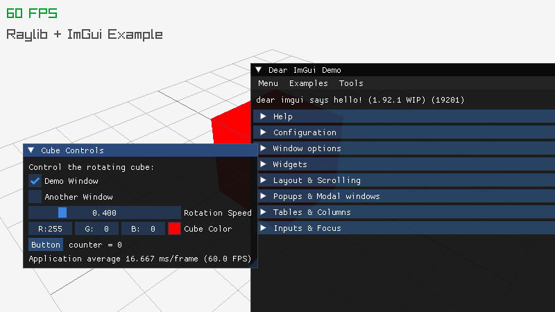
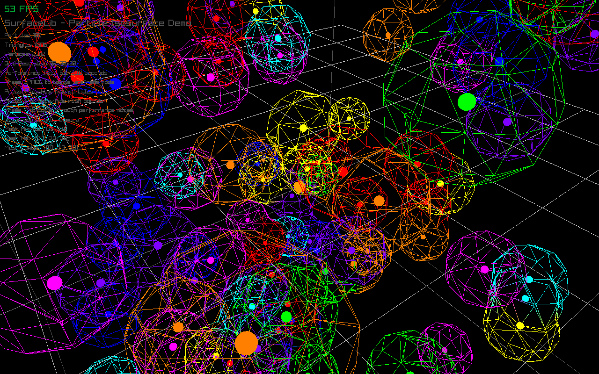
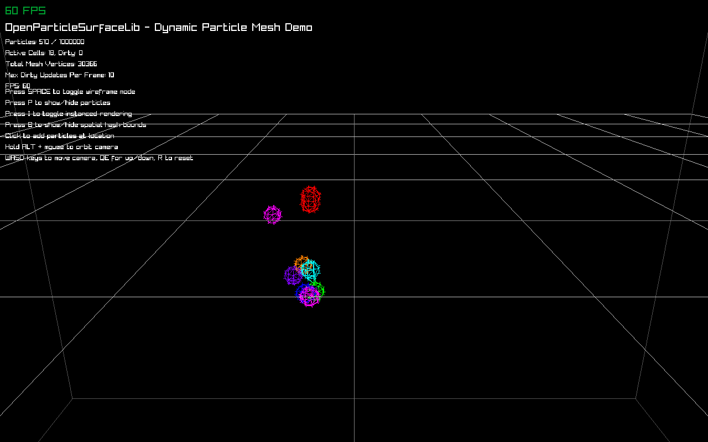
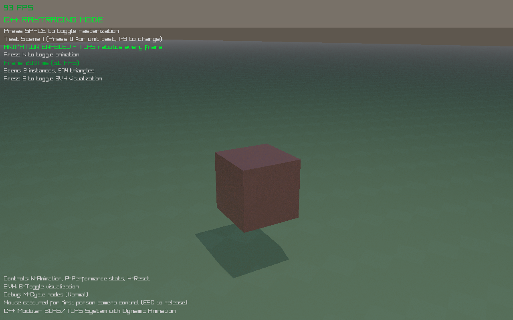
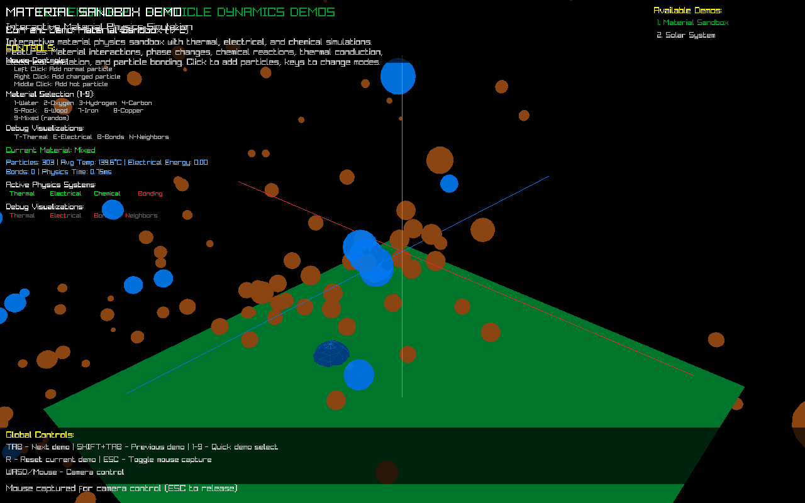
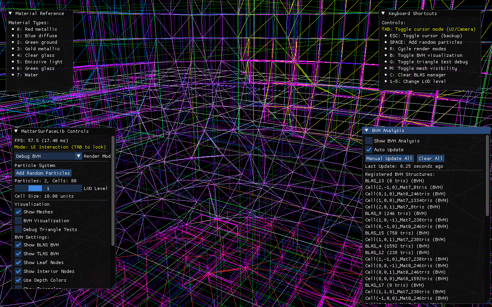

# matter-engine-cpp

A prototype C/C++ engine for **procedural generation and ray-traced rendering of voxel/particle "matter"** — the long-term target is real-time rendering of billions of meshed static particles with LOD, plus a dynamic particle-physics layer for material interactions (thermal, electrical, chemical, bonding).

This repository is a **monorepo of independently-buildable sub-projects**, each one a focused experiment that builds on the last. Together they form the technology stack the eventual engine sits on.

---

## Sub-projects

Ordered roughly from foundational → integration.

### `BasicWindowApp/` — raylib + ImGui starter



C++ raylib starter with ImGui integration — a rotating cube with live controls and the canonical Dear ImGui demo window. Every later project was forked from this template.

### `ObjectAllocatorLib/` — paged growable allocator (C)

Test-driven C allocator that grows in pages of fixed-size objects. No graphics. **6/6 tests pass.**

### `SurfaceLib/` — marching-cubes isosurfaces



C library that builds meshes from scalar fields via marching cubes — spheres, tori, metaballs, custom user functions. The screenshot shows a metaball field with hundreds of overlapping wireframe surfaces and particle sites.

### `SpatialQueryLib/` — spatial hash + CPU BVH (C)

Generic spatial hash for radius/box queries and a CPU-side BVH that can flatten into node/index buffers ready for GPU SSBO upload. No graphics. **9/9 tests pass.**

### `OpenParticleSurfaceLib/` — dynamic particle → mesh pipeline



C library that hot-rebuilds isosurface meshes as particles move. Pulls in `SurfaceLib` and `ObjectAllocatorLib`. Tested up to 1M particles with active-cell tracking and dirty-bounds rebuilds.

### `GPURayTraceExample/` — pixel-shader BVH ray tracer



C++ ray tracer with modular BLAS (bottom-level acceleration structures) per-mesh and a TLAS (top-level) that animates per frame. BVH is built CPU-side, flattened, uploaded as data textures, then traversed in a fragment shader. Includes a BVH analyzer/visualizer.

### `ParticleDynamicsExample/` — material-physics sandbox



C++ N-body sim with spatial-hash optimization (O(n²) → O(n·m)). The `MaterialManager` loads 20 material types, 3 chemical reactions, and a 50-entry adhesion matrix. Multiple demo scenes (material sandbox, solar system) selectable at runtime.

### `MatterSurfaceLib/` — the convergence project



**Pulls everything together.** Implements the `Cluster` / `Cell` architecture from the roadmap: a cluster owns particles in its local space, sub-divides into power-of-two integer cells, generates per-cell marching-cubes meshes (~0.5 ms each), registers each mesh as a BLAS, and ray-traces the resulting TLAS in a fragment shader. The screenshot shows the BVH-visualization debug mode with the analyzer panel listing every BLAS in the scene.

See [`ROADMAP.md`](./ROADMAP.md) for the design intent behind each project and what's still ahead (ODE-backed `ParticleDynamicsLib`, streaming data layer, the asteroid-mining game prototype).

## Architecture

- **One repo, many independent projects.** Each sub-project has its own `Makefile` and produces its own binary. There's no umbrella build target — `build-all.sh` just walks the list.
- **Code sharing** between sub-projects is via `-I../OtherProject/include` in Makefiles (and occasionally filesystem symlinks). No package manager, no submodules.
- **Vendored third-party deps** live under `Libraries/` (raylib, ImGui, ODE). Building from a fresh clone needs no system packages other than a C/C++ toolchain and OpenGL/X11 dev headers.
- **Cross-platform** Makefiles target Linux, macOS, and Windows (native + MinGW cross-compile from WSL). `build-all.sh` defaults to the host platform.

## Building & running

```bash
# Build every project for the host platform
./build-all.sh

# Clean and rebuild from scratch
./build-all.sh clean

# Build, then run the headless test suites (ObjectAllocatorLib + SpatialQueryLib)
./build-all.sh test
```

Per-project builds:

```bash
cd MatterSurfaceLib
make WSL_LINUX=1    # or just `make` on native Linux/macOS
./matter_surface_lib
```

### Prerequisites (Linux/WSL)

- `gcc`, `g++`, `make`, `pkg-config`
- OpenGL + X11 dev headers: `libgl1-mesa-dev libx11-dev libxrandr-dev libxinerama-dev libxcursor-dev libxi-dev`
- For graphical apps: a working display (WSLg, XQuartz, or a desktop session)

### Per-project quick reference

| Project | Build command | Binary |
|---|---|---|
| `BasicWindowApp` | `make` | `./cube_app` |
| `SurfaceLib` | `make` | `./surface_app` |
| `ObjectAllocatorLib` | `make` | `./objectallocator` (test runner) |
| `SpatialQueryLib` | `make` | `./spatialquerylib` (test runner) |
| `OpenParticleSurfaceLib` | `make` | `./open_particle_surface` |
| `GPURayTraceExample` | `make WSL_LINUX=1` | `./gpu_raytrace` |
| `ParticleDynamicsExample` | `make TARGET=linux` | `./build/linux/particle_dynamics` |
| `MatterSurfaceLib` | `make WSL_LINUX=1` | `./matter_surface_lib` |

## Status

Working as of the latest commit, verified by `./build-all.sh test` on Linux/WSL with an RTX 4090 via WSLg:

- All 8 projects build cleanly
- All 15 headless tests pass (6 in `ObjectAllocatorLib`, 9 in `SpatialQueryLib`)
- All raylib apps initialize a window and reach the render loop
- `MatterSurfaceLib` runs the full pipeline: 1 cluster → 80 cells → marching-cubes mesh generation → BLAS registration → TLAS-based GPU ray tracing

See [`ROADMAP.md`](./ROADMAP.md) for what's done and what's planned.

## Repository history

This repo was consolidated from seven previously-independent local-only sub-repos into a single monorepo. Per-project history (86 commits across the original repos) was preserved via `git subtree` import — those commits remain reachable via `git log --all`. The first project-level commit you'll see on `main` is `7a94621` (initial monorepo); everything older lives in the imported histories.

## License

Not yet specified. The vendored libraries under `Libraries/` retain their original upstream licenses (raylib: zlib, ImGui: MIT, ODE: BSD/LGPL dual).
