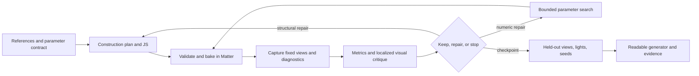

# AI pipeline for photoreal procedural object scripts — Astra proposal

Date: 2026-09-28. Task: `steady-stone-51`. Status: proposed for review.
Repository inspected: `33aa006c4028359b2949634f46d9c80a61d5b97f`.
Scope: research and design; no engine changes, generated assets, model benchmark,
or new capture measurements were performed for this proposal. Thresholds and
budgets below are proposed starting points, not measured performance claims.

## Recommendation

Build an external **render–measure–edit controller around Matter's actual JS
authoring system**. A strong vision/code model chooses the object's construction
and makes occasional structural edits. A bounded numerical search tunes its
meaningful parameters. Matter bakes and renders every candidate; a combination
of image measurements, targeted visual critique, and held-out tests decides
whether to keep it. Deliver the generator, its material dependencies, parameter
contract and reproducible evidence together.

Start with opaque rocks, bark and woody objects. These expose geometry and
material mistakes without immediately depending on difficult transmission or
subsurface behavior. Add leaves, shells and translucent specimens as challenge
cases. Aim for a compact, understandable *family generator*: reproducing one
photograph exactly and generating convincing new specimens are different tests.

The recommended initial routing is Astra for construction planning and difficult
repairs, Opus 5.5 as a competing author/editor, and a cheaper model for routine
local patches only after it passes the same evaluation. Include Fable as a
full-quality competitor. Choose the production mix by measured cost to reach
acceptable quality, not model reputation or token price alone.



## 1. Define what the references mean

Separate three input modes in the manifest. Do not average their scores together.

| Input mode | What can be fitted | What cannot honestly be claimed |
| --- | --- | --- |
| Several views of the **same specimen**, known or recoverable cameras | Shape, material and appearance of that specimen | Unseen detail uniquely recovered from a few views |
| Several specimens of one family | Shared construction rules and a distribution of parameters | Pixel correspondence between different rocks or leaves |
| One photograph or an uncalibrated collection | Plausible object consistent with visible evidence | Measured backside accuracy or uniquely identified roughness and lighting |

For the first pilot, photograph each specimen on a marked turntable with a scale
and color reference: eight azimuth/elevation views under fixed illumination,
plus two views under a second known light arrangement. Keep the background and
camera exposure fixed; include grazing views and a top view. A second physical
specimen per family is useful for diversity assessment. Masks need a quick human
check, particularly around thin leaves and broken bark.

Store original image hashes, provenance, specimen/family IDs, physical size,
camera intrinsics/extrinsics and confidence, illumination/exposure metadata,
foreground masks, and the fit/validation/test split. Undistort images using the
calibration. Unknown camera or light values stay marked unknown. Generated
reference images can illustrate an intended appearance but are labeled synthetic
and excluded from measured reconstruction accuracy; generated reverse views are
priors, never new observations.

Solve camera alignment and gross scale before material detail. Then freeze the
camera solution for candidate comparisons. If camera uncertainty remains, allow
one bounded calibration stage shared by all models and report its residual.
Arbitrary per-candidate crops, camera moves, exposure shifts or image warps can
hide shape errors and must not be part of the asset optimizer. For uncalibrated
inputs, report semantic/structural plausibility separately from aligned image
error. Request additional real views when ambiguity prevents progress.

## 2. The actual Matter authoring target

### Existing capabilities and constraints

The following are grounded in this checkout; the source map in section 10 makes
them traceable. Older architecture prose contains obsolete `WorldData` and GL
references, so use current examples, bindings and protocol implementations when
building the controller.

| Capability | Existing evidence | Design implication |
| --- | --- | --- |
| QuickJS `class X extends Part`, `static params`, `build(p)` | `objects/terrain/Rock.js`, `script_host.cpp` | Generate executable Matter JS, with explicit supported operations |
| Voxel CSG, direct mesh emission, child composition | `Rock.js`, `Leaf.js`, `static requires`/`placeChild` in authoring docs | Use different constructions for solids, thin surfaces and repeated subparts |
| Authored normals/source UVs | `MountainDetailRock.js` and `mountain_detail_rocks.js`, `surfaceVertex` | Dense procedural displacement can become real triangles; source UVs are not automatically runtime texture UVs |
| Source + canonical parameters + dependencies identify baked variants | `ScriptHost::resolve_hash` | Cache candidates by full dependency closure; keep engine/render configuration in the outer evaluation key |
| Deterministic seeded script execution | `derive_seed`, `shared-lib/rng.js` | Same inputs can reproduce geometry, but parameter continuity needs explicit RNG design |
| Typed root parameter edits and jobs | `procedural.parameters`, `procedural.update`, `job.*` | Cheap controller integration already exists; no arbitrary JS editing through this API |
| Production viewport capture | `viewport.capture`, `shot`, `drive.py` | Use the renderer as the oracle; existing completion records prevent stale-shot false passes |
| Diagnostic images | `viewer.debug.debug_view_mode` | Normals, depth, raw albedo, LOD and wireframe help localize defects; they are display images, not a complete numeric AOV export |

Create a tiny dedicated production world containing one generated root and a
fixed stage. The family generator and its material/detail modules are the
authored output; camera, stage and lights belong to the evaluation harness.
Reuse the existing `World.static roots` pattern in `RockGallery.js`. Opening a
part through `workbench <module>` is useful interactively, but production scene
selection/provenance is not the private Workbench scene: capture metadata marks
`production_view:false` there. Use the dedicated world for automated scoring.

Prefer flat scalar parameters for the first version: seed, size, aspect ratio,
fracture depth, erosion amount, bark furrow spacing, pigment variation and so on.
The live override path accepts existing numeric, boolean and string fields;
arrays/objects are described but cannot be overridden. It supplies types, **not
physical ranges**. A proposed companion `asset-contract.json` must define units,
ranges, integer/enumeration constraints, correlations and expected behavior.
These are controller metadata, not newly existing engine declarations.

`procedural.update` is session-only and refuses a module published as multiple
roots. Discover the current root identity rather than retaining IDs through a
rebake. Apply with `expect.scene_revision`, wait for the returned job if present,
and inspect `job.state`: a successful status query does not mean a successful
bake. A no-op update may return no job. Persist the accepted parameters into the
authored package and verify them after a fresh launch without overrides.

### Keep the program small without hiding its complexity

Use a construction plan with a few named stages: primary mass/skeleton,
secondary features, surface assignment, small detail. Start from one or two
relevant repository examples rather than putting the entire engine in context.
Keep shared helpers versioned and reusable, with a frozen library baseline for
model comparisons. A three-line wrapper around a newly generated 4,000-line
helper is a 4,003-line asset, not a compact solution.

Report both object-local bytes/tokens and the unique transitive authored source
closure, excluding the fixed engine/library baseline. Also report AST node
count, parameter count, generated triangle/page cost and bake time. Do not
minify, remove useful names/comments, encode a mesh as a giant numeric array,
or smuggle photographs into source strings to win a script-length score.
Imported textures or scans, if later allowed, form a separate benchmark track
with their bytes charged. The first track is procedural-only.

Prefer physical correlations: larger weathered cracks expose a related mineral
color; growth direction governs bark and branches; roughness changes follow
wear. Independent noise on every output often destroys the relationships that
make a material believable. Sample plausible correlated parameter presets,
not every combination of an unconstrained Cartesian product.

**RNG detail that affects convergence:** `script_host.cpp:derive_seed` mixes the
entire merged parameter JSON into the host seed. Changing `size` while keeping
`seed` fixed can therefore change all `Math.random()` draws. Use explicit
`rng(seed ^ salt)` streams from `MatterEngine3/shared-lib/rng.js` for structure,
damage and surface features. The salts and seeds are integer contract fields;
keep draws stable across resolution changes. For repeated components, derive
the component seed from a stable index, so adding one feature does not reroll
all later features. Existing `Rock.js` already uses an explicit `rng` stream.

Maintain two controls: semantic shape parameters and sampling/detail quality.
Changing mesh resolution must sample the same continuous shape, not invent
another specimen. After visual acceptance, simplify the program in a separate
pass and rerun the identical view/seed suite. Choose the smallest readable
program within the accepted quality tolerance, rather than reducing code while
the optimizer is still trying to discover the shape.

### Use VG, VT and RT for the jobs they actually perform

**Geometry:** put silhouette, substantial cracks, holes, overlap and shadowing
forms into geometry. Coarse CSG suits rock masses; curves/extrusions or meshes
suit branches and leaves. `MountainDetailRock` is a concrete high-detail mesh
example. Virtual geometry is opt-in (`MATTER_GEOMETRY_PAGES=1`) for eligible
static standalone leaf parts, with a module filter and admission threshold.
It streams/selects compiled triangles; it does not automatically add detail to
a coarse script. Begin without paging for small prototypes, then qualify dense
objects on the intended production path. Record actual admission and fallback.

**Materials:** `defineMaterial` provides PBR material parameters. `surfaces(s)`
and the recorded surface machinery can create continuous color/roughness/height
fields; current `StreamMountain` and `mountain_surface.js` show this. Existing
`Tileset` detail generators such as `RedwoodBarkDetail` offer another reusable
surface source. For each chosen path supply an executable example in the
model's capability pack; do not invent a generic `Part.materialGraph` API.
World-anchored terrain fields are not automatically suitable for shared movable
props: inspect the coordinate contract and use part-local features for those.

VT pages carry composed surface appearance at a bounded physical residency
cost. Match texel density and footprint to the smallest detail that matters in
the intended views. `MATTER_VT_PROP_TEXELS_PER_METER` requests prop density, but
chart packing may reduce it. More density does not allocate more pool memory.
Reuse a variant where appropriate; millions of unique seeds can defeat sharing.

`detailMode:'surface'` enables finished-surface height parallax; it does not
change the silhouette. Use it for micro-relief, not missing rock facets or leaf
curl. Compare grazing views and contact shadows to catch this confusion.

**Lighting:** use native RT for final material/occlusion evaluation where the
target machine supports it, plus raster diagnostic captures. RT shading is not
an independent physical ground truth and its temporal noise is not zero.
Record requested and observed render paths. In particular,
`MATTER_GEOMETRY_RASTER_ONLY=1` skips page BLAS resources at registration; changing
the live render path does not restore them. A final RT run needs a restart
without that policy. Treat missing RT capability as an unavailable track.

## 3. Feedback loops that converge

Use a nested, staged search rather than an unrestricted conversation that
rewrites the entire script after every screenshot.

| Stage | Variables allowed to change | Measurements and promotion rule |
| --- | --- | --- |
| Calibration | Shared camera/light nuisance parameters | Fit measured reference setup; then freeze it |
| Structure | Construction family, topology, proportions | Multi-view silhouette, holes, landmarks, bounds; reject invalid geometry |
| Shape refinement | 4–12 named shape parameters at a time | Boundary error and available depth/normal evidence; require gains in several views |
| Material | Albedo, roughness, pigment/relief scale | Matched-lit RGB, highlights, raw-albedo diagnostics, second-light checks |
| Fine detail | Detail amplitudes/frequencies and resolution | Close crops plus full views; check grazing angles, aliasing and page/bake cost |
| Generalization | Seeds and allowed parameter presets | Family identity, variation, stability, no collapse; do not fit unseen seeds to the reference |
| Compression | Equivalent refactors/helper reuse | Same quality and variation gates, smaller readable dependency closure |

First ask the strong model for at most three construction hypotheses and one
preferred implementation. The alternatives are reserved for a structural
plateau, not all rendered automatically. Have it name observable predictions:
"the chipped edge should move this silhouette segment in views A and C" is
actionable; "make it more realistic" is not.

Within a construction, start with bounded coordinate/pattern search over a few
parameters. Reuse the same seeds and poses for paired comparisons. For each
parameter group, sample the incumbent and small positive/negative changes,
cache duplicates, and accept only measured improvement. Once measured bake
cost warrants it, compare a surrogate/Bayesian search for mixed variables or
an evolution strategy for continuous groups. The first implementation need not
depend on either. Do not assume the JS–mesher–VG–VT–renderer chain is
differentiable; branching, remeshing, hashing and page decisions are discrete.
Freeze the fitting seed for all arms; reserve seed changes for the declared
variation suite. Selecting a lucky random specimen after every edit obscures
whether the construction improved.

Use cheap 512-pixel renders of three fit views to screen proposals, then 1024
pixels and all fit views for promising ones. Calibrate that screening preserves
candidate ranking; material micro-detail can reverse a low-resolution ranking.
Avoid early rejection based only on the cheap view for such cases. A structural
edit and a material edit are separate candidates, so their effects remain
attributable. Discard candidates with unsupported API calls, invalid dimensions,
missing children, NaNs, empty output, bake failure or exceeded resource budgets
before paying for a vision critique.

The VLM receives reference/render pairs with view IDs, a contact sheet, two
failure crops at original useful resolution, relevant numeric residuals and
the small source region it may edit. Its structured response contains:

```json
{
  "defect": "upper fracture is too rounded",
  "views": ["fit-front", "fit-right"],
  "region": {"view": "fit-front", "xyxy_normalized": [0.2, 0.1, 0.6, 0.4]},
  "category": "geometry",
  "confidence": 0.8,
  "hypothesis": "the edge blend radius is too large",
  "edit_scope": ["edgeBlend"],
  "expected_effect": "lower boundary distance in both views",
  "check": "silhouette and grazing-light capture"
}
```

This is a proposed controller schema. Ask for at most three ranked defects,
including uncertainty and competing lighting/shape explanations. An editor
returns a patch plus the base source hash and expected checks. Reject a patch
against another version. The controller owns execution, measurements and
acceptance; a VLM never declares its own change successful. For final critique,
hide model identity and source length, randomize A/B order and include unchanged
pairs to measure judge inconsistency. Cross-model critique is an experiment,
not a guarantee of independence or an obligatory extra call every iteration.

### Objective and acceptance

Keep a metric vector and a Pareto set for image fidelity, program size and
runtime cost. A scalar helps local search but is not the only exit gate. For a
calibrated specimen, use the following proposed score on fit views:

```text
L_view = 0.40 * (1 - silhouette_IoU)
       + 0.25 * clamp(symmetric_boundary_distance / image_diagonal / 0.02, 0, 1)
       + 0.25 * clamp(masked_LPIPS / 0.30, 0, 1)
       + 0.10 * landmark_error_normalized
L_fit  = 0.7 * mean(L_view) + 0.3 * max(L_view)
```

Landmark error is mean reprojection distance divided by image diagonal and by
0.02, clamped to [0,1]. If landmarks are unavailable, remove that term and
renormalize the other weights for the whole specimen before any run. The 0.02
and 0.30 scales and weights are pilot calibration constants, not universal
perception thresholds. Early shape search uses only silhouette/boundary/landmark
terms, renormalized; material search uses full color/appearance checks. Publish
unclamped component values so saturation cannot hide severe errors.

For LPIPS, use a fixed common crop, resolution, model checkpoint and input
normalization. Composite each foreground mask on the same neutral background;
do not independently recenter/scale the two objects. Report silhouette error
separately because masked image error still contains boundary error. Compare
matched lighting/color transforms and report both full-image and foreground
results. LPIPS is supported by human perceptual judgments in its original
evaluation, but that does not make it a photorealism certificate for this task.
[LPIPS paper](https://arxiv.org/abs/1801.03924)

| Question | Measurement | Limit / handling |
| --- | --- | --- |
| Is the shape right? | Mask IoU, symmetric contour distance, projected landmarks, holes/component counts | Use independently checked masks; a visible silhouette cannot establish hidden topology |
| Does the image match? | Masked LPIPS, SSIM and linear-color residuals at fixed alignment | SSIM/pixel error mainly diagnose registered changes; do not optimize uncalibrated photos by pixel error |
| Are material and light disentangled? | Highlight width/location, roughness response under two lights, regional color distributions | Raw albedo is available for renders, not known for arbitrary photos; inferred intrinsic maps are uncertain priors |
| Is the object semantically/structurally plausible? | Local feature similarity plus localized VLM/human rubric | DINOv2 features are an optional secondary descriptor, not a calibrated realism score; CLIP/category agreement alone is too coarse |
| Is geometry wrong or just shading? | Normal/depth/wireframe diagnostic images; metric depth/normal error only with calibrated data | Colorized depth/normal PNGs are not metric float buffers; monocular predictions are not ground truth |
| Is it usable in Matter? | Bake latency, triangles, page/BLAS memory, render timing, repeated-run stability | A pretty image with budget rejection or a fallback is not a passing production candidate |
| Is it a useful generator? | New seeds, parameter sweeps, family identity and diversity, human edit task | A different color on an identical shape is not adequate structural variation |

DINOv2 supplies general image and patch features; the choice to use them for
this controller's region matching is an inference to validate on the pilot.
[DINOv2 paper](https://arxiv.org/abs/2304.07193)

For each renderer configuration, estimate paired repeat noise from at least
five unchanged captures, including one cold restart. Let `epsilon` be the larger
of 0.01 normalized loss and the empirical 95th percentile absolute repeat
difference. Accept a numeric candidate only if `L_fit` improves by more than
`epsilon` and no view or hard constraint regresses beyond its registered
tolerance. Re-render borderline finalists; avoid repeatedly selecting noise.
Before declaring a plateau, verify that noise is not hiding the proposed effect.

Proposed stop rules:

1. **Accepted checkpoint:** all mandatory validity/resource gates pass; calibrated
   view IoU is at least 0.95 on average and 0.90 in every scored view; mean boundary
   distance is at most 1% of image diagonal; appearance meets the human-calibrated
   LPIPS threshold and blind reviewer rubric. Thin objects may need different
   predeclared thresholds. Validation seeds/lights and persisted reload pass.
2. **Plateau:** three accepted-search rounds without improvement exceeding
   `epsilon`. Permit one construction-level repair if diagnosis predicts a
   measurable benefit; otherwise preserve the best candidate with an unresolved
   defect report.
3. **Budget exhausted:** stop at any call, dollar, time, bake or capture cap.
   Report best achieved quality and failure to meet acceptance; do not label it
   converged. Infrastructure failures are separate from bad generated assets.

Validation views select checkpoints at fixed intervals, so they are not an
unbiased final test. Never show test images, their metrics or the reserved test
seeds to the author/editor/controller. Run the locked final suite once on the
selected artifact. A failed test result can motivate a later version, but that
version requires a new held-out test set for an unbiased claim.

## 4. Repeatable capture in this engine

Deterministic inputs and repeatable measurements are achievable; bit-identical
RT pixels are not an existing guarantee. The repository's replay baseline
recorded roughly 22% differing pixels at channel tolerance 2 for unchanged RT
runs, and increasing settle from 90 to 400 frames did not remove that variance.
Those are historical, scene-specific measurements, not this proposal's new
results. Recalibrate on the actual machine/scene.
[Recorded baseline](../baselines/README.md)

### Capture contract

For every evaluation, record source/dependency hashes, canonical params, seed,
engine commit and executable hash, shader/build configuration, GPU/driver, cache
namespace and warm/cold status, camera pose **and projection**, viewport crop and
pixel dimensions, lights/exposure, VG/VT budgets and densities, render path,
DLSS mode, simulation state, settling policy, and presented-frame metadata.
Include requested and observed values. An output directory is unique per
candidate and capture; no previous PNG may satisfy a new request.

Use a static test world with physics paused, wind/animated materials/clouds
omitted or explicitly controlled. Fix lighting and exposure. `cam` sets eye and
target only; it does not set full calibrated intrinsics. Issue replay restores
recorded projection and layout with `MATTER_REPLAY_STRICT=1`, while a general
typed calibrated-camera setter remains a gap. For the initial capture pilot,
use the observed fixed projection and a matching calibrated setup; do not claim
exact photographic reprojection for unsupported intrinsics.

Build once using `tools/build-windows.ps1 -Config RelWithDebInfo -Target
matter_editor`, or `./tools/build-windows-from-wsl.sh RelWithDebInfo matter_editor`.
Use native Windows Python to drive the executable. `drive.py` sets the editor
working directory and TMP/TEMP; its current default executable is still the
legacy `build/windows/editor.exe`, so explicitly select MSVC.

The following is an existing-tool **capture plumbing probe**, not the future
isolated-object benchmark or a claim of settled photoreal output. From native
PowerShell at the repository root, create `C:/tmp/matter-ai-probe` and save this
timeline as `C:/tmp/matter-ai-probe/timeline.txt`:

```text
wait_event bake.finished 300
wait_idle 2 60
pause
render_path native_rt
dlss native
set render.lighting.exposure_ev 0
cam 4 3 6 0 1 0
wait_frames 90
stats ai_probe_beauty
shot C:/tmp/matter-ai-probe/beauty.png
set viewer.debug.debug_view_mode 1
wait_frames 10
shot C:/tmp/matter-ai-probe/normals.png
set viewer.debug.debug_view_mode 2
wait_frames 10
shot C:/tmp/matter-ai-probe/depth-display.png
set viewer.debug.debug_view_mode 4
wait_frames 10
shot C:/tmp/matter-ai-probe/albedo-display.png
quit
```

```powershell
py -3 MatterEngine3/tools/drive.py --world RockGallery `
  --editor MatterEditor/build/windows-msvc/editor.exe `
  --timeline C:/tmp/matter-ai-probe/timeline.txt `
  --out-dir C:/tmp/matter-ai-probe --hide-ui --timeout 600 `
  --env MATTER_WINDOW_WIDTH=1024 --env MATTER_WINDOW_HEIGHT=1024 `
  --env MATTER_VOLUMETRICS=0 `
  --env MATTER_VT_TRACE=C:/tmp/matter-ai-probe/vt.jsonl
```

`drive.py` removes old expected PNG/`.done` pairs and checks editor exit and file
completion. The controller must additionally reject `event: ... timeout`,
`idle: timeout`, `shot: timeout`, unrecognized commands, refused properties,
unavailable RT, bake errors and validation errors. FIFO wait timeouts currently
release the timeline and continue; an exit code of zero alone does not mean
all requested waits succeeded. Decode each PNG and verify dimensions/nonempty
foreground, not just file existence. The chosen camera is illustrative for
RockGallery; derive and freeze actual views from the isolated asset's bounds.

For iterative operation, launch with unique `MATTER_CMD_FIFO` and
`MATTER_AGENT_RESULT_FILE` paths. Use `tools/matter_agent.py` discovery
(`agent.commands`, `agent.schema`) before making typed requests. Numeric updates
use `procedural.update`; structural edits write allowed JS files atomically,
then request `job.start` with `operation:"reload"`. Reacquire root identities
and confirm the resulting parameters/provenance before scoring. Waits can be
bounded and polled on the same job; never blindly resend an ambiguous edit.
The client already distinguishes appending a request from reconnecting to read
its result.

Use `viewport.capture` for scored images: its terminal result reports the
camera, image size, viewport, `captured` context and presented frame associated
with the pixels. Keep `annotate_selection:false` and selection overlays off;
capture annotations only as separate diagnostic evidence. A capture request
does not wait for texture convergence. Serialize it after the readiness policy
below. Only one capture can be in flight.

### Readiness, caching and failure classification

Use these steps for **each pose**, including a move to the backside:

1. Confirm successful generation, expected source/parameter identity and
   nonempty bounds. Startup `wait_event bake.finished` precedes `wait_idle`;
   a later subscription can miss the event. For reloads prefer job completion.
2. Wait for the scene to become drawable and the requested geometry/material
   detail to arrive. `wait_idle` watches stable resident sector counts plus
   bake-ready, which does not certify visible VG pages, BLAS or VT enrichment.
3. Hold the fixed pose, capture twice a registered number of presented frames
   apart, and compare against the repeat-noise band. Reject changing detail,
   pending required work, rejected residency or a permanently coarse fallback.
4. Save the final captures and all readiness evidence. Report unmeasured
   readiness as unverified; do not replace missing counters with zero.

Today `MATTER_VT_TRACE` supplies presented-frame/VT counters **after the frame
loop exits**, and geometry/VT profiling supplies diagnostic logs. An initial
controller can render bounded intervals, quit, check traces and rerun a candidate
with a longer dwell if necessary. A live readiness query/barrier is proposed
below. Pixel stability alone is insufficient: a missing page can be stably
wrong. Conversely, demanding all background work in a streaming world be empty
could never finish; the future barrier must cover the requested visible set.

`history_reset` currently resets atmosphere history; it is not a documented
universal reset for RT, DLSS and every temporal subsystem. Standardize restart
and warmup for final comparisons, measure their noise, and reserve an explicit
unified reset/sample-seed API as a later improvement. Do not promise that
holding 90 frames makes arbitrary scenes deterministic.

Cache bakes by complete authored input closure and the relevant build identity;
cache measurements additionally by camera, lighting, quality and renderer
configuration. Use candidate-local project/cache roots. Reuse unchanged warm
candidates for tuning; separately report a cold first bake and a warm reopen.
For engine-only changes, never trust JS-addressed caches as a before/after test
without a fresh namespace or narrowly targeted invalidation. Do not clear a
shared project's entire cache.

Classify failures as: invalid program, bake/resource failure, capture/transport
failure, unsettled residency, image-quality failure, or renderer limitation.
Only the first and image-quality failures normally ask the model to repair JS.
After two identical infrastructure failures, stop that candidate with diagnostic
evidence rather than spending the model budget rewriting a valid object.

## 5. Proposed controller and artifact contract

Implement the first controller outside the engine, near `tools/matter_agent.py`.
Reuse the protocol and `drive.py`; no new editor optimizer UI is needed. Its
proposed operations are `inspect_capabilities`, `validate_candidate`,
`apply_parameters`, `apply_patch`, `bake`, `capture_views`, `score`, and
`compare_checkpoint`. These are adapter operations, not claims that those
literal engine commands already exist.

Each candidate is immutable after evaluation starts. Store:

```text
asset/
  objects/Example.js              readable family generator
  shared-lib/...                 additional authored helpers, if any
  materials/...                  source/detail dependencies, if any
  asset-contract.json            proposed ranges, units, seed policy, budgets
  presets.json                   accepted parameters and variation examples
evaluation/<candidate-hash>/
  manifest.json                  source/build/reference/configuration hashes
  requests.jsonl, results.jsonl   command and job receipts
  captures/                      images, .done markers, capture metadata
  metrics.json, critique.json     versioned metrics and bounded defect reports
  timing.json, usage.json         stage time, tokens, actual billed cost
  decision.json                  base candidate, patch, acceptance rationale
```

This is a packaging layout proposal; the runner stages files into Matter's
existing project object/shared-lib lookup roots. It does not teach the engine
a new `materials/` loader. Store raw references separately with restricted
fit/test access; do not pass the final-test directory to model tools.

At run start, snapshot supported DSL examples, protocol schemas and material
fields into a small capability pack. Bound script runtime, mesh size, helper
expansion and render time. The QuickJS bake context already excludes Date and
ambient require/fetch/os and supports interrupt budgets, but that does not make
the surrounding file-editing agent a sandbox. Limit its write scope to the
candidate package; the controller owns cameras, references, metrics and budget
limits. Invalid programs remain separate immutable attempts with their logs.

## 6. Model choice and experiment design

### Candidates and routing

Official documentation checked 2026-09-28 lists the following standard input
and output token prices. These are a planning snapshot; verify account access,
model ID, current rates and billing rules before running. No throughput or
Matter-script quality ranking has been measured here.

| Model/API ID | USD per million input / output tokens | Initial experiment role |
| --- | --- | --- |
| Astra / `gpt-6-astra` | $10 / $50 | Construction and structural-repair baseline |
| Fable / `claude-fable-5-1` | $10 / $50 | Independent full-quality author/editor baseline |
| Opus 5.5 / `claude-opus-5-5` | $4 / $20 | Full author/editor baseline and possible routine editor |
| Sol / `gpt-6-sol` | $2 / $10 | Candidate for bounded local edits after screening |

Astra and Sol support image inputs and structured outputs. Anthropic's current
model overview lists text/image input and tool use for Fable and Opus. The claim
that Opus 5.5 is particularly good at this task remains a hypothesis to test.
[Astra](https://developers.openai.com/api/docs/models/gpt-6-astra),
[Sol](https://developers.openai.com/api/docs/models/compare?model=gpt-6-sol),
[Anthropic model overview](https://platform.claude.com/docs/en/models/overview),
[Opus 5.5](https://platform.claude.com/docs/en/models/opus-5-5/overview).

For the proposed mixed arm: Astra makes the initial construction, Sol edits
bounded parameter/local code regions, and Astra repairs structural plateaus.
One Fable critique is reserved for a finalist with unresolved visual defects.
Swap Opus into the routine role in a development-set ablation; use the benchmark
to choose that substitution. Arithmetic parameter search and deterministic
validators require no LLM. These roles describe the future pipeline, not agent
delegation performed for this research task.

Escalate when two validated edits fail to improve the measured defect, the
patch needs to change representation/topology, or cross-view evidence conflicts.
Use a cheaper model only for tasks whose measured error rate fits the budget.
At most one escalation per plateau avoids a costly debate loop. Cache the
capability pack and unchanged references where supported; send patches and
failure crops rather than growing transcripts. A low-resolution contact sheet
does not replace a full-resolution crop when microstructure is under review.

Record actual resolved model/version, provider, effort setting, prompt hash,
sampling controls, tool calls, context/image sizes, retry count and route for
every call. Effort labels are not equal compute across providers. Pin versions
where available and report any alias change or fallback as a separate cohort.
Do not silently substitute a missing provider and call it a comparison of the
requested models.

### A small, useful reference set

Use two development specimens for threshold/prompt calibration: one rough
stone and one woody branch. Lock the protocol before evaluating six new
specimens, with different source photos from the development set:

| Evaluation specimen | Failure mode it probes |
| --- | --- |
| Angular dry rock | Facets, silhouette, mineral scale, grazing detail |
| Smooth river pebble | Subtle shape, roughness/specular response without noise camouflage |
| Bark fragment | Directional multiscale relief, cracks, exposed edge geometry |
| Broken twig/branch | Taper, branching construction, exposed wood versus bark |
| Pine cone | Repeated correlated structure, overlaps and occlusion |
| Curled dry leaf | Thin geometry, holes/curl, two-sided appearance; material challenge |

For each evaluation specimen, reserve four same-specimen views for fitting,
two for checkpoint validation and two for final testing, distributing angles
and elevations across splits rather than withholding only near-duplicates.
Reserve one second-light view for validation and one for final testing. The
family-reference images describe permissible variation and are not treated as
pixel targets. New seed tests have no exact-photo target.

Run four arms: all-Astra, all-Fable, all-Opus, and the fixed mixed policy above.
Each uses the same scaffold, allowed helper library, metric/controller code,
reference split, repair protocol, hardware and budgets. For the single-model
arms the author and iterative VLM critic use that model; final blind human
assessment is shared and outside all arms. Three independent generation attempts
per specimen give **6 × 4 × 3 = 72 attempts**. Changing the asset seed tests
variation, not independent model success; retain separate attempt IDs.

Proposed per-attempt caps: 12 model calls, 64 total bake evaluations, 480
captures including readiness/diagnostic captures, $15 model spend, and 30 active
elapsed minutes, whichever binds first. Limit fitting to 24 bake evaluations.
For this bounded benchmark, contracts expose at most eight semantic parameters
besides seed and sampling quality: reserve up to 24 one-at-a-time min/interior/max
checks, 10 new seeds, and six evaluations for persistence/repeat checks. The
fitting budget includes validation checkpoints and limited parameter/seed
preflights; final reserved seeds are distinct and hidden. Reserve at least half
the capture budget and the pilot-measured final-validation time before starting
another fitting candidate. Broad parameter interaction sweeps are a later
qualification suite, not implied by these one-at-a-time checks.

Readiness retries, judge calls and repairs consume the caps; human review is
recorded separately. If an expensive failure consumes the remaining reserve,
the attempt cannot pass without its final suite. Queue delay is recorded
separately. Before the full run, two development probes must show these caps
permit at least one final checkpoint; otherwise revise and relock the protocol
for every arm. Stop issuing calls before their configured maximum output spend
could exceed the dollar cap, and bound in-flight bake/capture work by the time
limit.

At the dollar cap the full run is at most $1,080 in model spend, plus GPU and
human review costs; its active-time cap totals 36 hours if serialized. This is
a budget bound, not a price or latency prediction. Start with development
probes and inspect their costs before scheduling the full matrix. Run one
capture workload per GPU, randomize model order, and avoid concurrent builds or
other graphics loads.

Every arm saves its first valid generated candidate, which gives a one-shot
image-quality baseline without a separate generation charge. Evaluate its
held-out images only after fitting ends, charge those captures to the reserve,
and do not count it as a fully accepted generator without the variation checks.
On the development specimens,
compare the full controller with (a) VLM-only feedback, (b) numeric metrics only,
and (c) no bounded parameter search. Use matched starting scripts and three
attempts, record all extra costs, and label these small ablations exploratory.
Do not tune the controller using the final evaluation/test results.

### Accuracy, speed and cost reporting

**Accuracy:** report valid-bake rate, first-checkpoint and final acceptance rate,
every metric component on fit/validation/test views, and a blinded human score
for specimen likeness, material believability and cross-view consistency.
Use three raters, a five-point rubric with anchored examples, randomized order
and identical viewing conditions. A proposed pass requires a median of at least
4/5 on every visual dimension and no major defect confirmed by two raters.
Retain disagreement, not just the average. Test 10 unseen seeds and boundary
plus interior values of each meaningful parameter: no invalid/empty output,
family identity retained, visible shape variation without implausible collapse.
Publish all seeds, not a curated best-of contact sheet. Report pairwise
silhouette/structural-feature distances at two fixed views and duplicate rate;
a changed artifact hash alone proves no useful variation. Calibrate the minimum
structural change against unchanged-render noise and real within-family
variation. Require at least eight of ten seeds to be structurally distinct
under that registered test, with family plausibility checked by the same blind
rubric. Report material-only diversity separately.

**Readability:** measure source closure and ask a human unfamiliar with the
script to change a semantic feature using its parameters (for example, larger
fractures without changing overall size). Record completion time/errors. A
short script that requires reverse engineering fails the readability goal.

**Speed:** report time to first valid object and time to first accepted
checkpoint, plus model latency, queue time, JS/bake time, VG/BLAS preparation,
VT settling, capture and scoring time. Show cold and warm timing separately,
including a fresh persisted reload. Report p50 and observed tails with sample
counts; 18 attempts per arm do not support precise tail-latency claims. Failed
attempts stay in the denominator and count as budget-censored time-to-success.

**Cost:** aggregate uncached input, cache reads/writes, image input, output and
billed reasoning according to each provider's actual usage categories, plus
tool charges, retries and GPU runtime. Avoid double-counting reasoning already
included in output. Record both actual invoice usage and a dated normalized
price calculation. The main efficiency measure is total spend across *all*
attempts divided by accepted artifacts, alongside quality-versus-spend curves.

For scale only, 20,000 uncached billable input tokens plus 4,000 output tokens
would cost $0.40 on Astra/Fable, $0.16 on Opus or $0.08 on Sol at the table's
rates. These illustrative calculations exclude extra image tokens, cache
operations, tools and other charges unless already included in those totals;
they are not a per-iteration forecast. Retrieve rate cards at run time.

Select the cheapest policy that is noninferior in held-out acceptance/quality
within a predeclared margin (initial proposal: no more than 10 percentage points
lower acceptance or 0.25/5 lower blind visual score), then compare time to
success. Use paired per-object
differences and bootstrap by specimen, with attempts nested within specimen;
do not pretend hundreds of views are independent assets. Six specimens yield
wide uncertainty: if the quality margin cannot be resolved, report no winner
and expand the reference set. Do not choose the policy by its self-critic's score.

## 7. Gaps and delivery sequence

These are proposed follow-up work packages, not implementation delivered here.

| Priority | Gap | Smallest useful addition / acceptance |
| --- | --- | --- |
| P0 | No general object-optimization controller or reference benchmark | External runner, six-specimen manifest, fixed metric/report schema and immutable candidate store; interrupted runs resume without replaying edits |
| P0 | No portable physical parameter ranges or saved live overrides | Companion contract, typed patch validation and explicit source/preset persistence; fresh process reproduces accepted parameters |
| P0 | Capture completion is weaker than visible-detail readiness | First use bounded captures plus post-exit traces; then add a typed visible-set readiness/status API for VG/BLAS/VT and enrichment, with timeout reasons and observed quality |
| P0 | Arbitrary calibrated camera setting and numeric masks/AOVs are not exposed by the current capture API | Add a bounded full-camera setter and synchronized object-ID/mask, linear depth, normals, linear color/material exports; verify against analytic fixtures. Until then use fixed projection and audited masks, label diagnostic PNGs honestly |
| P1 | Temporal systems have no single evidenced deterministic capture contract | Explicit freeze/reset and sample-seed policy, same-frame metadata; repeat suite establishes tolerance, not an unsupported cross-GPU bitwise promise |
| P1 | Asset-level resource accounting is scattered | Collect existing stats/traces into candidate budget evidence; add missing per-asset attribution before strict cost gates rely on it |
| P1 | Generic high-detail prop material/VG combinations need qualification | Validate representative opaque, thin and overlapping objects under raster/RT, moved/rotated instances and near/far views; distinguish shader limitations from author errors |
| P2 | Repeated families may benefit from learned proposals | Mine accepted scripts, rejected patches and measurements; consider retrieval or a specialized model only after enough independent family coverage exists |

Implementation sequence and exits:

1. **Capture and scoring pilot.** Isolate an existing rock, exercise the MSVC
   capture path and typed updates, save provenance, and calibrate noise. An
   unchanged candidate must repeat within the measured band; deliberately
   wrong scale, missing geometry, stale captures and unfinished VT must fail.
   Establish camera/mask handling before claiming quantitative photo accuracy.
2. **One-family optimizer.** Implement immutable candidates, bounded numeric
   search and targeted patches with the fixed high-quality model. Demonstrate
   improvement on several fit views without validation regression, persist and
   reopen the result, then evaluate new seeds. Separate render failure from
   program repair in a forced-error case.
3. **Controlled model comparison.** Run the frozen matrix, blind human review,
   and cost/time analysis. Publish failures and confidence intervals. Choose
   routing only when the evidence distinguishes the alternatives.
4. **Generalization and compactness.** Extend approved construction helpers,
   test new natural families, simplify accepted scripts, and validate real
   production VG/VT/RT configurations. Keep a library change charged to the
   asset until independently reused and versioned.

No promised schedule is justified until the first native capture and bake
latencies are measured. The first two stages are useful even if no cheaper
model ever qualifies.

## 8. What related research supports—and what it does not

Infinigen demonstrates that diverse natural assets and appearance can be
generated procedurally. It supports investing in reusable construction rules;
it does not show that a small LLM-generated Matter script can recover any
photographed object. [Infinigen](https://arxiv.org/abs/2306.09310)

CAD-Coder uses executable parametric code with geometric/format validation;
IterCAD studies iterative program repair from orthographic CAD views. They
support testing executable-code feedback and explicit repair/stop decisions.
Their evidence concerns CAD tasks, not photoreal natural materials or Matter.
[CAD-Coder](https://arxiv.org/abs/2505.19713),
[IterCAD](https://arxiv.org/abs/2608.24020)

nvdiffrec jointly estimates geometry, materials and lighting from multiple
images and exports conventional meshes/textures. It motivates separating those
variables and can be an optional geometric diagnostic when sufficient views
exist. It does not output a compact procedural family generator and is not a
drop-in differentiable Matter renderer.
[nvdiffrec](https://nvlabs.github.io/nvdiffrec/)

Thus a scan, reconstructed mesh or neural field can serve as a teacher or
comparison baseline, while the deliverable remains readable generative code.
Do not add a photogrammetry/neural optimization dependency to the first loop
unless simple calibration and multi-view fitting demonstrably need it.

## 9. Decision requested by this proposal

Approve a first implementation slice comprising the isolated capture/scoring
pilot and one-family controller, with a fixed reference/parameter contract and
explicit noise/readiness evidence. Treat the model matrix as the next measured
decision. The outcome to optimize is **a believable, editable family of objects
per unit of time and money**, with actual unseen-view and unseen-seed evidence.
Photorealism on arbitrary natural objects remains an empirical target, not a
guarantee supplied by choosing a frontier model.

## 10. Repository evidence map

All paths below were inspected at the revision at the top. Line references are
orientation for that revision; linked files and named symbols are the authority.

| Evidence | Location / relevant range |
| --- | --- |
| Build and worktree rules | [CLAUDE.md](../../CLAUDE.md), Windows build section |
| Core authoring and attributed vertices | [authoring.md](../../MatterEngine3/docs/authoring.md), Part schemas and attributed structural surfaces |
| CSG rock and explicit RNG | [Rock.js](../../projects/world_demo/objects/terrain/Rock.js), lines 20–116 |
| Thin direct-mesh part | [Leaf.js](../../projects/world_demo/objects/vegetation/trees/Leaf.js), `build` |
| Dense mesh wrapper | [MountainDetailRock.js](../../projects/world_demo/objects/terrain/MountainDetailRock.js), entire module |
| Geometric displacement and authored normal emission | [mountain_detail_rocks.js](../../projects/world_demo/shared-lib/mountain_detail_rocks.js), `buildMountainDetailRock`, `emitMountainDetailRock` |
| Current world root syntax | [RockGallery.js](../../projects/world_demo/scenes/terrain/RockGallery/RockGallery.js), `static roots` |
| Current material and surface declarations | [StreamMountain.js](../../projects/world_demo/scenes/streaming/StreamMountain/StreamMountain.js), lines 24–65 and `surfaces` |
| Continuous material source | [mountain_surface.js](../../projects/world_demo/shared-lib/mountain_surface.js), `mountainSurface` |
| Procedural detail source | [RedwoodBarkDetail.js](../../projects/world_demo/objects/vegetation/trees/RedwoodBarkDetail.js), entire module |
| Determinism, input identity and execution budgets | [script_host.cpp](../../MatterEngine3/src/script_host.cpp), `new_bake_context`, `derive_seed` (646–673), `resolve_hash`, `bake_source` |
| Explicit stable PRNG | [rng.js](../../MatterEngine3/shared-lib/rng.js), `rng` |
| Scalar-only live editing | [procedural_parameters.cpp](../../MatterEditor/src/procedural_parameters.cpp), `overridable`, `make_plan`; [main.cpp](../../MatterEditor/src/main.cpp), lines 4173–4240 |
| Job/capture wire contract | [agent-protocol.md](../agent/agent-protocol.md), viewport capture, procedural parameters, regeneration jobs |
| Frame-associated capture geometry and Workbench distinction | [viewport_capture.h](../../MatterEditor/src/viewport_capture.h), `Geometry`, capture state machine |
| Request reconnect behavior | [matter_agent.py](../../tools/matter_agent.py), `ResultPoller`, `append_request`, `wait_for_result` |
| Actual launch/shot checks and legacy default path | [drive.py](../../MatterEngine3/tools/drive.py), module contract, `parse_args`, `main` |
| Debug view indices and exposure control | [editor_props.cpp](../../MatterEditor/src/editor_props.cpp), `s_lighting`, `kDebugViewLabels`, `s_viewer_debug` |
| FIFO waits, VG/VT flags, trace timing, surface detail | [control-surface.md](../agent/control-surface.md), sections b/c and timeline semantics |
| Practical native capture/replay recipes | [qa-cookbook.md](../agent/qa-cookbook.md), screenshots, FIFO sessions and replay |
| Capture state and replay provenance | [issue-system.md](../agent/issue-system.md), on-disk layout and replay |
| Recorded RT variability | [baselines/README.md](../baselines/README.md), noise-floor table and settle comparison |
| Surface coordinate distinction | [vt_surface_tape.glsl](../../MatterEngine3/shaders_vk/vt_surface_tape.glsl), `vt_tape_eval` input contract, lines 166–175 |

Verification for this research deliverable consists of source/API inspection,
official model documentation and primary research citations, document/link
checks, and explicit coverage of the task requirements. A future implementation
must execute the proposed native capture and benchmark gates; this document
does not report them as already passed.
