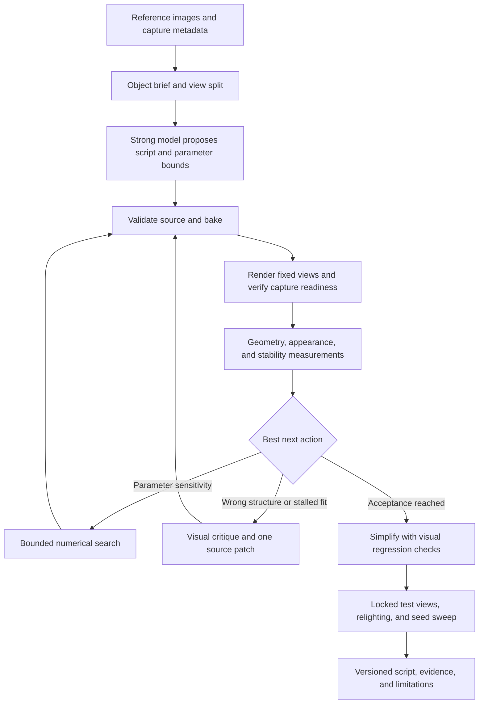

# AI authoring and refinement of photoreal object scripts

Date: 2026-09-28. Status: proposed; research and design only.

Task: `clear-summit-89`. Author: Codex, profile `deep-high-codex`, after AQ
capacity spill from `deep-high-claude`. Despite the task's original “Fable”
title, this is not a Fable-authored result or a cross-model experiment.
Repository observations below refer to `33aa006c4028359b2949634f46d9c80a61d5b97f`.
No reference collection, model benchmark, engine build, or rendered accuracy
experiment was performed for this proposal. Numerical budgets and thresholds
below are proposed starting policies, not measured results.

## 1. Recommendation

Build an external controller around Matter's existing JS authoring, regeneration,
and capture tools. Ask a strong vision/coding model to infer a **small generative
program**, then improve it through measured renders. Separate three activities:

1. **Choose structure:** a strong model proposes an object family, its anatomy,
   a short script, and meaningful parameters. Keep two plausible structural
   hypotheses when photographs leave the hidden side ambiguous.
2. **Fit parameters:** a bounded numerical search adjusts proportions and surface
   statistics within that structure. Most iterations should not require an LLM
   to rewrite JS or reread the entire conversation.
3. **Repair and simplify:** a vision model examines the worst views and proposes
   one causal edit when parameter fitting stalls. After visual acceptance,
   remove unnecessary code while preserving held-out views and seed behavior.

Start with opaque rocks and wood, then move to thin foliage and mushrooms.
Fine geometry, material appearance, and lighting must be evaluated separately;
otherwise the controller can improve the photograph match by baking a shadow
into albedo, flattening an unseen side, or hiding missing geometry with noise.

Use Opus 5.5 as the **initial mixed-pipeline author/editor candidate**, with Astra
or Fable for difficult structural diagnosis and occasional independent critique.
This is a hypothesis to benchmark, not an established winner on Matter. Keep
single-model Astra, Fable, and Opus 5.5 baselines. Route routine numeric evaluation,
parsing, scoring, and rollback through ordinary code.



## 2. What exists in Matter today

These are implementation observations, not promises inferred from older designs.
Paths below are relative links from this document.

| Need | Existing seam and evidence | Consequence for this pipeline |
| --- | --- | --- |
| Procedural object source | `class … extends Part`, `static params`, `build(p)`; [Rock.js](../../projects/world_demo/objects/terrain/Rock.js), [MountainRock.js](../../projects/world_demo/objects/terrain/MountainRock.js), [ConiferTree.js](../../projects/world_demo/objects/vegetation/conifer/ConiferTree.js) | Generate actual Matter JS, with either voxel/CSG construction, analytic triangle construction through existing helpers, or reusable child parts. No new object language is needed. |
| Reuse and anatomy | [mountain_rocks.js](../../projects/world_demo/shared-lib/mountain_rocks.js) constructs fracture planes and bevels; [conifer.js](../../projects/world_demo/shared-lib/conifer.js) separates skeleton generation from representation | Retrieve a few relevant working examples. Prefer named domain helpers over thousands of emitted coordinates. Measure transitive new helper code as part of program size. |
| Deterministic evaluation | [script_host.cpp](../../MatterEngine3/src/script_host.cpp), `new_bake_context`, `derive_seed`, canonical parameter merging; [rng.js](../../MatterEngine3/shared-lib/rng.js) | QuickJS bake contexts exclude ambient Date/OS/network APIs and install seeded randomness. Explicit object RNG streams are still needed to keep a roughness edit from rerolling shape. |
| Source identity and dependencies | [script_host.cpp](../../MatterEngine3/src/script_host.cpp) folds transitive shared imports; [script_host.h](../../MatterEngine3/src/script_host.h) exposes bake and retained-geometry results | Record source closure, canonical parameters, and dependency identity. Do not use filename/mtime alone as an evaluation-cache key. |
| Procedural surface | `MountainRock.static surface(p)` returns a versioned recipe; [mountain_rock_material.js](../../projects/world_demo/shared-lib/mountain_rock_material.js) supplies correlated color, roughness, occlusion, height, and `heightRange`, with footprint filtering | Use the existing surface expression API. `height` is not a promise of silhouette displacement. Keep physical feature sizes in metres and check VT density at the intended camera distance. |
| World fixture | [RockFormationProof.js](../../projects/world_demo/scenes/texturing/terrain/RockFormationProof/RockFormationProof.js) demonstrates roots, camera, and lights | Add a dedicated single-object evaluation world during implementation, with controlled background and lights. Workbench is useful interactively; a production-world fixture is easier to attest through scene APIs. |
| Machine control | [agent-protocol.md](../agent/agent-protocol.md), [matter_agent.py](../../tools/matter_agent.py), registration in [main.cpp](../../MatterEditor/src/main.cpp) | Reuse typed results and revision guards for discovery, provenance, parameter updates, jobs, and captures. Batches are sequential, bounded, and non-transactional. |
| Parameter fitting | [procedural_parameters.cpp](../../MatterEditor/src/procedural_parameters.cpp), protocol section “Regeneration jobs” | `procedural.update` accepts declared scalar fields with matching JSON types; it is a session-only, root-module override. Arrays/nested objects and duplicate roots of one module are refused. Ranges are unavailable. Persist selected parameters to source explicitly. |
| Capture and replay | [drive.py](../../MatterEngine3/tools/drive.py), [control-surface.md](../agent/control-surface.md), [issue-system.md](../agent/issue-system.md) | Fixed cameras, presented-frame waits, PNG completion markers, strict issue replay, and hidden-window rendering exist. This is GPU automation, not a display-free CPU renderer. |
| Diagnostics | [editor_props.cpp](../../MatterEditor/src/editor_props.cpp), `kDebugViewLabels`; [vt_acceptance.py](../../tools/vt_acceptance.py); [geometry_paging_report.py](../../tools/geometry_paging_report.py) | Normals, depth, raw albedo, LOD, and wireframe views aid diagnosis. VT/paging traces supply partial readiness/performance evidence; they are not an object-quality score. |

### Renderer constraints that change the design

VG is opt-in here. `MATTER_GEOMETRY_PAGES=1` admits eligible static standalone
leaf meshes to binary hierarchy pages; assemblies, animation, and shared-surface
parts retain other paths. See `PartStore::stage_from_snapshot` and
`stage_geometry_cached` in [part_store.cpp](../../MatterEngine3/src/render/part_store.cpp).
Use `MATTER_GEOMETRY_MODULE` to isolate a dense pilot. Do not assume every
procedural object automatically uses VG, or that a dense source mesh makes a
particular fine page resident when a screenshot is taken.

VT and geometry are separate quality constraints. Higher
`static vtTexelsPerMeter` requests more texture detail but does not guarantee
atlas fit or physical residency. The documented surface-detail POM path changes
shading, not the silhouette. Real chips, deep cracks, branch forks, and rim
damage belong in geometry; grain and shallow pores generally belong in the
surface recipe. The reference [surface_displacement.h](../../MatterEngine3/src/geometry/surface_displacement.h)
is a C++ bake utility, not evidence for an arbitrary JS displacement API.
Do not invent one in generated scripts.

Both `render_path raster` and `render_path native_rt` exist; the latter explicitly
fails when RT is unavailable. Beauty acceptance must name the intended shipping
path, GI/DLSS settings, LOD policy, and actual device. Compare both paths for
geometry/material regressions, without expecting their lighting to be identical.
`MATTER_GEOMETRY_RASTER_ONLY=1` omits page BLAS work and requires a restart to
restore it; it is unsuitable for a later RT acceptance pass in the same process.

Some procedural material work requires renderer services: the direct/finite
source paths in [local_provider.cpp](../../MatterEngine3/src/provider/local_provider.cpp)
can report unavailable services. A successful headless JS/bake check is therefore
an early gate, not proof that the final textured object rendered correctly.

## 3. Define the object before fitting it

Distinguish **several views of one specimen** from **several specimens of a
category**. Only the former support pixel correspondence to one fixed seed.
For category images, fit shared rules and distributions with one latent seed
per specimen; evaluate a fresh seed population. Never demand that one pinecone
simultaneously match incompatible cones in different photos.

For each reference, retain the original image/hash, rights/provenance, specimen
ID, mask plus confidence/uncertain boundary, scale evidence, camera estimate,
lighting estimate, and crop/color transforms. Separate observations (“three
visible branch junctions”) from hypotheses (“likely a fourth behind the trunk”).
Ask for missing views only when they would settle a material ambiguity; otherwise
carry uncertainty into the result. Do not score an invented backside as measured
reconstruction accuracy.

Estimate camera and lighting before detailed shape fitting. Use shared camera
intrinsics for a turntable sequence, bounded per-view poses, and a scale anchor.
Fix exposure/white balance from a card where available. First fit silhouettes
and landmarks with a plain material, then broad albedo/roughness, then fine
detail. Camera, lighting, and object edits have separate budgets and logs.
Freeze nuisance parameters after calibration; unlimited per-candidate image
warps or exposure fitting would conceal geometry/material errors.

Define an authoring contract outside JS, versioned with the object:

- Named parameters, units, bounds, defaults, discrete/continuous type, and
  expected effect; initially 6–12 influential parameters.
- Separate `shapeSeed` and `surfaceSeed` concepts, mapped to declared scalar
  fields; use explicit `rng(seed)` calls for independent streams. The current
  host RNG also incorporates merged parameters, so relying on its default
  stream would couple numeric tuning to random shape changes.
- Physical invariants: bounds, positive thickness/radii, permitted branching,
  connectedness where required, material assignments, and plausible scale.
- Resource limits: bake deadline, maximum source/generated geometry, artifact
  bytes, VT density, and GPU memory on a named device/profile.
- A readability rule: clear names and comments for anatomy; no minification,
  encoded meshes, giant lookup tables, or camera-dependent geometry cheats.

Reuse the project's proven `static requires`/child patterns where useful. Do
not create one unique child parameter set per leaf when a small prototype set
will do. Preserve anatomical positions across LOD changes and vary representation
after generating the skeleton, as the conifer implementation demonstrates.

Small scripts are an objective **subject to fidelity**, not an unconditional
line-count target. Report root non-comment tokens, total new reachable helper
tokens, dependency bytes, AST complexity, and a human readability rating. Freeze
the shared library version during a benchmark. Library extraction is accepted
only when several objects reuse a coherent operation and regressions pass;
moving 2,000 lines into a helper does not make a 20-line object “small.” This
proposal's library-learning rationale is inspired by [DreamCoder](https://arxiv.org/abs/2006.08381),
not a claim that Matter already implements program induction.

## 4. A capture contract strong enough for optimization

### Existing command sequence

Build the canonical MSVC editor once, through
`./tools/build-windows-from-wsl.sh RelWithDebInfo matter_editor` from WSL or
`tools/build-windows.ps1 -Config RelWithDebInfo -Target matter_editor` from
PowerShell. Never rebuild while that executable is running. The following is
a **capture plumbing example**, using an existing world, not a photorealism gate.
Create `C:/tmp/object-fit/run-001` first; paths are native Windows paths.

```text
wait_event bake.finished 120
wait_idle 2 120
pause
render_path raster
dlss native
set viewer.debug.debug_view_mode 0
set viewer.budget.pixel_budget 1
set render.lighting.exposure_ev 0
cam 10 9 14 0 0.4 0
wait_frames 90
stats front
shot C:/tmp/object-fit/run-001/front.png
cam -10 9 14 0 0.4 0
wait_idle 2 120
wait_frames 90
stats reverse
shot C:/tmp/object-fit/run-001/reverse.png
quit
```

From repository root in native PowerShell, with that text saved as `views.txt`:

```powershell
py -3 MatterEngine3/tools/drive.py --world RockFormationProof `
  --editor MatterEditor/build/windows-msvc/editor.exe `
  --timeline C:/tmp/object-fit/run-001/views.txt `
  --out-dir C:/tmp/object-fit/run-001 --hide-ui --timeout 600 `
  --env MATTER_HIDE_WINDOW=1 `
  --env MATTER_WINDOW_WIDTH=1024 --env MATTER_WINDOW_HEIGHT=1024 `
  --env MATTER_VT_TRACE=C:/tmp/object-fit/run-001/vt.jsonl
```

`drive.py` supplies `cwd=MatterEditor/` and TMP/TEMP, clears old expected PNGs
and `.done` files, and checks process exit plus shot completion. Explicit
`--editor` is necessary: the script's default still names `build/windows`,
whereas onboarding names `build/windows-msvc`. Use native Windows Python;
the script rejects MSYS2/Cygwin Python. For a direct WSL launch, pass required
variables through WSL interop and use Windows paths inside the editor.

The example's 90-frame hold is merely a starting value. `wait_event` and
`wait_idle` timeouts continue the FIFO script rather than failing its exit code.
Reject timeout/abort/unknown-command/property-refusal messages, missing images,
wrong dimensions, empty-object shots, and nonzero process exits. Put the initial
`bake.finished` wait before `wait_idle`. After a `world` switch, prefer job/session
tracking; an immediately following bake-event wait can subscribe to the old
session. `history_reset` resets atmosphere history, not every temporal subsystem.

### Preferred interactive optimization loop

Use [the typed protocol](../agent/agent-protocol.md) once the fixture is running:

1. Discover with `agent.commands`/`agent.schema`; locate the baked root via
   `scene.list_objects`, inspect `procedural.parameters`, and trace provenance.
2. For scalar proposals, `procedural.update` with `dry_run:true`, then apply
   with `expect.scene_revision`. Wait for the returned `job_id` using `job.wait`.
   Job completion attests a successful bake, not converged GPU appearance.
3. Reacquire the object identity: a baked-root ID is its resolved hash and can
   change after rebake. Use logical module identity and current listing, not
   a cached numeric ID. Record a scene snapshot/content digest.
4. Apply a fixed camera through `cam`, wait for presentation and the readiness
   policy below, then call `viewport.capture` to a unique absolute PNG path.
   Clear selection and use `annotate_selection:false` for scoring.
5. Require the terminal `ok` result, decoded PNG, and completion marker. Store
   **`captured`** frame/view context and image/viewport mapping; the result
   envelope's completion-time context can refer to a later frame.
6. For source changes, atomically replace only the candidate's allowed files,
   then request `job.start` with `operation:"reload"`; use a fresh process if
   source/provenance attestation disagrees. For reproducible world regeneration,
   `operation:"regenerate"` requires a decimal-string seed. World seed and an
   object's explicit `p.seed` are different inputs; verify both through source
   and provenance rather than assuming one controls the other.

There is one in-flight viewport capture, so the controller serializes it.
`view.focus` is useful for exploration but changes framing with object bounds;
use fixed benchmark cameras for scoring. Workbench captures can show an isolation
world while scene/pick APIs describe the production world; the protocol rejects
some such combinations. Use a dedicated ordinary world for the automated loop.

### Reproducibility and readiness

Persist a manifest for every candidate/view: source closure SHA-256, canonical
parameters and seeds, engine/binary/shader identity, camera pose **and projection**,
framebuffer and viewport dimensions, lighting/color settings, render path, LOD,
VT/VG settings, temporal policy, GPU/driver, cache mode, command transcript,
job result, capture result, image hash, and metric versions. `cam` sets only eye
and target; current startup FOV is 45 degrees in `main.cpp`, and strict issue
replay restores recorded projection. An explicit general camera-intrinsics setter
is a gap for calibrated photo reconstruction. Verify projection in capture metadata.

Use two levels of evidence:

- **Available now:** fixed fixture and camera; no animated wind/water/particles;
  explicit pause; settled bake; fixed frame holds; repeated fresh-process captures;
  VT trace and paging logs; diagnostic images. Inspect actual returned dimensions
  rather than trusting window-size requests. Archive strict issue replay state
  for troublesome views, but record full settings separately because the issue
  property dump describes modified properties at filing time.
- **Required for strong automatic acceptance:** a per-view readiness record tied
  to the captured frame, covering desired/visible geometry cut and BLAS readiness,
  required VT pages/content revisions, pending refinement, and temporal history.
  Global sector count and flat pixel differences cannot prove this: a stalled
  texture can be perfectly stable. Until this record exists, mark the run
  `capture_confidence: provisional` and require diagnostic/manual confirmation.

Measure the render noise floor on an unchanged script with at least five repeats.
After each camera/material change, compare three successive sampled images,
separated initially by 30 presented frames, to that baseline. Require stable
content identity, no new page failures, and no persistent queues in the fixed
fixture, in addition to image stability. Use a 120-second readiness deadline;
on expiry classify **infrastructure/unconverged**, not “bad object.” Do not give
the model feedback that encourages it to erase detail to meet a stuck capture.
Reset with a fresh process for final comparisons when history cannot be attested.
Bitwise identical geometry does not imply bitwise identical RT screenshots across
devices. Publish same-device tolerances and separate cross-device results.

VT traces are written at shutdown, and their GPU timing is the latest retired
readback, not necessarily the current presentation. Analyze completed pilot runs
with `tools/vt_acceptance.py`; use a future live readiness API for online gating.
`tools/geometry_paging_report.py` aggregates CPU stage timings, not a proof of
visible-detail completion. Do not sum overlapping pipeline timings as frame time.

## 5. Feedback that converges instead of oscillating

### Measure different causes separately

Store a score vector and hard-gate failures. A single semantic similarity score
is too easy to satisfy with a generic object of the right class.

| Measurement | How to use it | Guard against a misleading score |
| --- | --- | --- |
| Silhouette | Mask IoU; symmetric contour distance normalized by reference bounding-box diagonal; report mean and worst view | Background removal and thin/uncertain edges need reviewed masks. Exclude uncertain pixels explicitly; do not silently shrink the mask. |
| Structure | Landmark reprojection error, width/height ratios, branch or lobe counts, gap/negative-space masks; depth/normal consistency when measured ground truth exists | A photo does not provide true normals/depth. Monocular predictions are weak priors with confidence, not ground truth. |
| Appearance | Masked, aligned multi-scale LPIPS; SSIM/pixel difference for repeatability and controlled same-light captures; color and local contrast statistics | LPIPS needs consistent preprocessing/model weights. Use the same neutral background outside both masks; include a contour penalty so a wrong silhouette cannot disappear from the loss. |
| Surface detail | Frequency-band energy, anisotropy, feature spacing in metres, and close-up crops; compare weathering location to geometry | Added high-frequency noise can improve texture statistics while making the object less real. Require cross-scale and relighting review. |
| Materials/lighting | Raw albedo and normal diagnostic views, roughness behavior under broad versus raking lights, highlights, contact/shadow consistency | Shaded PNGs alone cannot uniquely identify roughness or albedo. Keep light/exposure fixed after calibration; no painted-in highlight/shadow shortcuts. |
| Engineering | Valid JS/bake, finite geometry, expected bounds, resource limits, deterministic provenance, LOD/view stability | A failed render has unavailable quality metrics, never zero error. Small scripts with explosive runtime are rejected. |
| Human judgment | Blind paired reference/render review for identity, plausibility, material, and readability | Keep the judge independent of the author and hide model names. Record disagreement rather than averaging it away. |

[LPIPS](https://richzhang.github.io/PerceptualSimilarity/) supplies a learned
perceptual comparison; it is not a calibrated photorealism probability. Avoid
FID for an eight-object paired benchmark. Semantic embeddings may triage a wrong
category, but should not determine geometric acceptance.

The current debug PNGs are useful visualizations, not promised linear, floating
point ground-truth channels. Object-ID masks, linear color, normal/depth, and
roughness export are explicit implementation gaps. Before those exist, use a
controlled background plus externally reviewed segmentation and keep confidence
flags; do not claim precise metric depth from a displayed depth screenshot.

### Controller policy

The proposed controller state machine is:

```text
brief -> choose_structure -> validate -> bake -> settle -> measure
measure -> numeric_search | source_patch | simplify | finish | stop_with_reason
any invalid candidate -> retain incumbent and record failure
any capture failure -> bounded infrastructure retry, without a creative edit
```

Keep an incumbent and at most two alternatives. Start at 512-pixel views and
moderate geometry/VT detail; promote only promising candidates to the fixed
1024-pixel scoring profile and close-up RT views. Never compare scores from
different fidelity profiles as though they were the same measurement.

For numeric search, first perturb each active parameter by a small bounded
amount (initially 5% of its range) with fixed random streams. Estimate which
measurements change. Use coordinate/pattern search for up to about eight active
continuous parameters; introduce a Bayesian or evolutionary search only if a
pilot shows it improves quality per render. Enumerate small discrete choices
such as branch count separately. JS topology, CSG, remeshing, LOD selection,
and streaming are not one differentiable pipeline. Differentiable reconstruction
can provide an optional shape prior, but its mesh is not the required readable
script; [nvdiffrec](https://nvlabs.github.io/nvdiffrec/) is an example of the
separate geometry/material/light optimization problem, not a drop-in Matter solver.

Use a weighted loss only **inside a stage**. For calibrated rigid objects, start
shape fitting with `0.5*(1-IoU) + 0.3*contour_error + 0.2*landmark_error`, with
distances normalized and missing terms explicitly unavailable. Lock its geometry
gates before appearance fitting. For overall candidate selection, use mean loss
plus a worst-view penalty (initial weight 0.25) and reject material regressions
above the measured noise tolerance on any validation view. Report the raw vector;
never conceal a bad side behind an average. Calibrate weights on pilots only.

Send a VLM a small comparison packet at plateaus: labeled reference and render
contact sheets, identical crops, masks/diagnostic views, parameter values, source
excerpt, metric deltas, and known renderer limitations. Request at most three
ranked findings in this proposed output schema:

```json
{
  "finding": "upper silhouette is too round",
  "views": ["azimuth_045", "azimuth_090"],
  "region_uv": [0.2, 0.05, 0.8, 0.4],
  "cause": "geometry",
  "confidence": 0.8,
  "evidence": "contour protrudes at the ridge in both views",
  "edit": "increase the dominant fracture plane extent",
  "parameters": ["ridgeWidth"],
  "predicted_effect": "reduce top contour error without changing albedo"
}
```

This is a controller contract, not an existing engine command. The controller
validates parameter names and applies one edit family at a time. A critique must
distinguish geometry/material/light/camera/render-readiness causes, name evidence,
and predict a measurable change. An A/B render decides whether to keep it.
Rollback on regression; hash candidates to avoid cycles. After two rejected
structural repairs, return to the alternate hypothesis or stop with a limitation.

Cache evaluations by full source/parameter/render/reference/metric identity.
Cache extracted reference features separately. Maintain a short ledger of tested
hypotheses and rejected edits instead of an ever-growing transcript. Reuse the
editor for fitting only after proving hot-reload equivalence to a clean start.
Serialize work on one GPU; measure any future concurrent scheduling separately.

### Stop, simplify, and generalize

Before the benchmark, freeze class-specific acceptance bands using pilot renders
and human judgments. Initial proposed targets for calibrated opaque objects:
mean silhouette IoU at least 0.90, worst-view IoU at least 0.85, mean normalized
contour error at most 0.02, and measured major dimensions within 5%. Thin foliage
needs its own mask/boundary bands. LPIPS thresholds must be calibrated against
acceptable same-specimen renders and the noise floor; no universal value is
asserted here. Human identity and material ratings must both reach at least 4/5.

Stop successfully only when geometry, appearance, resource, readability, and
variation gates pass. Stop unsuccessfully/provisionally when a hard budget is
spent, captures remain untrustworthy, or three full candidate rounds yield less
than `max(1% normalized loss, 2 * measured repeatability spread)` improvement.
Escalate at most once before a plateau stop. Retain the best verified candidate,
its residual errors, and the reason. “The critic likes it” is not a stopping rule.

Then simplify: remove one feature/helper/branch at a time and rerender the fixed
development suite. Accept compression only within calibrated visual tolerances
and with all physical invariants intact. Check default, boundary, and ten fresh
seed cases for finite geometry and plausible anatomy; render every seed from
at least three directions and selected boundary settings from the full view set.
Report diversity and failure rate. Exact seed reruns should reproduce content;
different seeds should vary the intended details while preserving family identity.

Use fitting views, development-validation views, and a **locked final test**.
Validation can guide selection and is therefore not an unbiased final score.
Reveal locked views once for the frozen candidate. If they trigger edits, record
the failed test and require new locked evidence; do not relabel the same images
as unseen. Include top/back/underside views, a grazing close-up, a second light
rig, and farther LOD views. For single-photo inputs, final results are plausible
extensions with explicitly unverified hidden geometry.

## 6. Benchmark accuracy, speed, and cost together

### Small reference set

Collect eight real specimens: rounded river stone, angular fractured rock,
bark fragment, forked driftwood, pinecone, mushroom, broad leaf, and conifer sprig.
This samples smooth versus faceted geometry, correlated texture, branching,
repeated structures, and thin/translucent material limits. Keep at least two
separate calibration fixtures outside this set, including one known procedural
object rendered from a known script to test parameter recovery and capture repeatability.

For each real specimen, collect 12 calibrated views: eight azimuths, two elevated
obliques, top, and underside where physically accessible. Predeclare six fitting,
three development-validation, and three locked test views, ensuring different
elevations appear in the held-out sets. Add measured dimensions and two matched
relighting views; reserve one light condition for final review. Store masks and
uncertainty; use scans/depth only where actually measured. Category-only and
uncalibrated-photo cases form a separate exploratory track, not pooled accuracy.

### Runs and ablations

| Arm | Model policy | Purpose |
| --- | --- | --- |
| A | Astra (`gpt-6-astra`) for authoring and critique | Frontier OpenAI baseline |
| B | Fable, exact available provider model/version pinned at run time | Frontier Anthropic baseline |
| C | Opus 5.5, exact provider model/version pinned | Test the reported coding/visual efficiency advantage |
| D | Opus 5.5 author/editor, deterministic numeric search, Astra structural escalation; Fable as an optional separately labeled critic variant | Test a practical mixed pipeline; do not pool distinct routing recipes |

Run A–D on all eight objects with three independent authoring trials each:
**96 runs**. All arms use the same retrieval bundle, numerical controller,
training views, scoring profiles, parameter/resource constraints, and escalation
budget; in A–C an escalation stays with that arm's model. D's optional Fable
critic is a later named variant, not part of the initial 96. Object variation
seeds are identical across arms and distinct from authoring trial IDs.

Separately run three ablations on the two calibration fixtures, three trials
each (**18 pilot runs**): one-shot generation, VLM-only iterative edits, and the
full mixed loop. Match the maximum spend/time and report actual usage; a one-shot
arm need not waste its unused budget. Add the compression pass as a before/after
comparison of the same accepted program. This estimates feedback/optimization
benefit without multiplying the entire model matrix. It is exploratory evidence;
confirm a promising effect on the locked benchmark before generalizing it.

Starting per-run limits: 45 minutes end-to-end, US$15 billed model usage, 16 model
calls, 60 complete candidate fitting sweeps, and two structural restarts, whichever
is reached first. One sweep means all six fitting views at one declared fidelity;
individual renders, extra validation, repeatability samples, and failures are
also charged and counted. Use the same fixed GPU, serialized rendering, frozen
engine/library/prompt versions, and randomized arm order. Report warm-cache fitting
and a fresh-process/cold **application-cache** final pass separately; an empty
application cache is not proof that OS or driver caches are cold.

Resolve provider IDs, reasoning settings, image detail, and rate limits before
launch. “High” across providers is not an equal compute budget: compare measured
cost and elapsed time. Record requested and observed model, fallback/reroute,
usage, and failure status per call. A rerouted trial is a separate arm or an
inconclusive model comparison, never silently credited to the requested family.

### Scorecard and decision rule

- **Accuracy:** locked-view geometry/appearance vector; worst-view errors;
  blind human pairwise preference and 1–5 identity/material ratings from at least
  three raters; variation failure rate; complexity/readability; engineering
  acceptance rate. Include all failed runs in denominators.
- **Speed:** time to first valid render, time to the predefined acceptance band,
  end-to-end p50/p90, and stage breakdown: model, JS/bake, page/BLAS/VT readiness,
  capture, metrics, and queue wait. A budget-exhausted run is censored/failed,
  not an omitted slow sample. Show quality-versus-time curves.
- **Cost:** provider-reported input, cached input/cache writes, output/reasoning
  usage as billed, image/tool charges, retries, and all author/critic calls;
  GPU-hours and human minutes separately. Report total experiment cost divided
  by accepted objects, plus quality-versus-dollar curves and artifact/runtime cost.

Use paired per-object differences and bootstrap intervals clustered by specimen;
views and seeds from the same specimen are not independent object samples.
Report trial dispersion and thin-object failures explicitly. Eight objects cannot
establish universal model superiority. Choose the cheapest/fastest point that
meets the required quality band; keep the Pareto frontier when no arm dominates.
If intervals overlap materially, prefer the simpler policy pending more cases.

### Model evidence and cost accounting

Official sources checked on 2026-09-28 describe Astra as the highest-capability
OpenAI option and Sol/Luna as lower-cost tiers; that is a routing prior, not a
Matter result. [OpenAI model catalog](https://developers.openai.com/api/docs/models)
and [Astra model page](https://developers.openai.com/api/docs/models/gpt-6-astra).

Anthropic's [Opus 5.5 announcement](https://www.anthropic.com/claude-opus-5-5)
reports improved coding performance and efficiency, with standard input/output
rates of $4/$20 per million tokens. Its vendor benchmarks do not measure Matter
script fidelity. [Fable's model page](https://www.anthropic.com/claude/fable)
identifies the Fable family and 5.1 release; pin the actual accessible model and
fetch its rate card before a trial rather than assuming a local profile alias.

As an illustrative text-only call, 20,000 uncached input tokens and 4,000 output
tokens cost $0.40 on Astra at $10/$50 per million, versus $0.16 at the cited Opus
rates. This excludes images, caching, service-tier/context adjustments, tools,
and any additional billed usage. Use the dated [OpenAI pricing table](https://developers.openai.com/api/docs/pricing)
and actual provider bills for experiments. Do not project dollars from number
of turns or treat subscription usage as free API usage.

The mixed policy spends frontier inference on ambiguity and structural repair,
not on every scalar nudge. Test a lower-cost model for schema checking or simple
critique triage only after measuring its false-accept rate; deterministic code
already handles schema validation. Final judgment remains blind measurement
plus human review, rather than an author grading its own work.

## 7. Implementation packages and explicit gaps

The following are proposed follow-up work, not files or APIs implemented here.

| Order | Deliverable | Acceptance evidence |
| --- | --- | --- |
| P0: capture calibration | Single-object world fixture, reference manifest, frozen render profile, fresh-process capture runner reusing `drive.py`/`matter_agent.py` | Five identical-source repeats; same provenance/dimensions; measured image noise; injected timeout/stale PNG/unsupported RT refuses quality scoring. |
| P1: readiness and channels | Frame-linked readiness contract; explicit camera projection control; object mask and linear diagnostic exports; complete render-setting snapshot | Deliberately missing VT/geometry page cannot pass as stable; capture metadata identifies the actual frame; known geometry validates mask/depth/normal conventions. |
| P2: controller and metrics | External candidate store, bounded parameter search, source patch/rollback, metric packet and cost ledger | Known procedural fixture recovers proportions within declared tolerances; stale IDs, unsupported overrides, invalid JS, and budget exhaustion preserve the incumbent and report the cause. |
| P3: model benchmark | Frozen eight-specimen set and pilot ablations; reproducible prompts and provider usage records | Complete scorecard including failures, observed model identity, confidence intervals, and held-out evidence. No ranking from illustrative examples. |
| P4: compact family library | Compression and seed/parameter validation; documented object families | Human can explain/edit the generator; transitive code decreases without visual regression; ten fresh seeds and parameter boundaries satisfy family invariants. |

P0 and a provisional P2 can use existing tools immediately. Strong unattended
acceptance depends on P1; it should not be hidden inside an arbitrary “wait 90
frames.” No engine change is necessary to submit this design, and no new engine
code is part of this task.

Other known limits to surface in results:

- No supplied reference set or measured camera/light calibration exists for this
  task. Image generation could illustrate concepts, but generated reference views
  would not establish real specimen accuracy and are unnecessary here.
- The current protocol does not persist arbitrary source edits or supply parameter
  ranges. Controller-owned schemas and source transactions are required. A model
  may modify candidate code, never the scorer, reference masks, held-out split,
  or capture settings to improve its score.
- There is no verified gradient path from pixels back through arbitrary Matter
  JS/CSG/meshing. Use black-box search and small structural edits first.
- Thin leaves, translucent mushroom tissue, wet surfaces, and dense foliage may
  expose material/transport limitations. Establish them with controlled reference
  fixtures before blaming authoring. Do not promise path-traced/offline fidelity
  from an unverified real-time RT configuration.
- VG/VT/RT combinations need their own acceptance evidence at the intended object
  density. More triangles, more VT texels, or a smaller JS file alone prove none
  of photorealism, predictable startup, or affordable runtime.

The review decision requested is whether to proceed with P0–P2 and the proposed
budgeted benchmark. It does not approve a production rollout or assert that any
model has already met the photorealism target.
