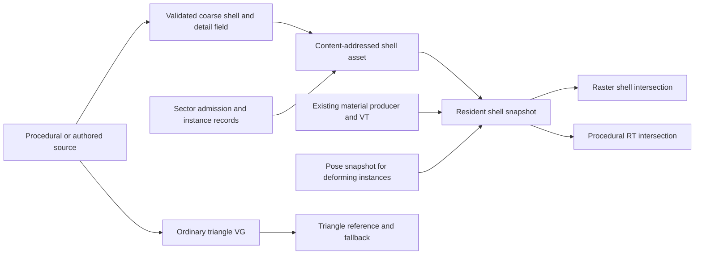

# DASHR for Matter Engine: initial design proposal

Status: research proposal, not an approved implementation plan. Task: `crisp-orbit-37`.
Research date: 2026-09-28. No engine changes or new performance measurements accompany this document.

## 1. Recommendation

Prototype DASHR as an **optional surface representation for one closed, displaced
rock asset**, then test a small set of its instances in StreamMountain. Keep the
existing triangle path as the reference and fallback. Do not replace the world
streamer, general virtual geometry (VG), virtual texturing (VT), or the ray-tracing
scene with DASHR.

The useful opportunity is to stop materializing fine surface relief as triangles:
retain a coarse control mesh and store detail as a height field. DASHR supplies a
mapping that follows the curved, potentially skinned control surface and crosses
UV seams. For suitable assets this could remove fine-triangle hierarchy cooking,
fine geometry pages and their BLASes, while retaining the existing material
producer and much of VT. Its strongest incremental contribution to Matter is the
curved/deforming mapping, compared with our existing chart-local and connected POM.
It does not itself supply a new streaming or LOD system.

The first decision is whether the representation saves **total** memory and frame
time at matched quality. The present measurements make a blanket speedup claim
untenable: both G-buffer shading and height marching are already expensive.
Evaluate accelerated conventional relief alongside DASHR so we can tell whether
the mapping earns its extra reads and storage. Keep POM off in the ordinary
StreamMountain configuration throughout the experiment.

### Evidence boundary

- Matter source reviewed: `ba5f8d82b79ecdd69bff9b5bdc302bcad032f14e`, the
  `origin/vg-vt-improvements` commit from which this task branch was prepared.
  The local `vg-vt-improvements` ref was `d006f20e`, an ancestor of that commit.
  Source references below describe this snapshot, not future branch work.
- DASHR reviewed: v1.0, announced September 27, 2026;
  [`9cf55d4c989a4ff7974dc1360e58027e739099f2`](https://github.com/tomforsyth1000/DASHR/tree/9cf55d4c989a4ff7974dc1360e58027e739099f2).
  Read the paper, preprocessing and allocation code, rendering/animation shaders,
  project configuration and bibliography. This was source review, not execution
  of the supplied Windows binary.
- Current cost evidence is the
  [StreamMountain attribution report](../findings/streammountain-frame-attribution-2026-09-27.md)
  from `smart-torrent.17`, including its Task 18 addendum, interpreted against the
  [smart-torrent stabilization plan](../superpowers/plans/2026-09-27-vg-vt-stabilization-and-measurement.md).
  The older [work queue](../vg-vt-work-queue-2026-09-19.md) lists hypotheses and
  historical estimates; it is not a substitute for those measurements.
- Sections describing the proposed Matter integration are engineering inferences.
  Neither upstream DASHR nor this task demonstrates them in Matter.

## 2. What DASHR actually implements

DASHR means *Dynamically Animated Skinned Heightfield Rendering*. The
[paper](https://github.com/tomforsyth1000/DASHR/blob/9cf55d4c989a4ff7974dc1360e58027e739099f2/paper/DASHR_Paper.html)
connects two spaces: ordinary post-skinning object space, in which a ray is
straight, and surface space `(u, v, h)`, in which a height field is easy to sample.
The control surface lies at `h = 0.5`; its normal length defines shell thickness.
The mapping is sampled using an estimate of the surface coordinate, then refined
while the height intersection is refined. This combined iteration is the core
technique, rather than a novel height-field traversal accelerator.

### Representation and cook

The demo takes a coarse indexed triangle mesh with a unique, non-overlapping UV
atlas, smooth displacement normals, and skin weights. It builds physical tangent
and bitangent vectors whose **lengths and directions** describe the UV-to-object
mapping. Ordinary normalized normal-map tangent frames are insufficient.

Preprocessing then:

1. Rasterizes the control mesh into atlas space and reads back coverage once.
2. Finds coincident vertices and paired seam edges in object space.
3. Builds a teleport map: destination UV across each seam plus a signed distance
   indicating when a ray has stepped outside the current chart.
4. Builds an edgefill map: where a gutter texel should obtain valid mapping data.
5. Flood-fills these maps and uploads them. The coverage scratch can be discarded.

The seam SDF is filtered, but teleport destination UVs are point-sampled because
interpolating unrelated destinations is invalid. Teleporting precedes mapping
refinement, which corrects the quantization error. Edgefill and teleport serve
different purposes and cannot be substituted for one another.

This is asset setup code, not an offline asset compiler with a versioned disk
format, import pipeline, resource budgets or asynchronous streaming. The demo
constructs its tube/cube variants procedurally. A Matter cook must supply those
missing production contracts. Evidence:
[`main.cpp`](https://github.com/tomforsyth1000/DASHR/blob/9cf55d4c989a4ff7974dc1360e58027e739099f2/demo/main.cpp)
(`CreateModel`, `GenerateTangentSpace`, `CreateTextures`, `CreateTeleportEdgefill`).

### Per-frame rendering and LOD

The demo executes three passes:

1. Skin the control mesh and render its inverse mapping into four distortion
   targets in UV space. The preferred mode stores an inverse 3×3 basis and an
   object-space anchor, avoiding interpolation problems with a full affine map.
2. Edgefill those targets into another set of four targets. Finite differences
   measure animation-induced stretch/compression and write two additional values.
3. Rasterize the outward-extruded shell. Each fragment starts a camera ray with
   a known surface-space seed, follows the mapping and teleports until a height
   hit or shell escape, shades the hit, and optionally marches a local shadow ray.

The marcher increases object-space step size with distance above the height
field. Stretch above a heuristic threshold damps corrections; negative distortion
slows steps markedly. These measures mitigate, rather than prove correctness for,
folds and self-intersections. There is no cluster tree, cone/min-max hierarchy,
automatic view-dependent cut, page feedback or residency scheduler in this demo.
Height and mapping reads use explicit mip zero, and the created textures have one
mip level. The paper suggests fading height toward `0.5` with distance and then
switching to a normal-mapped mesh; that is a proposed LOD policy, not an implemented
world-scale selector or a demonstrated antialiasing solution.

`TraceRay` has a 10,000-iteration emergency cutoff, with additional diagnostic
controls. A production port needs a much smaller measured work budget and a
defined representation fallback; returning a miss at exhaustion would create holes.

Two important gaps in the supplied shader:

- `PipelineMain.hlsl::ps_main` outputs color and discards misses; it does not
  output `SV_Depth`. `main.cpp` labels shader-depth alpha modes TODO. Consequently
  ordinary successful fragments write shell depth, not the marched intersection
  depth. Matter must implement hit depth, G-buffer position/normal and motion
  consistently before comparing overlapping objects or RT lighting.
- Its local shadow march stops on leaving the shell. It does not find another
  object, or a later re-entry into a disconnected portion of the same shell.

Sources: [mapping pass](https://github.com/tomforsyth1000/DASHR/blob/9cf55d4c989a4ff7974dc1360e58027e739099f2/demo/PipelineDeform.hlsl),
[edgefill pass](https://github.com/tomforsyth1000/DASHR/blob/9cf55d4c989a4ff7974dc1360e58027e739099f2/demo/PipelineEdgefill.hlsl),
[main pass and `TraceRay`](https://github.com/tomforsyth1000/DASHR/blob/9cf55d4c989a4ff7974dc1360e58027e739099f2/demo/PipelineMain.hlsl).

### Memory, GPU requirements and maturity

The default mapping resolution is 256×256, independent of the high-resolution
height/albedo images. The actual allocation, excluding materials and geometry, is:

| Resource | Demo format/count | Bytes per mapping texel | At 256² |
|---|---|---:|---:|
| Temporary distortion | Four RGBA32F targets | 64 | 4 MiB |
| Edgefilled distortion | Four RGBA32F targets | 64 | 4 MiB |
| Teleport | RGB32F | 12 | 0.75 MiB |
| Edgefill | RGB32F | 12 | 0.75 MiB |
| **Total** | | **152** | **9.5 MiB** |

This is calculated from `main.cpp:2842–2849,3322,3370`, not a VRAM capture. Driver
padding, depth/scene targets, setup readback, mesh data and temporal copies are
additional. One thousand independently posed copies at these dimensions would
cost about **9.28 GiB** for these resources alone if allocated independently.
Static assets can instead retain their completed mapping, share it across rigid
instances, and reuse setup scratch: 5.5 MiB per unique asset at the demo formats,
before materials. That caching is a proposed integration optimization.

The paper suggests smaller formats, including normalized 16-bit UVs and a
separate lower-precision teleport SDF. FP16 mapping targets, compact frames and
shared scratch deserve experiments, but quantization error in an inverse mapping
can become visible geometric error. Do not put these fields through lossy BC color
compression without a separate error analysis. Reducing a 256² map to 128²
quarters this allocation but may erase small seams and destabilize traversal.

Upstream is a Windows/D3D11 raster demo with VS/PS shader model 5.0, float sampled
render targets and four MRTs. It requires neither mesh shaders nor hardware RT.
The device setup attempts feature levels 11.0 and 10.0, but shader compilation
targets `vs_5_0`/`ps_5_0`; that fallback is not evidence of full D3D10 support.
The solution's x64 configurations use v143 and expect adjacent ImGui/STB sources.
A Vulkan port must check format filtering/renderability and MRT limits, implement
barriers and frame ownership, and compile GLSL/SPIR-V through Matter's build.
Hardware RT is an additional requirement only for the RT experiment below.

This is a day-old research release at the inspected version. The author explicitly
positions it as a paper and proof of concept, not a maintained drop-in library,
and discourages benchmarking the unoptimized debug-heavy demo as a product.
The license is in the paper's **License and misc** section, even though there is
no top-level LICENSE file: a choice of MIT No Attribution (MIT-0) or the public
domain/Unlicense text. Any future import should record that source and separately
track dependency and texture-asset notices. No upstream code or assets are copied
by this proposal.

## 3. Matter today and the concrete simplification boundary

Matter has both a conventional part/cluster LOD ladder and an opt-in geometry-page
hierarchy. They must not be conflated. The sector-resolution bundle specification
is the intended direction; its header still says it is not fully implemented.
Existing banks and prepared-sector caches implement parts of that direction.

| Current subsystem and source evidence | DASHR effect for an admitted asset | What remains |
|---|---|---|
| [Geometry compiler](../../MatterEngine3/src/geometry/geometry_compiler.cpp), `compile` (249–407), and [hierarchy contract](../../MatterEngine3/src/geometry/geometry_hierarchy.h): adjacency-grown leaves, grouped simplification, attribute/boundary constraints and `mesh_error::measure` | Bypass the **fine relief triangle** hierarchy and its repeated error measurements if the detail can be represented by the shell field | Cook/validate the coarse cage, height field, mapping, envelopes and error bounds; arbitrary source geometry still needs VG |
| [Displacement reference bake](../../MatterEngine3/src/geometry/surface_displacement.h), `displace_surface` | Avoid subdividing surface relief into persistent fine triangles | Authoritative source/collision/export geometry where required; coarse shape must still express overhangs/topology |
| [Root cache](../../MatterEngine3/src/geometry/geometry_asset.h), [page encoding](../../MatterEngine3/src/geometry/geometry_pages.cpp), [residency](../../MatterEngine3/src/geometry/geometry_residency.h) | Fewer geometry roots, child pages, uploads, scratch reservations and BLASes for converted detail | Immutable content keys, manifests, leases, budgeting, cancellation, generation checks and retirement |
| [Geometry runtime](../../MatterEngine3/src/render/geometry_world_runtime.cpp), `GeometryWorldRuntime::update`, and [page adapter](../../MatterEngine3/src/render/geometry_raster_adapter.h) | No fine triangle cut/part assembly for the converted shell detail; a small cage may use one conventional part or VG itself | World admission, instance culling and a bounded shell-page working set |
| [Prepared-sector cache](../../MatterEngine3/src/render/prepared_sector_cache.h), `Cache`, and [binary page banks](../../libs/AssetStoreLib/include/asset_pages.h) | Store cage/field dependency references instead of full fine rung payloads for converted content | Sector locality, shared-asset references, coalesced reads, bank allocation and transactional publication |
| [LOD/chart baking](../../MatterEngine3/src/lod_bake.cpp), `build_chart_rung`, and [PartStore](../../MatterEngine3/src/render/part_store.cpp) | One stable shell parameterization can replace fine-relief per-rung mesh/chart copies | The canonical [distance rule](../../MatterEngine3/src/render/lod_distance.h), far mesh fallback, material identities and general part ladders |
| [Connected POM](../../MatterEngine3/shaders_vk/vt_surface_walk.glsl), `vt_walk_neighbor`, and [parallax](../../MatterEngine3/shaders_vk/vt_parallax.glsl) | Replace connected triangle walking **inside the converted asset** with a distortion/teleport lookup | Existing POM on other representations; cross-owner residency/continuity checks; no double application of displacement |
| [VT compositor](../../MatterEngine3/src/render/vt_compositor.h), [residency](../../MatterEngine3/src/render/vt_residency.h), [feedback](../../MatterEngine3/src/render/vt_feedback.h) | Feed shell hit UVs to material sampling; possibly simplify receiver reconstruction on converted assets | Material tape evaluation, page fills/encoding, height data, coarse tails, feedback and physical pool |
| [RT renderer](../../MatterEngine3/src/render/vk_scene_renderer.cpp), `emit_ray_instances` and `record_ray_trace_dispatch` | Potentially replace fine triangle BLASes with a small shell-bound BLAS plus custom intersections | TLAS, instance masks, hit-group dispatch, descriptors, material lookup, GI, shadows and denoisers |
| [Animation evaluator](../../MatterEngine3/src/animation/animation_evaluator.h), [skin bridge](../../MatterEngine3/src/render/animation_skin_bridge.h), [GPU skinning](../../MatterEngine3/src/render/vk_animation_skinning.h) | Skin a smaller cage and update its mapping | Ozz assets, controllers, fixed/render clocks, pose history, bounds, budgets and fallbacks |

This reduces data and some per-asset work before it reduces engine code. A mixed
world still needs the triangle systems. Remove a subsystem only when all of its
remaining consumers have migrated and matched acceptance evidence exists.

The current page adapter creates an ordinary indexed raster part with one cluster
and one LOD for a decoded group. Current RT builds are ordinary Vulkan triangle
BLASes per selected cluster/rung; this is not a mesh-shader or vendor cluster-AS
implementation. The proposal should not depend on features that the phrase
“meshlet/cluster BLAS” might incorrectly imply.

## 4. VG, VT and page ownership

Use DASHR **alongside VG**, as another representation of suitable surface detail.
VT feeds its materials and, after validating precision/semantics, its height data.
A large coarse cage may itself be paged by VG. A shell is neither a new world
streamer nor permission to duplicate all geometry into another cache.

### Proposed data and ownership contract

These are proposed concepts, not existing C++ APIs:

| Data | Owner/key | Publication and granularity |
|---|---|---|
| Cage, unique shell UVs, physical frames, seam connectivity, patch bounds/errors | Immutable asset hash including source revision, parameterization, cook version and thickness policy | Small mandatory root bundle; shared by all placements |
| Teleport/edgefill and static mapping | Same asset plus mapping resolution/format | Initially whole low-resolution maps; later independently addressable tiles with explicit seam dependencies |
| Detailed height and conservative min/max/error data | Geometry-affecting field identity; independent from color-only material revision | Field tiles and pinned coarse coverage; geometric readiness participates in representation publication |
| Albedo, normal, ORM and reusable material modules | Existing VT/material identities | Existing VT page residency and material-module sharing |
| Pose-dependent distortion, previous mapping and dynamic patch bounds | Asset + instance slot/generation + presentation pose revision | GPU transient bank ranges, retained until raster, RT and history consumers retire |
| Sector placements | Sector revision + instance transform | References to shared assets; never duplicate maps per rigid placement |

For the first asset, keep mapping and seam topology fully resident. Start field
tiling at the existing VT payload size, **128×128 plus four texels of border**
(136×136 physical stride, [vt_types.h](../../MatterEngine3/src/render/vt_types.h)).
This is a candidate material/height tile size, not a decree that every resource
or disk record must be 136². A floating-point mapping tile has very different
costs from BC7 color. Store channels in a typed mapping pool, not the BC material
pool. GPU tiles, disk chunks, sector bundles and allocation quanta are distinct.

Reuse AssetStore content hashes and bank-backed pages. Current generic
`PageLimits` defaults to 1 MiB; an uncompressed 256² RGBA32F plane already consumes
1 MiB **before headers**, so a four-plane mapping cannot be one default page.
Split it into bounded plane/tile records and a small manifest, or define an
explicitly budgeted page class. Do not silently enlarge all geometry-page limits.
Batch nearby records physically and retain one logical asset identity, avoiding a
new engine part, draw or TLAS instance for every texture page. This follows the
[sector bundle contract](../superpowers/specs/2026-09-18-sector-resolution-paging.md).

### Residency and correctness

Treat geometry-affecting height differently from optional color detail. Existing
VT's resident coarse tail prevents invalid reads; it does not prove geometric
equivalence, conservative ray stepping or matching silhouettes across mips.
Publish a frame's shell selection only when its cage, mapping, field level,
required seam neighbors and RT resource are ready. Pin their revisions for that
frame. On missing detail, retain the last complete representation or choose a
complete coarse representation for **both** raster and RT. Do not let each ray
invent a different silhouette based on whatever tile happens to be resident.

Use a geometric error bound combining cage approximation, field filtering and
quantization, and mapping approximation. Convert that policy to the existing
`lod_distance.h` selection rule. A texture derivative may select a color mip;
it must not independently choose a different geometric surface. Any permitted
secondary-ray quality bias must be explicit and measured separately.

Cache the resolved physical height-page address while a march stays within that
page; re-resolve at crossings. This matches smart-torrent's physical-page POM
direction. Bounds or step accelerators must remain conservative under mapping
distortion: a cone/min-max bound in flat UV space cannot automatically justify
an arbitrarily large object-space step through a curved shell.

Depth-tested hit feedback should identify the final receiver and material owner,
not just the shell entry UV. Marches can need pages before reaching their final
hit, so add bounded missing-page requests, seam-neighbor prefetch and RT demand
for off-screen casters/reflections. Deduplicate requests; cap per-ray and per-frame
work; retain coarse coverage on overflow. Do not add a CPU round trip inside a
march or make primary visibility the only RT residency signal.

Rigid cross-part connections already carry target slot/generation and transforms
in [vt_surface_connections.h](../../MatterEngine3/src/render/vt_surface_connections.h).
DASHR's within-atlas teleport does not implement that ownership protocol. Keep
the first shell closed and self-contained. Streaming terrain introduces open
sector boundaries, different resolution neighbors and edits; it needs a separate
seam contract and is not the first prototype.

## 5. Ray tracing: promising data reduction, significant new intersection work

### Current path

At the reviewed snapshot, `vk_scene_renderer.cpp:16223–17095` selects cluster/rung
BLASes, builds static triangle ASes with `PREFER_FAST_TRACE`, emits matching
`GpuRtPartRecord` records, and rebuilds or reuses a per-frame-slot TLAS.
Reuse checks the geometry epoch and exact instance bytes. Raster and RT use the
same distance policy; the hit record includes the VT slot of the traced rung.
[VkBlasCache](../../MatterEngine3/src/render/vk_blas_cache.h) caches serialized
static triangle BLASes with device/driver and content identity checks.

`record_ray_trace_dispatch` still assembles a 25-write descriptor array in this
snapshot, including the live VT pool, indirection, variants and retained inputs.
The comment referring to 22 writes is older than the code. DASHR does not remove
these bindings or the planned dirty-descriptor optimization; it adds shell
mapping/field bindings and another hit-record representation.

Active compute-skinned clusters are deliberately excluded from the TLAS
(`:16373–16388`). Their immutable bind-pose BLAS would be a wrong occluder. The
build path explicitly does not set `ALLOW_UPDATE` (`:16635–16643`). Thus we must
not claim savings against a dense animated BLAS refit that Matter does not yet do.

### Proposed RT experiment

Use an ordinary KHR procedural-AABB BLAS over conservative **coarse shell patches**,
with a new intersection hit group. Hardware traversal finds candidate patches;
shader code performs the actual shell/height intersection and reports the real
ray distance. Keep Matter's TLAS and lighting pipelines. Vulkan's
[ray traversal contract](https://docs.vulkan.org/spec/latest/chapters/raytraversal.html)
supports programmable intersection for AABB candidates; it does not make height
marches hardware triangle intersections.

The difficult missing operation is **initialization**. Raster gives DASHR an
entry UV from the shell triangle; an AABB hit has no such UV. A first RT prototype
should explicitly intersect a bounded set of coarse patch-shell faces, derive a
surface-space seed and interval, then run the same intersection evaluator as
raster. It must also seed rays starting inside the shell, consider multiple
intervals/re-entry and overlapping patches, and select the closest valid hit.
This is new work; if robust seeding requires expensive search or a tetrahedral
cage, compare that design directly with the cage alternatives in section 9.

A closest-hit shader on an ordinary coarse triangle cannot simply move the hit
behind that triangle and guarantee scene ordering. It can miss outward relief,
occlude another object's nearer real hit, and fail for rays that never hit the
coarse triangle. Keep dense triangle RT during isolated raster experiments only
as a comparison configuration, not as accepted raster/RT consistency.

| Case | Expected AS behavior under the proposal | Qualification |
|---|---|---|
| Static rock, fixed field envelope | Build small patch-bound BLAS once, reuse across rigid instances | Fewer AS primitives can save build/storage, but custom marching may lose more trace time |
| Height edit within unchanged conservative bounds | Reuse bounds/BLAS; publish new field revision | Still synchronize field visibility and invalidate temporal history |
| Rigid placement movement | Share asset BLAS; update instance/TLAS state | DASHR does not eliminate TLAS work |
| Skinning/deformation | Recompute mapping and conservative patch bounds; update/refit AABB BLAS when allowed | New path must build with update support; large deformations can degrade traversal and require rebuild |
| Fixed all-animation envelope | Potentially avoid per-frame bound updates | Loose bounds increase candidate tests and may erase the gain |

Vulkan [AS update restrictions](https://docs.vulkan.org/spec/latest/chapters/accelstructures.html)
require a compatible update-enabled build and retained structure; topology or
primitive-count changes are not an arbitrary refit. Measure build, update,
scratch, memory and trace time separately. Static cached triangle BLASes are a
strong baseline: DASHR is a potentially more economical **surface representation**,
not inherently a more natural hardware-RT primitive.

Raster and RT must share the selected cage, field level, height scale, envelope,
material revision and mapping pose. Return true hit position, UV and shading frame
from one evaluator. Transform ray parameters correctly under instance scale;
normalizing an object-space ray without adjusting its distance breaks world hit
ordering. Cover shadow, GI, reflection and transmission rays, including rays
beginning inside an object. Honor existing `rayTraced` policy and masks.

## 6. Animation, deformation and instancing

Keep Matter's authored animation IR, Ozz runtime assets, evaluator, controllers
and pose snapshots. Feed the shell cage from the same presentation snapshot as
the rest of the character. The demo uses four fixed bones with weights but no
joint indices ([Utils.hlsl](https://github.com/tomforsyth1000/DASHR/blob/9cf55d4c989a4ff7974dc1360e58027e739099f2/demo/Utils.hlsl));
this is not a general skeleton import. Matter already has indexed four-influence
skinning and current/previous palettes in
[animation_skin.comp](../../MatterEngine3/shaders_vk/animation_skin.comp).

Extend the cage input to carry the physical mapping frame and thickness. The
current skin shader normalizes shading normals and does not carry a DASHR tangent
frame, so its output cannot be used unchanged as the displacement mapping basis.
Apply deformations consistently to the geometric mapping, retaining meaningful
lengths; shading normals remain a separate quantity. Nonuniform scale, shear,
negative determinant and nearly singular frames need explicit handling.

The hypothesized saving is `skin(cage vertices) + update(mapping texels)` instead
of `skin(dense vertices)`, followed by pixel/ray-dependent marching. Updating a
large mapping can cost more than skinning a modest mesh. Budget visible and
RT-relevant poses, rather than updating an atlas for every character every frame.

Rigid placements share all immutable shell/field data and a static object-space
mapping. Identically posed instances can share a mapping keyed by pose identity;
independently posed instances generally cannot. The demo renders multiple objects
using one distortion pass and shared bone state, so it is not evidence for a
thousand unique-pose crowd. Any pose sharing or reduced update cadence must also
define bounds, motion history and RT synchronization.

Motion vectors must follow the **marched surface point**, not the shell entry
vertex. Evaluate its persistent surface coordinate with previous pose/mapping
data, or carry another validated inverse/forward mapping for history. Keep the
previous data alive behind frame fences and reset history on page, pose or
representation discontinuities. Retain Matter's complete-pose fallback behavior
under budget pressure; do not publish half-updated mapping tiles.

Fixed-topology blend shapes or procedural cage deformations may fit after updating
the basis and bounds. Topology-changing destruction, tears, fluids, intersecting
triangle soup and disappearing patches do not inherit this support. The demo
requires paired edges, no T-junctions, consistent UV winding and smooth
displacement normals across seams. Open clothing, leaves, sharp control edges,
overhangs relative to the chosen height direction and folds are problematic.
An arbitrary SDF/voxel marcher is an upstream extension idea, not implemented
general volumetric support. Keep ordinary meshes/voxels for these cases.

## 7. What the measurements justify

The attribution report used RTX 4090, driver 610.74, 1920×1080 native, visible
IMMEDIATE presentation, RT/GI on and no DLSS, at source commit `78a5a994…`.
The stress scene includes 1,283 dense rock placements (~252 million placed source
triangles). These are historical observations, not a benchmark of this proposal.

| Observation from smart-torrent.17 | Implication for the DASHR experiment |
|---|---|
| POM off: G-buffer median 145.53 ms after 45 s warmup, 302.24 ms after 300 s | First split geometry, overdraw, VT sampling and material shading. A shell may reduce triangles but increase fragment work |
| At 300 s, POM adds 220.98 ms G-buffer and 56.37 ms RT GI; total GPU median 416.55 → 693.55 ms | Do not equate another marcher with a speed fix; test mapping overhead and page-local traversal separately |
| VT GPU p99 158–525 ms over eight runs; often near-zero median, with bursts | Field conversion may shift costs into fills and streaming tails; median-only acceptance is inadequate |
| Six named CPU traversals sum to 2.66–2.94 ms mean | Eliminating some traversal work cannot explain a large whole-frame gain here |
| BLAS median about 9–14 ms when sampled; only 7–12 samples in the 45 s runs; TLAS about 1.3 ms | Build cost is intermittent, not a fixed charge on every frame. Include cache-hit and no-build frames |
| Default traces have no `geometry.*` runtime work; paged prepare ran out of device memory | The old 24–26 ms steady geometry-runtime claim was neither reproduced nor refuted; do not use it as an assumed DASHR saving |
| Cook: 22,424 worker-s in error measurement, 88.5% of compile; writer ~10% of compile+write | Avoiding relief triangle hierarchy verification is a plausible large cook saving for convertible assets, but a new shell bake also has costs |
| Cook produced 31.9 GB pages; median terrain asset 67 MB, 576k stored triangles from 154k source triangles | Measure representation amplification, cage/height/map bytes and retained references together |
| During fill, `pf.static`/`publish.vulkan` hitches of roughly 2.3–2.7 s; VT pool log reports 4064 MiB | Memory and publication stalls deserve equal weight with raster throughput |

The 45 s POM-off G-buffer medians varied by 14.4 ms; the long-warmup runs still
uploaded geometry and were not fully settled. Sample windows contained only
27–66 frames, limiting percentile confidence. Do not sum pass medians or nested
CPU timings into a new frame estimate.

**Changes already after that capture:** `18d8a4b5` bounds terrain's static fallback
instead of restoring all full-detail rungs on page failure. It may clip the last
resort fallback to its triangle cap; this is not proof of visual acceptance.
`03536326` implements the persistent batched cook writer. Its addendum reports
18.6% less recorded write/commit time for matched assets, with incomplete prepare
and no demonstrated end-to-end load speedup. `ba5f8d82` avoids repeated authored
LOD evaluation on cached visits. Rerun the baseline before implementation; do not
re-propose these completed source changes or claim their effects as DASHR gains.

Expected direction, not a forecast: disk/cook and static geometry/BLAS storage
may improve substantially for dense *surface* detail; static instancing is the
best amortization case. Mapping memory, grazing-angle overdraw, dependent reads,
shader divergence and secondary rays may make GPU time worse. There is no evidence
yet for a particular speedup or for meeting the sector plan's <10 ms whole-frame
target.

## 8. Prototype and decision gates

The following phases are proposed work, not work performed by this task. Rough
effort assumes one experienced renderer engineer and an already buildable branch;
RT correctness and authoring failures can invalidate the estimates.

| Phase | Bounded scope and rough effort | Exit evidence |
|---|---|---|
| 0 — Asset and baseline, 2–3 days | Choose one closed `MountainDetailRock`-class asset; capture its dense triangle reference and current POM-off rendering. Validate shell UV topology and bake representability | A valid cage, height reconstruction error, seam test images, fixed camera/lighting/config and attributable baseline |
| 1 — Static raster, about 1 week | Standalone opt-in Matter representation, initially fully resident maps; cache static mapping; correct hit depth/normals; compare ordinary relief and DASHR | Single asset plus 1/16/128 rigid placements, close/grazing/far views; no overlap/depth/near-plane defects; map and marcher costs isolated |
| 2 — RT feasibility, 1–2 weeks | Patch-AABB prototype, robust entry/inside seeds and exact reported hit distance; retain triangle RT as an A/B oracle | Primary/secondary hit agreement, external shadows, reflection/transmission, build/trace/memory comparison; stop if seeding or trace cost is unacceptable |
| 3 — Streaming, about 1 week | Typed bounded field pages, pinned roots/tails, atomic raster/RT selection and missing-page feedback; small StreamMountain rock patch | Cold/warm runs, constrained-memory camera travel, forced failures/eviction, no OOM or unbounded full-detail fallback |
| 4 — Deformation, 1–2 weeks | One skinned tube or closed creature patch driven by Matter poses; current/previous maps, animated bounds and procedural-AS update | Matched moving surface, motion vectors and shadows; then scale independently posed instances and report the crossover |

Only after these gates consider a contiguous terrain patch. First solve open
sector edges, coverage across mixed LODs, geometric edits and unsupported
topology. Do not begin with the whole mountain, foliage forest or a character
crowd; they mix several unknowns and hide the result.

### Measurement matrix

- Compare **dense triangles**, the current **VG path where it can complete**,
  **conventional/page-local relief**, and **DASHR** with the same visible detail,
  material, camera, resolution and RT settings. Include POM off as a baseline,
  without calling its lower-detail image quality-equivalent.
- Record build/compiler/source hashes, driver, field/map precision and dimensions,
  resident working set and camera path. Use the MSVC wrappers and the existing
  [capture script](../../tools/streammountain_attribution.sh),
  [frame table tool](../../tools/frame_attribution.py) and
  [terrain audit](../../tools/terrain_cache_audit.py) as starting points. The audit
  takes `prepare`, `reopen` or `load`; it does not take the plan's stale `--world`
  invocation. A failed prepare cannot count as a warm-load success.
- Add GPU zones for mapping, edgefill, shell raster/intersection, material reads,
  RT shell intersection, BLAS update/build and page production/upload. Measure
  whole-frame median/p95/p99/max plus missed frame targets, not only the new pass.
  Collect enough repeated frames for tail estimates, and distinguish ongoing fill
  from a stable workload. Keep other GPU jobs out of matched captures.
- Record triangles/cage vertices, covered pixels and overdraw; march-step and
  teleport histograms; mapping failures, iteration caps and RT candidates per ray;
  physical-page resolves and missing-neighbor requests. Use GPU counters to test
  occupancy/register-spill/cache hypotheses where available.
- Account for disk bytes, cold cook wall time and worker time, warm open latency,
  CPU RSS, mapping/height/material/geometry/AS VRAM, reserved bank capacity versus
  occupancy, upload/build scratch, retained previous-frame data and bytes filled
  per second. Include rejected assets, queue tails and fallback frequency.
- Compare silhouettes, hit depth, normals, UV/material continuity and shadow/GI
  results against a dense reference. Exercise chart corners, mismatched seam
  heights, thin features, folds, near-plane/camera-inside cases, negative scale,
  object overlap, page changes and fast motion. Export deterministic captures
  and error distributions, including temporal flicker.

Proposed initial continuation gates: no missing coverage, stale reads or Vulkan
validation errors; no unbounded iteration/allocation paths; silhouette error at
most one pixel at the agreed capture views and stable motion/depth within the
asset's declared error budget. Set the world-space tolerance with the chosen
asset before testing. Aim for at least **2× lower total resident representation
bytes** and **2× lower detail cook time**, while total GPU p95/p99 stays within
5% of the quality-matched triangle baseline. These are decision thresholds, not
promised outcomes. Require repeated runs whose spread is smaller than the claimed
gain. A memory-only win with a GPU regression needs an explicit product tradeoff;
it does not justify automatic rollout.

Stop or narrow scope if valid shell authoring is more expensive than the avoided
cook, mapping storage overwhelms the saved triangles, RT seeding is unreliable,
or geometric mip/page transitions cannot preserve continuity. A useful result may
be adopting only the mapping for selected skinned surfaces, or keeping existing
geometry and adopting a better height traversal instead.

## 9. Alternatives and research lineage

| Alternative | Why consider it | Why it is not the default recommendation here |
|---|---|---|
| Finish current VG/VT stabilization and residency work | Preserves arbitrary triangle content, shared raster/RT geometry and existing tooling; directly addresses measured load/publication faults | Does not inherently remove dense surface-detail triangles; remains the baseline and parallel priority |
| Optimize existing POM with page-local addressing and min/max or cone stepping | Lowest integration cost for modest static relief; compatible with the current VT producer | Does not by itself supply DASHR's curved/deforming mapping or solve all silhouette and seam cases |
| Coarse mesh plus normal maps; direct terrain heightfield | Very cheap for distant relief; a simple heightfield can avoid an unnecessary inverse mapping | Cannot reproduce all close silhouettes, caves or arbitrary rock topology; benchmark this for suitable terrain |
| Cook displaced meshes into existing VG, or generate bounded microgeometry | Uses ordinary raster/RT primitives and hit semantics | Retains tessellation, geometry residency and AS costs; useful reference/fallback |
| Shell/tetrahedral cage methods | Explicit bounded regions provide seeds and piecewise mappings; can support volumetric detail | Adds cage construction, regions and overlap/overdraw; may nevertheless be a better RT/deformation tradeoff |
| Sparse voxels/SDFs | Better fit for volumetric topology and some procedural content; Matter has a separate voxel direction | Different material, streaming and animation work; DASHR's demo is not evidence that arbitrary volumes now work |
| Vendor micro-mesh/cluster-AS features | Potentially retain hardware acceleration for dense detail | Feature/platform dependence and a separate API migration; not required for the proposed portable raster/KHR-RT trial |

Primary sources reviewed for the most relevant comparisons:

- **Policarpo, Oliveira, Comba (2005),
  [Real-Time Relief Mapping on Arbitrary Polygonal Surfaces](https://www.inf.ufrgs.br/~oliveira/pubs_files/Policarpo_Oliveira_Comba_RTRM_I3D_2005.pdf).**
  Tangent-space per-pixel relief, self-occlusion and deformation are already in
  this paper. Do not repeat DASHR's broad suggestion that earlier POM cannot
  animate as an established fact. DASHR's contribution is its particular mapping
  and seam/distortion treatment.
- **Porumbescu et al. (2005),
  [Shell Maps](https://www.cs.jhu.edu/~misha/ReadingSeminar/Papers/Porumbescu05.pdf).**
  Maps a shell and texture volume through corresponding tetrahedra. Useful when
  detail is volumetric rather than a single height layer; compare region count and
  ray work with the texture-map approach.
- **Policarpo and Oliveira (2007),
  [Relaxed Cone Stepping](https://developer.nvidia.com/gpugems/gpugems3/part-iii-rendering/chapter-18-relaxed-cone-stepping-relief-mapping).**
  Precomputed cones accelerate relief intersection before binary refinement.
  A traversal alternative to benchmark, not an automatic correctness guarantee
  after introducing a nonlinear mapping.
- **Ogaki (2023),
  [Nonlinear Ray Tracing for Displacement and Shell Mapping](https://github.com/shinjiogaki/shinjiogaki.github.io/blob/master/Nonlinear%20Ray%20Tracing%20for%20Displacement%20and%20Shell%20Mapping.pdf),
  [code and slides](https://github.com/shinjiogaki/nonlinear-ray-tracing).**
  The original paper formulates degree-2 rational rays for traversal and
  microtriangle tests in texture space. It offers more explicit intersection
  mathematics than DASHR's approximate refinement; its reported CPU results do
  not establish a skinned Vulkan frame-time win.
- **Luton and Tricard (HPG 2025),
  [Real-time rendering of animated meshless representations](https://diglib.eg.org/server/api/core/bitstreams/bd94e19b-9866-4477-979a-6db6ddc4dcc5/content),
  [authors' implementation](https://github.com/PacomeLuton/Real-time-rendering-of-animated-meshless-representations).**
  Animates tetrahedral cages and uses interval shading for implicit/voxel content,
  including self-intersection examples. The implementation requires mesh shaders.
  It is a stronger volumetric-animation comparison than ordinary POM, with a
  different geometry/overdraw tradeoff.
- **Gruen, Benthin, Kern, McAllister (HPG 2026),
  [Ray Tracing Massive Amounts of Animated Geometry — authors' overview](https://gpuopen.com/learn/ray-tracing-massive-amounts-animated-geometry/).**
  Deforms a tetrahedral cage, transforms rays into rest space and reuses static
  mini-BLASes. Especially relevant if Matter's goal becomes independently animated
  foliage with hardware triangle tracing. This preserves fine triangle payloads
  rather than replacing them with height data. The reported demos are different
  workloads and cannot predict Matter performance. The overview was accessible;
  the linked ACM full text was blocked during this review.

The DASHR bibliography also points to GI 2004 per-pixel displacement, EGSR 2007
curved shells, generalized/view-dependent displacement maps, earlier volumetric
textures, tessellation-free displacement, multi-layer relief, DMM, progressive
mesh UVs and seamless atlases. Those are follow-up reading for the corresponding
prototype problem, not independently validated performance evidence here.
The [DASHR short video](https://youtu.be/-Su9YrcazRk), its linked older silhouette
demonstration and the linked HPG talk were not retrievable through the browser;
no claim above depends on having watched them. The three downloaded relief,
Ogaki and Luton papers were read from their primary PDFs after browser retrieval
failed. No paper, image or video is redistributed with this proposal.

## 10. Decision requested by this proposal

Consider phases 0–2 as a bounded feasibility experiment, with a review before
streaming or animation integration. Keep the existing stabilization priorities
and measured triangle baselines. Success would justify a new surface-detail
option for proven asset classes; it would not yet justify deleting VG, VT, the
triangle RT path, or general mesh animation.
