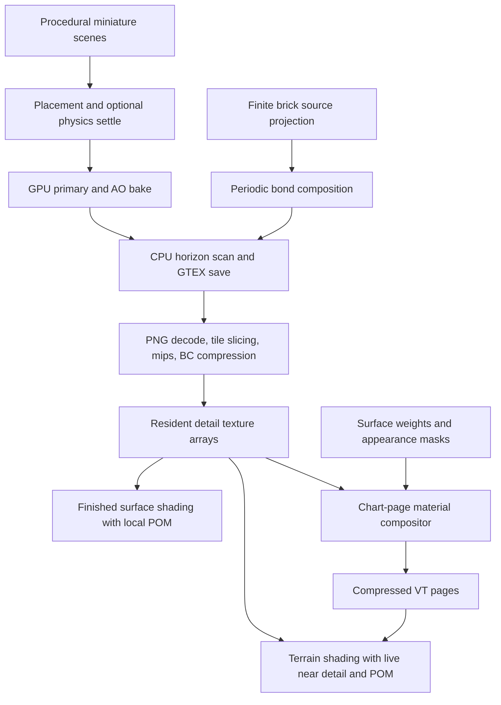

# Texturing system: appearance, blending, and generation cost

Date: 2026-09-14. Scope: terrain and constructed surfaces in the current working tree.

Implementation direction: [layered texturing design](../superpowers/specs/2026-09-14-layered-surface-texturing-design.md)
and [implementation plan](../superpowers/plans/2026-09-14-layered-surface-texturing.md),
following the [VT foundation plan](../superpowers/plans/2026-09-14-vt-reliability-and-throughput.md).

## Conclusion

**Much better material realism is achievable within the existing renderer.** Keep POM, the procedural authoring system, compressed detail textures, and chart-space virtual texturing. First stabilize VT residency and update latency; then concentrate on source-material quality, consistent material composition, and preparing textures once.

**Priority update following the reported flashing and repeated reloads:** the companion [VT stability and latency audit](vt-stability-and-latency-review-2026-09-14.md) identifies global invalidation paths, mandatory-tail queue loss, and preparation/scheduling concerns. It places VT reliability ahead of the material milestones below. The CPU source-texture timings in this report do not measure live VT page streaming.

The engine already has several foundations commonly associated with high-quality Unreal environments: physically based material channels, detail-height maps, parallax, GPU material-page composition, height-based terrain blending, and world-space appearance masks. However, these pieces do not yet form a consistent surface system across terrain, finished surfaces, close views, and object intersections.

The highest-priority findings are:

1. **Warm texture loading repeats expensive texture preparation.** Three-run CPU diagnostics measured median loading/preparation of **1.72 s for rock, 1.34 s for snow, and 0.335 s for brick**, before staging or GPU upload.
2. **Material IDs are linearly filtered.** At a material boundary this can select an unrelated third material for close-up detail.
3. **Terrain blends two materials in its base pages, but close-up detail reads only one ID.** Finished surface materials take a separate direct path that bypasses page composition.
4. **Repeated relief dominates the current source textures.** The inspected rock cache has one exact albedo over 96.35% of its pixels and normal-channel correlation of about 0.82 after a two-metre shift. The inspected brick cache has only one unique tile across all 16 layers.
5. **The terrain detail overlay is not a true separation of large and small features.** It can reinforce detail already present in the page.

Approaching the material appearance of a well-authored UE5 environment is a series of material/content milestones. Reproducing Nanite's adaptive geometric displacement is a substantially larger renderer project. There is no defensible percentage of visual parity without a matched scene, materials, lighting, camera, and performance target.

## Evidence and limits

This review uses current source, cached asset inspection, a new CPU microbenchmark, existing native wall measurements, and primary Unreal/research sources. It does **not** claim a new native editor benchmark or rendered before/after improvement. Existing RT diagnostic images were inspected for context; they are not a controlled assessment of the current terrain or castle appearance.

The checkout is dirty at HEAD `d753087d88417ab5b77cf77369c1e38e22cee6b9`, including in-progress renderer, tileset, and forest changes. Source fingerprints and platform details are in [provenance.json](../agent/evidence/2026-09-14-texturing-review/provenance.json). Cached assets are identified by SHA-256 and embedded content hash; their freshness against current source was not established. Thus their statistics describe concrete existing cached assets, while source findings describe the inspected working tree.

Some linked architecture documents are historical despite their placement in the documentation index. For example, the VT glossary describes texture-array indirection, while current source uses a storage buffer. Source is the authority for findings below.

## 1. What exists today



The brick path can omit horizon maps. A healthy GTEX cache hit skips generation but still enters the decode/slice/mip/compression stages.

### Useful foundations to retain

- **GTEX detail sources:** albedo, normal, occlusion/roughness/metallic (ORM), height, and optional horizon maps. The renderer uploads BC7/BC5/BC4 core channels with mip chains. See [tileset_gtex.h](../../MatterEngine3/src/tileset_gtex.h) and `VkSceneRenderer::load_tileset_slot`, [vk_scene_renderer.cpp](../../MatterEngine3/src/render/vk_scene_renderer.cpp), line 8418.
- **Terrain material composition:** up to eight weight columns, reduced to two materials per texel; triplanar source sampling; height-based blending; post-composition tint, roughness bias, wetness, and metallic. See [vt_composite.comp](../../MatterEngine3/shaders_vk/vt_composite.comp), lines 149, 219, 343; [vt_surface_tape.glsl](../../MatterEngine3/shaders_vk/vt_surface_tape.glsl), line 258.
- **Macro variation already authored:** StreamMountain uses world-space masks at multiple scales, including 420/260 m classification fields, 150/40 m appearance fields, and 11 m bedding. It would be incorrect to recommend adding the first macro-noise layer. See [StreamMountain.js](../../projects/world_demo/scenes/streaming/StreamMountain/StreamMountain.js), lines 416–695.
- **Finished surface parallax:** `detailMode: 'surface'` samples a local height field and its material channels through a shared raster/RT helper. This avoids the old ground overlay on brick and wood. See [surface_detail.glsl](../../MatterEngine3/shaders_vk/surface_detail.glsl) and [surface-parallax contract](../designs/castle-surface-parallax.md).
- **Chart reuse exists experimentally:** `MATTER_VT_UNIFY=1` enables parameterization reuse. It is not enabled by default in `unify_parameterisation_enabled()`, [lod_bake.cpp](../../MatterEngine3/src/lod_bake.cpp), line 150. Verify this path and its fallback rate before proposing to implement it from scratch.

## 2. Why surfaces look tiled or busy

### A. Shuffling tiles does not remove a base repeated inside every tile

`BaseField` stores one 64×64 height field and repeats it across the 4×4 atlas. At a two-metre tile size, the base geometry has a 31.25 mm sampling interval, even though the output has 512 texels/metre. The texture resolution cannot recover detail missing from that base field. Scattered objects add variety, but do not eliminate the shared relief underneath. See [tileset_spec.h](../../MatterEngine3/src/tileset_spec.h), lines 10, 52–65.

[wang_common.glsl](../../MatterEngine3/shaders_vk/wang_common.glsl), line 39, selects tiles by matching hashed edge colors. It varies arrangement while preserving seams; it does not manufacture new material structure. Independently rotating arbitrary Wang tiles would break their edge contract.

The brick recipe is more constrained: its four columns by eight rows occupy a 1.25 m periodic tile. That completed tile is repeated across the atlas, as described in [castle-chart-surface-bake.md](../designs/castle-chart-surface-bake.md). This is a real periodic source, not 16 different masonry layouts.

#### Cached asset measurements

| Cached asset | Most common exact albedo | Normal correlation after one tile, X / Y | Unique albedo / normal / height tiles |
|---|---:|---:|---:|
| AlpineRockDetail, 4096², 2 m tile | 96.35% | 0.823 / 0.818 | 16 / 16 / 16 |
| AlpineSnowDetail, 4096², 2 m tile | 97.64% | 0.558 / 0.554 | 16 / 16 / 16 |
| Castle brick bond, 2048², 1.25 m tile | 13.62% | 1.000 / 1.000 | 1 / 1 / 1 |

These are raw channel statistics using a wraparound one-tile shift, with each channel mean removed. They are not a perceptual score or a measurement of the final randomized world layout. Uniform snow color can be appropriate. For rock, the combination of nearly uniform albedo and strongly repeated normal structure supports the diagnosis that lighting must carry most of its visible character.

The current primary bake writes scalar material albedo with optional triangle tint and scalar roughness/metallic. There is no rich mineral/weathering material evaluation at the hit in that shader. See [tileset_bake_primary.comp](../../MatterEngine3/shaders_vk/tileset_bake_primary.comp), line 133. More bake rays or higher texture resolution alone cannot add that missing content.

**Recommendation:** build source materials with independent but related variation in color, roughness, height, and normals. Use physically meaningful masks for exposed grains, broken faces, deposited soil, weathering, and moisture. Preserve quiet areas. A few high-quality scanned or artist-authored PBR examples would help calibrate the procedural output; importing them into the same material-source contract is an optional extension, not a prerequisite for keeping procedural generation.

For natural stochastic surfaces, randomized patch blending with contrast preservation is worth prototyping in the page compositor. The authors' [histogram-preserving texture synthesis demonstration](https://unity-grenoble.github.io/website/demo/2020/10/16/demo-histogram-preserving-blend-synthesis.html) provides a relevant reference. Apply the same patch transforms and consistent blend rules to every channel. Masonry needs bond-aware variation in brick choice, wear, mortar, and stains rather than arbitrary patch rotations.

### B. Near detail can reinforce what the page already contains

The page compositor samples the detail source at the page footprint. The terrain near band then computes approximately:

```text
near_color = page_color × clamp(live_detail / whole_texture_mean, 0.25, 4)
```

It also composes the live normal with the page normal and applies corresponding ORM ratios. See [gbuffer.frag](../../MatterEngine3/shaders_vk/gbuffer.frag), lines 1028–1087.

Dividing by a global mean does not isolate high frequencies. Where a page already contains correlated detail, an idealized `page = D`, `live = D` produces `D² / mean(D)`: exaggerated variation. Its average is also shifted by the variance of D. Where mappings differ, layering can instead introduce competing patterns. This is a mathematical/code-level concern; its contribution to a particular view still needs an isolated render comparison. The finished-surface path already bypasses this overlay.

**Recommendation:** define which scales each representation owns. Either:

- sample the complete material once, selecting suitable mips; or
- compose a deliberately low-frequency page with a matched residual, conceptually `D_fine / D_lowpass`, using corresponding coordinates and filter footprints. Normals require a consistent slope/detail decomposition, not color-style division.

This is a stronger starting point than simply reducing every normal globally.

### C. Distant procedural patterns need filtering too

The compositor chooses source-texture LOD from page footprint, but `vt_tape_eval()` receives positions and interpolated fields without a footprint argument. Thin procedural cracks, thresholded ore flecks, and noise can therefore remain point-sampled at coarse page levels. `vt_resolve()` also floors the desired virtual mip and samples one mapped level. See [vt_surface_tape.glsl](../../MatterEngine3/shaders_vk/vt_surface_tape.glsl), line 139, and [vt_common.glsl](../../MatterEngine3/shaders_vk/vt_common.glsl), line 151.

**Recommendation:** filter procedural masks by their page footprint; average small coverage into stable large-scale material properties; preserve unresolved normal variation in roughness. Evaluate virtual-mip interpolation and page transition smoothing afterward. Merely turning on hardware anisotropy for the physical pool cannot implement correct filtering across virtual pages and mip levels.

## 3. Blending: implemented pieces and missing behavior

### A. Correctness issue: material IDs use linear filtering

The compositor stores two material IDs in aux R/G and a blend in B. `vt_sample_channel()` uses `textureLod`; every pool channel is bound to the linear pool sampler. The near shader rounds aux R back into an integer ID.

Evidence:

- Aux encoding: [vt_composite.comp](../../MatterEngine3/shaders_vk/vt_composite.comp), line 401.
- Linear sampler: [vt_residency.cpp](../../MatterEngine3/src/render/vt_residency.cpp), line 577.
- All-channel binding: [vk_scene_renderer.cpp](../../MatterEngine3/src/render/vk_scene_renderer.cpp), line 7524; mirrored RT binding near line 16376.
- Sampling and decoding: [vt_common.glsl](../../MatterEngine3/shaders_vk/vt_common.glsl), line 196; [gbuffer.frag](../../MatterEngine3/shaders_vk/gbuffer.frag), line 980.

For example, a half-way sample between IDs 30 and 34 produces 32. That is neither contributing material. This is a confirmed data/ sampler mismatch, although its visible severity has not been measured here.

**First fix:** sample categorical IDs exactly. For smooth transitions, filter weights with their associated identities. Separating IDs and weights does not by itself solve changing ID pairs: gather and merge contributions by ID, or establish a stable local palette. Add a GPU boundary fixture whose adjacent IDs deliberately have an unrelated valid material between them.

### B. Page blending does not survive consistently into close detail

The page has `(material0, material1, blend)`, but the near path reads only aux R. Aux G/B do not drive a matching two-material detail evaluation. The initial POM march is based on the draw's material; when aux selects another material, that material is resampled flat. This can make ground-to-snow or rock-to-soil transitions look less coherent close up even while page color is blended.

The two-height blend also uses a fixed normalized depth of `0.2`. Independently normalized source height ranges lack a common physical datum, so this is an artistic blend heuristic rather than a consistent layered surface. See [vt_composite.comp](../../MatterEngine3/shaders_vk/vt_composite.comp), lines 361–370.

**Recommendation:** introduce one small material-stack contract for the page compositor and near evaluator: source mapping, physical height scale/datum, weights, blend width, channel composition, and coverage. Start with two base materials and an optional coating. Use a common effective height field for close parallax; avoid independently marching every layer and crossfading unrelated intersections. Horizon maps derived from the old individual surfaces also need a defined approximation or regeneration policy when the effective relief changes.

### C. Finished surfaces bypass the terrain composition path

The working `detailMode: 'surface'` path deliberately bypasses VT page color/normal composition and samples the completed source directly. It fixes important coordinate and double-detail problems for brick/wood, but it does not automatically inherit terrain tape layers, macro masks, or cross-object contact blending. See [gbuffer.frag](../../MatterEngine3/shaders_vk/gbuffer.frag), lines 483, 938, 1127.

Share material semantics and sampling helpers while retaining explicit mapping types: terrain, finished local surfaces, and authored face coordinates. Avoid another independent compositor for each new material family. Store per-face provenance when orientation matters, especially wood grain, curved walls, reveals, and cut ends.

### D. Object-to-ground blending is a separate capability

Current chart pages belong to a variant/rung, not a world contact neighborhood. Sharing a rock's texture among instances cannot by itself make one placement muddy at a river and another dry on a cliff. World-space masks on anchored terrain do not provide a general neighboring-surface query for arbitrary props.

Epic's [Runtime Virtual Texturing documentation](https://dev.epicgames.com/documentation/en-us/unreal-engine/runtime-virtual-texturing-in-unreal-engine) describes GPU-generated shading caches over areas of the scene, with materials able to write and sample them. That is a useful model for terrain/prop contact effects.

**Recommendation:** add a low-resolution world surface field containing nearby terrain height, normal, material properties, and coverage. Props sample it near contact to inherit soil, dampness, or snow. Retain chart VT for overhangs, tunnels, and distinct stacked surfaces; a single top-down field cannot represent all of those. Define receiver identity or layered/volumetric queries where needed. Keep world-dependent overlays separate from reusable variant pages, or include their region/revision in cache identity.

Material blending hides a shading boundary. It cannot fill a physical gap or repair an exposed silhouette; selected contact geometry still has a role.

## 4. Generation and loading: measured costs

### New CPU diagnostic

Production helpers were compiled unchanged with GCC 13.3, `-O2`, on WSL/Linux on an AMD Ryzen 9 5900X (24 logical CPUs). The BC encoder retains its production automatic thread cap. Each existing asset was loaded three times sequentially without flushing OS caches. This measures CPU file-read/decode, slicing/mips, and compression. It excludes shader compilation, settle, GPU bake, allocation/staging/upload, device idle, and editor publication. It is not a substitute for native MSVC acceptance.

| Asset | Median CPU load/preparation | Observed range | Source decode/read, median | Re-encoding, median total | Prepared upload bytes |
|---|---:|---:|---:|---:|---:|
| Rock 4096² | 1,716 ms | 1,589–1,988 ms | 679 ms | 876 ms | 85.33 MiB |
| Snow 4096² | 1,345 ms | 1,343–1,366 ms | 535 ms | 701 ms | 85.33 MiB |
| Brick 2048² | 335 ms | 331–387 ms | 90 ms | 221 ms | 18.67 MiB |

Column medians are independent and need not sum to the median total. Full results: [cpu_bench.txt](../agent/evidence/2026-09-14-texturing-review/cpu_bench.txt).

The separate CPU horizon pass took **2,498 ms on rock** and **2,229 ms on snow**, one measured invocation each. At 4096² it performs 1024² × 8 directions × 24 radial samples = **201,326,592 height probes**. These are cold-generation costs, not additional warm-load costs. The production helper runs in the blocking Vulkan bake call after readback: [tileset_bake_vk.cpp](../../MatterEngine3/src/render/tileset_bake_vk.cpp), line 1139; algorithm in [tileset_bake_vk.h](../../MatterEngine3/src/render/tileset_bake_vk.h), line 143.

Existing native evidence agrees that generation and loading must be separated. The [CastleWallBakeProof record](../../projects/world_demo/scenes/castles/proofs/CastleWallBakeProof/README.md) reports a 2,193 ms fresh pipeline, including 4.791 ms GPU projection, 186.222 ms composition, 545.292 ms save/compression, and 409.983 ms load/upload. A separate warm diagnostic measured 1,041 ms load/upload. Those validation-enabled runs were not controlled enough to infer that warm loading is intrinsically slower than cold loading.

### Ranked performance work

1. **Persist GPU-ready detail data.** Save BC blocks, final mip chains, dimensions, physical scale, channel conventions, means, and encoder/version identity. Warm loads should validate ready bytes and upload. Keep GTEX as an intermediate/debug artifact if useful. This removes measured work instead of merely moving it between threads. Preserve the canonical version-key contract; do not bypass invalidation to gain speed.
2. **Prepare duplicate source layers once.** The brick cache contains identical layers, so generate/encode a unique layer once and replicate prepared bytes as a compatible first step. A layout mode that stores and uploads one layer can also remove redundant storage, but needs explicit sampler/format support. This does not itself improve visible repetition.
3. **Move the horizon pass to GPU or optimize its CPU fallback.** Keep height on the device and scan before readback. A CPU alternative can precompute sample offsets/distances, avoid repeated coordinate work, and parallelize independent rows. Validate Wang seams and numeric tolerances; the observed two-second cost is not a promised two-second end-to-end saving.
4. **Make texture preparation asynchronous and publication bounded.** PNG work, mips, and CPU encoding currently occur in the render-thread slot load, which ends with `wait_idle()` before rewriting all frame descriptors. Use worker-side preparation, batched uploads, and frame-safe descriptor publication/resource retirement. Moving CPU work improves responsiveness even before total wall time changes.
5. **Scale generation quality by the signal.** The default 4096² atlas uses 64 AO rays per hit texel, in addition to primary-hit work. A fully covered atlas can issue about 1.1 billion ray queries across the two passes. Lower preview resolution, reduced-resolution AO with edge-aware reconstruction, and preview/final settings are worth measuring. Keep their identities explicit. Reusing primary hit data may save a repeat traversal, but retain the geometric normal required by AO.
6. **Optimize page production after measuring it.** `vt_resolve_page_texel()` searches candidate charts and then triangle ranges for each texel ([vt_chart_resolve.glsl](../../MatterEngine3/shaders_vk/vt_chart_resolve.glsl), line 116); AO enrichment invokes the same resolve again. Consider per-page/subtile triangle bins or a reusable triangle/barycentric map. There is no persistent VT page cache today ([vt_types.h](../../MatterEngine3/src/render/vt_types.h), line 198). Persisting static expensive pages may help, but needs a complete content key, disk budget, and invalidation policy.

BC encoding is already multithreaded. Existing source textures already use GPU block compression and mipmaps. Recommending either as a missing feature would miss the actual problem: both are recomputed unnecessarily.

## 5. What to take from Unreal and the Nanite article

| Desired result | Current distance | Appropriate next step |
|---|---|---|
| Convincing rock, soil, brick, wood | Existing rendering features can carry it; source content and composition need work | Reference materials, less repeated relief, channel-specific art controls |
| Natural transitions on one surface | Height blending exists but the near path is incomplete | Shared stack semantics, ID-safe filtering, common height field |
| Less repetition across distances | Macro masks exist; repeated source structure and filtering remain | Multi-scale composition, stochastic natural-material patches, bond-aware masonry variation |
| Props integrated with terrain | No general world contact-material exchange in the inspected path | World surface field plus contact masks |
| Fast iteration and loading | Measured repeated preparation | GPU-ready cache, unique-layer preparation, asynchronous publication |
| Real displaced silhouettes and matching visibility | POM retains a proxy mesh; no Nanite tessellation equivalent established | Selected geometric relief first; adaptive displacement as a separate renderer project |

Epic's [Landscape Materials documentation](https://dev.epicgames.com/documentation/en-us/unreal-engine/landscape-materials-in-unreal-engine) supports weighted, alpha, and height-aware layer composition and distance-dependent detail/macro material networks. These are closer to the immediate visual problem than adding triangles.

Brian Karis's [Nanite Tessellation introduction](https://graphicrants.blogspot.com/2026/02/nanite-tessellation.html) makes a relevant architectural argument: reusable displacement fields and procedural combinations represent detailed surfaces compactly. Matter's geometry-derived textures already pursue a related idea. Preserve that investment and improve the material description that supplies it.

His [Nanite + Reyes follow-up](https://graphicrants.blogspot.com/2026/02/nanite-reyes.html) describes significant additional machinery: patch splitting/dicing queues, displacement bounds, material-specific evaluation, culling, software rasterization, and derivative handling. The transferable lessons are to separate scheduling from material evaluation, keep displacement bounds tight, and filter the displacement signal to the sampling rate. This is far more than connecting an existing height map to a tessellation stage.

Epic currently labels [Nanite tessellation experimental](https://dev.epicgames.com/documentation/unreal-engine/working-with-naniteenabled-content). It generates extra triangles according to pixel density; displacement magnitude affects culling cost. Matter's POM changes shading/depth while outer silhouettes, collision, and hardware visibility still use proxy geometry. Any geometric-displacement project here needs an explicit raster, shadow, RT, LOD-seam, and collision policy. The renderer's existing sparse-geometry work should be coordinated with that decision, not assumed to provide Nanite behavior.

## 6. Recommended implementation sequence

### Prerequisite: stable, responsive VT

Complete the baseline, mandatory-request retention, local invalidation, continuous replacement, and preparation-cache work described in the [VT audit](vt-stability-and-latency-review-2026-09-14.md). Verify stationary views, camera return, LOD transitions, local edits, and cache pressure on both terrain and buildings before increasing page-composition complexity.

### First milestone: two controlled material proofs

Use a rock-to-soil/moss transition and a weathered brick wall. Include a terrain/prop contact example, even if initially diagnostic. Fix material-ID sampling; isolate and replace doubled terrain detail; choose one high-quality source material per proof; expose useful controls for physical scale, normal strength, blend width, roughness range, and large-scale coverage. Keep lighting and exposure fixed during comparisons.

Capture at close, middle, and far distances, with overhead and grazing light. Include camera motion, rotated instances, page boundaries, LOD transitions, and RT reflections. This establishes whether the material direction addresses the reported look before a broad content conversion.

### Second milestone: prepared texture cache

Introduce the final compressed/mipped artifact and duplicate-layer preparation. Measure fresh bake, GTEX hit, final-cache hit, edit/rebake, and corrupt-cache recovery independently. Acceptance should prove **zero decode/mip/encode work on a final-cache hit**, not just a faster aggregate timer. Record native median/p95 timings and render-thread stalls on the MSVC build.

### Third milestone: shared layering and material variation

Implement the bounded stack across page and near paths, including valid material-ID filtering, consistent height units, normals, and endpoint behavior. Add regional appearance and per-instance variation without multiplying texture variants unnecessarily. Evaluate randomized natural-material sampling in page generation first, then extend matching near-height evaluation only where it visibly helps.

### Fourth milestone: cross-object contact blending

Implement the world surface field with explicit vertical-surface/overhang behavior and cache invalidation. Start with static dirt/wetness inheritance around rocks and foundations. Dynamic snow accumulation or tracks require additional update/invalidation design.

### Fifth milestone: selective geometry and broader optimization

Spend geometry on visible brick edges, wall damage, rock outlines, roots, and deep crevices. Then decide whether generalized adaptive displacement is worth its renderer complexity. Profile VT chart searches, mask evaluation, AO enrichment, and material sampling to select further optimization work.

The first two milestones are bounded changes to existing machinery; complete layered POM and contact blending are larger integration work. Nanite-like adaptive tessellation is a separate major investment. Calendar estimates should follow the controlled proofs and native profiles, rather than imply a known path to arbitrary UE5 scene parity.

## Reproducing the diagnostics

From the repo root, using the Linux compiler for this **CPU-only diagnostic**:

```bash
mkdir -p /tmp/matter-texturing-review
g++ -O2 -std=c++17 -pthread \
  -IMatterEngine3/src -Ithird_party/bc7enc -Ithird_party/raylib/src \
  docs/agent/evidence/2026-09-14-texturing-review/cpu_bench.cpp \
  MatterEngine3/src/tileset_gtex.cpp \
  MatterEngine3/src/render/tileset_slicer.cpp \
  MatterEngine3/src/render/bc_encode.cpp \
  third_party/bc7enc/bc7enc.cpp third_party/bc7enc/rgbcx.cpp \
  -o /tmp/matter-texturing-review/cpu_bench

/tmp/matter-texturing-review/cpu_bench \
  projects/world_demo/.cache/StreamMountain/AlpineRockDetail.gtex \
  projects/world_demo/.cache/StreamMountain/AlpineSnowDetail.gtex \
  projects/world_demo/.cache/CastleUpgraded/brick-bond-c405fec05e8e7978.gtex

python3 docs/agent/evidence/2026-09-14-texturing-review/inspect_assets.py \
  projects/world_demo/.cache/StreamMountain/AlpineRockDetail.gtex \
  projects/world_demo/.cache/StreamMountain/AlpineSnowDetail.gtex \
  projects/world_demo/.cache/CastleUpgraded/brick-bond-c405fec05e8e7978.gtex
```

The inspection script requires NumPy and Pillow. The cache filenames are machine-local inputs, not committed fixtures; use the hashes in [asset_stats.jsonl](../agent/evidence/2026-09-14-texturing-review/asset_stats.jsonl) to identify the measured versions. The helpers read inputs without changing them. Actual implementation acceptance should use the canonical Windows/MSVC build and the [QA cookbook](../agent/qa-cookbook.md).
