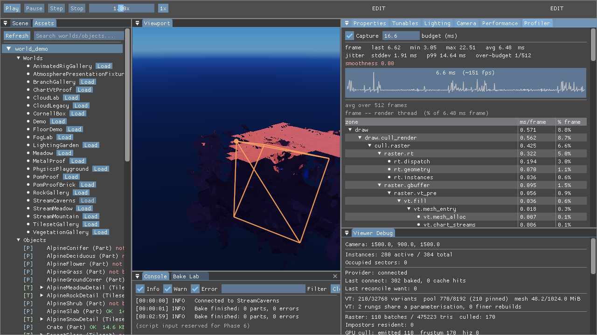

# Seeing the occlusion cull work (M4)

How to reproduce what M4 does and what it should look like. On StreamCaverns,
which is the world it was built against: a volumetric octree world where most of
what is resident at any moment is rock you cannot see through.

The design is `docs/volumetric-sectors-design-2026-08-10.md` §5.2, but the
implementation that survived is not the one it sketches — see "What was removed"
at the bottom. The one that shipped is a **low-resolution ID pass**:

1. `cull.comp` runs as **pass 0** (specialization constant `kCullPass`): frustum
   only, no mask, emitting the unfiltered draw list.
2. That list is rasterised at its coarsest rung into a small `R32G32_UINT`
   target — no lighting, no instances, ID only, depth test on
   (`shaders_vk/visibility_id.vert` / `.frag`).
3. `visible_ids.comp` reduces the target to a hashed bitmask of the tokens that
   own at least one pixel.
4. `cull.comp` runs as **pass 1**: the same frustum work, then the mask, then
   the real draw list.

All four are recorded into one command buffer in that order, so the mask
describes the camera the frame is being drawn from.

The circularity that killed the earlier attempts is broken by pass 0 being
**unfiltered**: what the ID pass rasterises is never filtered by the answer it
is about to produce. A culled sector is tested every frame and returns the
moment it owns a pixel, so it cannot get stuck hidden.

### The one-frame version, and why it went

The first landing wrote both lists from a single dispatch, which forced the mask
to be the PREVIOUS frame's — a list feeding the ID pass cannot be built after
the pass that consumes its answer. Correct while the camera is still, wrong
while it moves, and the error is not small. A 180° whip pan over four frames,
eye fixed, LOD trace keyed by pose index (`MATTER_CAM_PATH` drives one pose per
rendered frame, so the counts are directly comparable):

| pose | 39 (before) | 40 | 41 | 42 | 43 | 44 (after) |
|------|-------------|----|----|----|----|------------|
| one frame  | 30 | **15** | **13** | **12** | **18** | 31 |
| same frame | 30 | 28 | 24 | 35 | 31 | 31 |

Instance draws per frame. The stale mask dropped roughly half the visible world
for the whole pan and only recovered the frame after the camera stopped — that
is the popping. Both settle at 31, so nothing about a still camera changed.

It costs nothing measurable. Same pose, GPU timestamps, `MATTER_VSYNC=0` so the
numbers are not pinned to the refresh:

| | cull off | cull on |
|---|---|---|
| one frame  | 5.138 ms | 4.788 ms |
| same frame | 5.075 ms | 4.789 ms |

The serialization the split introduces — the G-buffer now waits on the ID raster
and the reduce — did not show up, because that pass was never overlapping
anything to begin with.

## 1. The cull — turn it on and watch the world halve

    cd MatterEditor
    MATTER_WORLD=StreamCaverns ./build/windows/editor.exe

Viewer Debug → **Occlusion culling**. Off is the default. Or over
`MATTER_CMD_FIFO`:

    set viewer.debug.occlusion_draw_cull true

Measured from the pose in the issue report that drove this work, one process,
toggling only that checkbox:

| | batches | triangles |
|---|---|---|
| cull off                 | 129 | 810,947 |
| cull on                  |  65 | 328,852 |
| frozen cull, same pose   |  65 | 328,852 |
| frozen cull, 2 km away   |  65 | 328,852 |
| cull off again           | 129 | 810,947 |

−50 % batches and −59 % triangles at an identical picture, and the underground
network is visibly gone when you fly out and look at it from the side. Standing
inside a cavern: 167 → 93 batches, 848 k → 507 k triangles, frame 8.69 → 7.36 ms.

Re-measured after the streaming cap and the HZB were deleted, camera at
`(0, 40, 0)` looking down, so the numbers are smaller but the toggle is the same:
78 → 55 batches, 341,338 → 236,158 triangles, and turning it off returns to
exactly 78 / 341,338.

The ID pass renders the **coarsest** rung, not the selected one. Selecting per
rung rejects about 10 % more sectors and buys no frame time, and the coarse mesh
is the conservative one — it can only over-report visibility, never under-report
it.

## 2. The frozen cull camera — looking at a culling decision

An over-aggressive cull and a correct one are identical from inside the frustum
until something pops. So:

1. Viewer Debug → **Freeze cull camera**.
2. Fly away and turn around.

The frame keeps being *drawn* from the live camera; the frustum planes, the eye
and the ID pass's projection are pinned. What is still on screen is exactly the
set the cull kept for the frozen view, seen from outside it. The frozen frustum
is outlined in orange.

Pair it with **Freeze terrain streaming** so residency is not moving underneath
you at the same time.

Both toggles are properties, so a scripted run can drive them:

    set viewer.debug.freeze_stream_anchor true
    set viewer.debug.freeze_cull_camera true
    set viewer.debug.occlusion_draw_cull true

`cull_world_to_clip` is what makes freezing usable at all. The ID pass has to
rasterise the FROZEN view: projecting with the live matrix re-renders the scene
from wherever you flew to, everything is visible from there, and the mask reports
the whole world visible. Inspecting the feature destroyed the thing being
inspected — reported as "culling doesn't hide anything", and correctly so.

## 3. Why the signal is a rasterised ID and not a bounding box

There are three answers to "was this sector drawn", and only one of them works
on terrain:

- **`emitted`** — the tokens the cull pass emitted, i.e. survivors of the
  **frustum** test. A sector buried in solid rock is in-frustum, so it reads as
  visible. Underground that is most of the world.
- **HZB** — a sector is ONE cluster whose AABB is the whole cube tile, so its
  screen footprint is nearly always larger than the coarsest pyramid level or
  crosses the screen edge, and every such case must fail open. It rejected 4
  clusters out of ~900.
- **The ID pass** — a token is in the set precisely because a fragment of it won
  the depth test. No bounding box is ever consulted, and a sector seen through
  one crack in the rock counts as visible because it owns a pixel.

The reduction is a hashed bitmask (`src/render/visibility_hash.h`, 2^19 bits,
Knuth multiplicative) because the GPU can only afford to record membership while
the consumer only ever asks about tokens it already holds. A collision degrades
toward drawing more, never less.

## What was removed

Two earlier attempts shipped and are now deleted outright, because both were
measured and neither did the job:

- **The streaming detail cap** (`MATTER_OCCLUSION_GRACE`, `SectorStreamer::VisState`,
  `submit_visible`/`submit_occlusion`) streamed unseen tiles one rung coarser.
  It never hid anything, so the frame looked identical with it on or off — which
  is exactly how it read to everyone who tried it. Its win was residency and bake
  cost, not pixels.
- **The HZB pyramid** (`shaders_vk/hzb_build.comp`, `hzb_occluded()` in
  `cull.comp`, the `hiz` FIFO command, `MATTER_HIZ`) — see above for why it could
  not work on tile-sized clusters.

`hiz <on|off>` is still recognised by the FIFO and answers with a pointer to
`set viewer.debug.occlusion_draw_cull true`, so old scripts get a message rather
than "unrecognized".

## The bugs this took to work

1. **The token was the wrong token.** The publish side keyed its token→sector map
   on `vulkan_history_token(instance_id)`, but a manifest entry is not what the
   renderer draws: `resolve_vulkan_instances` expands each entry into one
   `VkSceneInstance` per drawable node and re-keys every one through
   `temporal_instance_id(stable_id, part_hash, ordinal)`. 0 of 105 tokens mapped.
2. **The ID pass projected with the live camera.** See §2 — this is the one that
   made the feature look like it did nothing under inspection.
3. **`set_visibility_reduce` was gated on the streaming cap**, so the draw cull
   silently had no mask to filter by unless an unrelated feature was also on.
4. **The property was never registered**, so `set viewer.debug.occlusion_draw_cull`
   was a no-op and the first A/B measured a no-op against itself.
5. **The vis buffers were not seeded** in the frame-resource candidate pass,
   leaving null descriptors at the ID pass's bindings on frame 0.
6. **Deleting the HZB left a hole at binding 16.** A default-constructed
   `VkDescriptorSetLayoutBinding` has binding 0, so the scene layout carried a
   duplicate of binding 0 and layout creation failed — taking every cull smoke
   mode with it. The M4 bindings moved down to 16/17/18 to close it.
