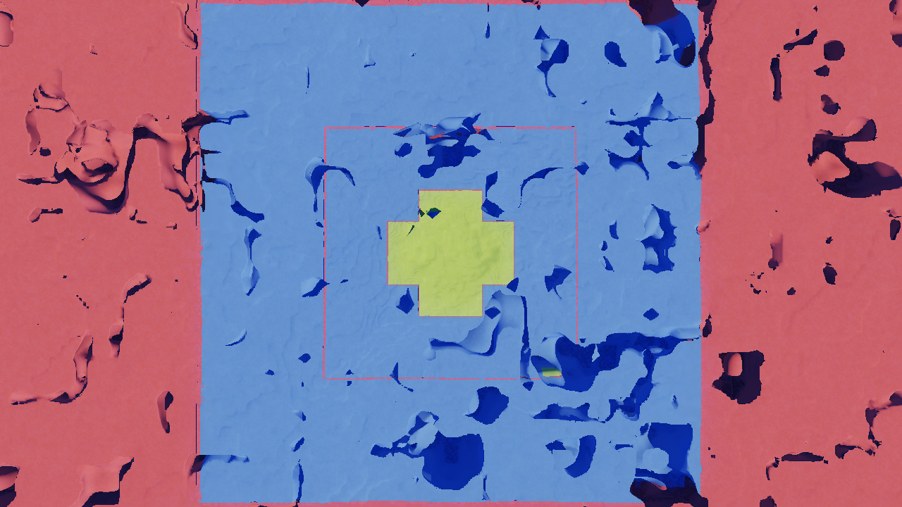
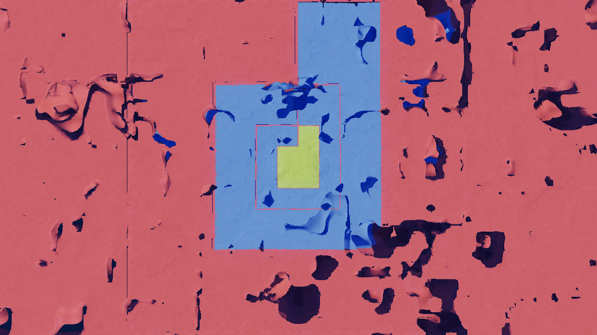

# Seeing occlusion streaming work (M4 Phase A)

How to reproduce the two things M4 does, and what each one should look like. Both
are on StreamCaverns, which is the world the feature was built against: a
volumetric octree world where most of what is resident at any moment is rock you
cannot see through.

The design is `docs/volumetric-sectors-design-2026-08-10.md` §5.2. The one-line
version: **visibility drives priority and detail, never existence.** A tile
nobody has drawn for a while is desired one level coarser than its distance band
asks. It is never evicted below coverage, so a wrong or stale visibility bit
costs a few seconds of detail and can never open a hole.

## 1. The detail cap — detail follows where you looked

    cd MatterEditor
    MATTER_WORLD=StreamCaverns MATTER_OCCLUSION_GRACE=60 ./build/windows/editor.exe

`MATTER_OCCLUSION_GRACE` is the grace in visibility ticks (≈ frames); 0 disables
the cap, which is the default and the A/B baseline. The feature is opt-in by env
rather than by world flag because it is still being characterised.

Then, in the editor:

1. Stand somewhere and look one way for ~30 s. The camera at `(0, 200, 0)`
   looking north (`-Z`) is what the pictures below used.
2. Viewer Debug → **Freeze terrain streaming**. This pins which tiles exist, so
   the next step does not change the thing you are inspecting.
3. Viewer Debug → view mode **LOD levels**. Yellow is the finest rung, blue the
   next, red the coarsest.
4. Fly straight up a couple of kilometres and look down.

With the cap **off** you get concentric bands: a square of blue with a square of
yellow inside it, centred on where you were standing. That is the distance-band
ladder, and it is direction-blind — the terrain behind you is as detailed as the
terrain in front.

With the cap **on**, most of that collapses to red and what is left is a
**finger** of blue and yellow pointing the way you were looking. Same anchor,
same bands, same grace: the difference is entirely that the tiles behind the
camera were never drawn, so they aged out and were desired coarser.

Measured on the run those pictures came from:

|                        | cap off | cap on |
|------------------------|---------|--------|
| instances at viewpoint | 741     | 315    |
| instances overhead     | 670     | 401    |
| triangles overhead     | 1.59 M  | 1.09 M |
| resident sectors       | 703     | 349    |
| sectors actually drawn | 157     | 156    |

The last row is the one to read first: **the cap halved the world and changed
what is on screen by one sector.** That is the whole claim.

## 2. The frozen cull camera — looking at a culling decision

An over-aggressive cull and a correct one are identical from inside the frustum
until something pops. So:

1. Viewer Debug → **Freeze cull camera**.
2. Fly away and turn around.

The frame keeps being *drawn* from the live camera; only the frustum planes and
the eye the GPU cull tests against are pinned. What is still on screen is
exactly the set the cull pass kept for the frozen view, seen from outside it.
The frozen frustum is outlined in orange.

Pair it with **Freeze terrain streaming** so residency is not moving underneath
you at the same time.

Measured, same world, streaming pinned:

| pose                    | batches | triangles | clusters culled |
|-------------------------|---------|-----------|-----------------|
| at the viewpoint, live  | 191     | 1,035,588 | 185             |
| at the viewpoint, frozen| 191     | 1,035,588 | 185             |
| 1.9 km out, frozen      | 171     |   813,886 | 174             |
| 1.9 km out, live        | 309     | 1,069,201 |  52             |

Freezing in place is a no-op (row 2), which is the sanity check. At one identical
far pose the frozen cull keeps a third of the batches the live one does.

LOD selection freezes with the cull camera, because `cull.comp` picks the rung
from the same eye. That is wanted — the frozen view's detail is much of what
there is to inspect — and it is why the control is not called "freeze frustum".

Both toggles are also properties, so a scripted run can drive them over
`MATTER_CMD_FIFO`:

    set viewer.debug.freeze_stream_anchor true
    set viewer.debug.freeze_cull_camera true
    set viewer.debug.debug_view_mode 5

## 3. Where the visibility signal comes from

There are two possible answers to "was this sector drawn", and they are not
close:

- **`emitted`** — the tokens the GPU cull pass emitted, i.e. survivors of the
  **frustum** test. A sector buried in solid rock is in-frustum, so it reads as
  visible. Underground that is most of the world.
- **`idbuffer`** (the default) — the tokens that own a pixel of the G-buffer's
  identity attachment, i.e. survivors of the **depth** test.

The second needs no extra work from the renderer, which is the whole reason it
wins. `gbuffer.frag` already writes `uvec2(material, instance_token)` per pixel,
and a pixel is in that attachment precisely because it won the depth test — so
the visible set is a reduction over something the frame already produced. A
sector seen through one crack in the rock counts as visible, because it owns a
pixel.

`MATTER_OCCLUSION_SOURCE=emitted` is the rollback. Measured on StreamCaverns
from one pose, everything else equal:

| | resident sectors | batches | triangles |
|---|---|---|---|
| cap off            | — (741 instances) | 114 | 600,795 |
| cap on, `emitted`  | 310 | 95 | 530,852 |
| cap on, `idbuffer` | **192** | **57** | **285,835** |

The screenshots at that pose are indistinguishable. That is the doctrine
working: coverage survived, only detail moved.

## 4. The HZB — what it is for now

An HZB depth pyramid also exists (`shaders_vk/hzb_build.comp`, `hzb_occluded()`
in `cull.comp`), opt-in via **Viewer Debug → HZB occlusion cull** or `hiz on`.
It is **not** the streaming signal and never became one.

It was built to be, and could not be. A streamed sector is ONE cluster whose
AABB is the whole cube tile, so its screen footprint is nearly always larger
than the coarsest pyramid level or crosses the screen edge — and every such
case fails open by design. It rejected 4 clusters out of ~900. The identity
buffer sidesteps that entirely by never looking at a bounding box.

What the HZB remains is a *draw-cost* optimization, worth revisiting when
clusters are finer than a whole tile (the design's "4 clusters per tile"
option). Its pyramid is built from the previous frame's depth, so it is one
frame stale while the camera moves and exact when the cull camera is frozen —
which is why the two toggles are meant to be used together.

## The two bugs this took to work

Both were silent, and either alone would have produced "the feature has no
effect", which is what the first landing measured.

1. **The token was the wrong token.** The publish side keyed its
   token→sector map on `vulkan_history_token(instance_id)`, but a manifest entry
   is not what the renderer draws: `resolve_vulkan_instances` expands each entry
   into one `VkSceneInstance` per drawable node and re-keys every one through
   `temporal_instance_id(stable_id, part_hash, ordinal)`. The emitted chain is
   `instance_id → temporal_instance_id → history_token`, and publish reproduced
   only the last link. 0 of 105 tokens mapped.

2. **The cap asked a question with a constant answer.** It read `last_visible`
   on the tile it was deciding whether to *split*, and a tile that is being split
   is not resident and is never drawn, so that bit is structurally always zero.
   Zero was documented to read as "visible" to protect the cold fill, so the
   branch could not fire. Visibility now propagates UP the octree into a ledger
   of its own, and "never seen" is decided against an eligibility clock the
   descent opens on first visit.

The second one changed behaviour the streamer suite was asserting: "never seen
reads as visible" is unimplementable as stated. It is replaced by the properties
that are actually load-bearing — a fully visible world is bit-for-bit the
uncapped world, an unseen one is strictly coarser *and* still covers its reach
exactly once per cell, and disocclusion releases the cap all the way back.
