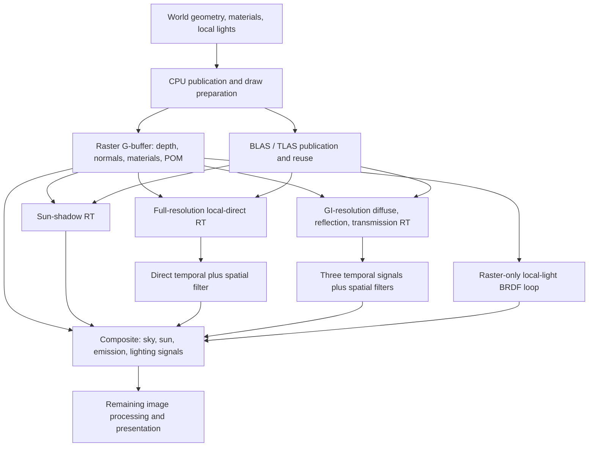

# RT, GI, and lighting performance review

Date: 2026-09-11. Scope: the current `castle/astra-assembly` worktree at
`D:/tmp/matter-castle-assembly`, including uncommitted lighting and surface-detail
changes. This is an analysis and proposed roadmap, not an implementation or a
claim that the proposed optimizations have passed GPU acceptance.

## Recommendation

Keep hardware ray tracing, but spend it on selected visibility queries and
view-dependent effects. Use deferred shading for primary material response,
reuse diffuse illumination in world space, and reserve detailed hit shading
for nearby sharp reflections and important glass.

We already have a deferred renderer. The expensive architectural choice is
evaluating many shadowed lights independently at each receiver, then repeating
lighting and detailed material work at secondary hits. A different deferred
pass alone will not remove those costs.

My recommended order is:

| Order | Work | Expected leverage | Effort / visual implications |
| --- | --- | --- | --- |
| 1 | Measure primary local-light RT separately; establish controlled ablations. | Essential to choosing the correct GPU work. | Small; no image change. |
| 2 | Remove demonstrably avoidable work: production diagnostic atomics, zero-contribution rays, unused GI normal reconstruction, repeated CPU light-index builds. | Potentially substantial, but each item's milliseconds remain unmeasured. | Small to medium; target equivalent lighting. |
| 3 | Reduce primary soft-shadow sampling from four to one temporally accumulated sample per contributing area light. | Up to 4× fewer primary area-light visibility queries, not 4× faster frames. | Medium; tune noise, history rejection, motion. |
| 4 | Replace exhaustive per-light shadowing with a bounded stochastic light-sampling budget. | Highest likely long-term direct-light improvement in dense interiors. | Medium to large; estimator and denoiser quality matter. |
| 5 | Make secondary material evaluation much cheaper; make POM depend on visible footprint. | Strong candidate across diffuse, reflected and transmitted hits. | Medium; preserve close primary brick detail and sharp hero reflections. |
| 6 | Cache diffuse illumination at runtime; settle sky/sun energy ownership before populating that cache. | Largest architectural reduction in repeated GI and secondary-hit lighting. | Large; convergence and invalidation become explicit systems. |
| 7 | Classify reflection/glass work and denoise only useful signals/tiles, with actual quality controls. | Removes broad, fixed work on mostly diffuse architecture. | Medium to large; requires good fallbacks. |
| 8 | Add screen-space light clusters and measured RT geometry/CPU publication improvements. | Helps scale to hundreds of lights and larger worlds. | Medium; preserve off-screen occluders and conservative culling. |

This ordering prioritizes confidence and useful intermediate releases. If the
new timers show secondary GI dominating primary shadows, promote items 5–6
ahead of item 4. No source-only audit can responsibly attach a promised FPS
increase to this list.

## Evidence and measurement limits

I reviewed the host scheduling and acceleration structures, raster/composite
shaders, light indexing and attenuation, RT ray generation/hit/any-hit shaders,
material VT/POM paths, denoising, and existing capture instrumentation. Three
Astra agents independently audited scheduling, material sampling, and RT
transport; their findings were cross-checked against the source. I also
inspected the saved hall and gold/glass screenshots and compared the design
with primary publications from Epic, NVIDIA, AMD, EA, and Ubisoft.

No new renderer build, live GPU benchmark, or change to the open editor was
made for this report. Historical captures establish that there is a severe
problem, but do not measure the most recent range/top-K changes.

| Historical capture | Frame time | Total GPU | G-buffer GPU |
| --- | ---: | ---: | ---: |
| `validated-final`, final gold/glass view | 425.22 ms | 351.986 ms | 5.442 ms |
| `validated-repeat`, exterior view | 97.25 ms | 78.234 ms | 5.783 ms |

Sources: [final log](/mnt/c/tmp/castle-startup-full/validated-final/capture/log.txt:1224)
and [exterior log](/mnt/c/tmp/castle-startup-full/validated-repeat/capture/log.txt:1170).
These are single recorded samples at different views, not medians or a
controlled comparison. The final capture records a visible 1280×720 window;
internal render resolution must still be recorded independently in benchmarks.

**Correction to earlier interpretation:** 351.986 ms is total GPU time, not
isolated ray-tracing time. In these `STATS` rows, the following 0.037/0.031 ms
field is **GPU culling**, not RT or sun-shadow time. The format is explicit in
[main.cpp](/mnt/d/tmp/matter-castle-assembly/MatterEditor/src/main.cpp:7931).
Thus these rows alone cannot identify the slow RT lane. The small G-buffer
times suggest that reducing raster triangles alone will not solve this
particular measured gap; triangle traversal can still matter in RT.

The existing performance JSON contains `gpu_rt_ms`, `gpu_rt_gi_ms`,
`gpu_denoise_ms`, and other pass fields, but most are the **last sampled
frame**, while frame-time median/p95 use the full sampling interval. Do not
describe those GPU fields as pass medians. See
[the writer](/mnt/d/tmp/matter-castle-assembly/MatterEditor/src/main.cpp:1233).

## What the pipeline currently does

The raster and RT local-direct branches are exclusive owners. They are not
both added in an RT frame.

| Stage | Current behavior and relevant source |
| --- | --- |
| Light publication | Sparse world-space hash grid, default 8 m cells; castle handoff applies 0.75 range and rebuilds at 4 m. [matter_engine.cpp:13253](/mnt/d/tmp/matter-castle-assembly/MatterEngine3/src/matter_engine.cpp:13253). |
| Primary materials | Raster G-buffer uses live finished-surface detail/POM for the baked castle surfaces. [gbuffer.frag:1104](/mnt/d/tmp/matter-castle-assembly/MatterEngine3/shaders_vk/gbuffer.frag:1104). |
| Raster local lighting | Screen-space composite reconstructs the receiver, queries the world grid, and sums BRDF contributions. This path has no equivalent local-light shadow query. [composite.frag:94](/mnt/d/tmp/matter-castle-assembly/MatterEngine3/shaders_vk/composite.frag:94). |
| RT sun shadows | Separate trace dispatch; this is the `kGpuZoneRt` timer. [vk_scene_renderer.cpp:15490](/mnt/d/tmp/matter-castle-assembly/MatterEngine3/src/render/vk_scene_renderer.cpp:15490). |
| RT primary local direct | Separate full-raster-resolution dispatch whenever any local lights are published, even with GI disabled. It lies outside both named RT timing zones. [vk_scene_renderer.cpp:15563](/mnt/d/tmp/matter-castle-assembly/MatterEngine3/src/render/vk_scene_renderer.cpp:15563). |
| Secondary lighting | GI-enabled dispatch contains a fixed two-vertex diffuse walk plus separate reflection and transmission work. Its extent follows GI trace scale. [rt_lighting.rgen:886](/mnt/d/tmp/matter-castle-assembly/MatterEngine3/shaders_vk/rt_lighting.rgen:886). |
| Secondary materials | Closest-hit evaluates detailed material appearance, potentially including full finished-surface POM. [rt_surface.rchit:24](/mnt/d/tmp/matter-castle-assembly/MatterEngine3/shaders_vk/rt_surface.rchit:24). |
| Denoising | Three temporal signals and fixed 5 diffuse / 3 reflection / 3 transmission spatial passes. Primary direct adds one temporal and one spatial pass. [vk_scene_renderer.cpp:11306](/mnt/d/tmp/matter-castle-assembly/MatterEngine3/src/render/vk_scene_renderer.cpp:11306), [iteration selection:11645](/mnt/d/tmp/matter-castle-assembly/MatterEngine3/src/render/vk_scene_renderer.cpp:11645). |
| Composite | Adds approximate sky, sun, emission, secondary signals, and exactly one primary local-direct owner. [composite.frag:498](/mnt/d/tmp/matter-castle-assembly/MatterEngine3/shaders_vk/composite.frag:498). |

### Why the number of rays can grow so much

The primary and transmission paths use four visibility samples for lights
with positive source radius; diffuse/reflection hit lighting uses one. A
zero-radius source uses one. Each visibility sample can trace once against
opaque geometry and, if still visible, again through non-opaque geometry.
There is already range/cone/backface/BRDF rejection before tracing. See
[rt_lighting.rgen:431](/mnt/d/tmp/matter-castle-assembly/MatterEngine3/shaders_vk/rt_lighting.rgen:431)
and [sample selection:446](/mnt/d/tmp/matter-castle-assembly/MatterEngine3/shaders_vk/rt_lighting.rgen:446).

| Lane | Source-level maximum trace calls per eligible launch |
| --- | --- |
| Primary local direct | Up to `8 × P` for `P` contributing shadow-casting area lights. |
| Diffuse walk | Two surface traces, up to `2 × (L0 + L1)` local visibility traces, plus up to four sun visibility traces. |
| Reflection | One surface trace plus up to `2 × Lr` local visibility traces. |
| Transmission | Up to five walk segments; alpha-aware lookup can use two traces per segment. Terminal lighting can add `8 × Lt` local visibility traces plus sun samples. |

These are upper bounds, not observed rays per pixel. Early hits/misses, source
radius, material eligibility, light flags, and top-K settings reduce them;
any-hit invocations can multiply the cost of an individual trace further.

The authored castle census has 136 lights, comprising 132 point and four spot
lights. Earlier synthetic sampling found as many as 55 contributing lights at
a receiver/normal using unoccluded diffuse weighting, not the complete RT
diffuse-plus-specular BRDF. At that count, the primary area-light lane alone
could reach 440 visibility trace calls at that receiver. This illustrates the
algorithm's scaling; it is **neither a measured screen average nor a general
maximum for the scene**.

The separate primary dispatch returns before GI, so primary light rays are
not also repeated in the GI dispatch. What is repeated is primary G-buffer
reconstruction and other setup.

## Detailed findings and actions

### 1. Fix attribution and quality controls first

Add a dedicated `gpu_rt_local_direct_ms` zone around the primary local-light
dispatch. Preserve the old field meanings; label `gpu_rt_ms` as sun shadows.
Capture time series or medians/p95 for all GPU lanes, not only frame time and
the final pass sample. Report actual dispatch dimensions, active light
budgets, area samples, POM settings, and history resets with each run.

Several public controls do not describe actual work:

- `max_bounces` and `samples_per_pixel` are forced to one in
  [set_gi_settings](/mnt/d/tmp/matter-castle-assembly/MatterEngine3/src/render/vk_scene_renderer.cpp:2573),
  while the shader has its fixed diffuse walk and other ray lanes.
- `denoiser_iterations = 0` is documented as disabling denoising in
  [vk_gi_contract.h](/mnt/d/tmp/matter-castle-assembly/MatterEngine3/src/render/vk_gi_contract.h:26),
  but the scheduler uses fixed 5/3/3 iterations.
- GI trace scale really changes GI resolution; it does not reduce the
  full-resolution local-direct pass.
- Disabling GI leaves local-light RT shadows active. It is not a lights-off
  or all-RT-off experiment.
- The new primary/secondary light budgets default to zero, meaning unlimited.
  They are opt-in, not an automatic cap in an ordinary launch.

Expose independent, truthful controls for primary shadows, diffuse transport,
reflections, transmission, and per-signal reconstruction. Start with test
controls if necessary, then make the supported quality settings explicit.

### 2. Remove work whose rendered contribution is unnecessary

**Production diagnostic atomics.** The transparent visibility any-hit shader
unconditionally increments shared global counters at
[rt_visibility.rahit:21](/mnt/d/tmp/matter-castle-assembly/MatterEngine3/shaders_vk/rt_visibility.rahit:21)
and line 72. Up to 32 accepted layers are processed per ray. Many glass-crossing
shadow rays can contend on the same words. Compile these diagnostics out of
normal pipelines, or use explicitly enabled sampled/subgroup diagnostics.
Retain the ray-local layer cap and termination logic. The gain depends on
actual transparent intersections; opaque-blocked rays do not execute this
shader. Its material-only needs also justify a smaller validated material
loader instead of relying on the compiler to remove unused full-surface work.

**Exactly zero diffuse/reflection lanes.** The diffuse walk occurs before
multiplication by primary albedo, `(1-metallic)`, AO and diffuse multiplier at
[rt_lighting.rgen:1031](/mnt/d/tmp/matter-castle-assembly/MatterEngine3/shaders_vk/rt_lighting.rgen:1031).
Fully metallic or otherwise exactly zero-weight pixels can discard all this
work. Reflection's multiplier is likewise applied after tracing. Reject
exact-zero lanes early and write defined zero outputs. Keep independent random
streams so skipping one lane does not accidentally change another. Treat
thresholding small-but-nonzero contributions as a separate lossy feature.

**Unused GI proxy-normal reconstruction.** The POM-compatible primary
geometric normal is calculated in both dispatches at
[rt_lighting.rgen:802](/mnt/d/tmp/matter-castle-assembly/MatterEngine3/shaders_vk/rt_lighting.rgen:802),
but consumed only by primary local direct. Its helper can make up to 21
source-level texture reads, including repeated neighbor identity/depth data.
Move that calculation inside the direct-only branch. The GI path still needs
its proxy position; do not remove the entire reconstruction.

**Repeated CPU light indexing.** Every frame constructs an effective light
publication, copying/validating/rebuilding the authored index; CastleUpgraded
then rebuilds it at 4 m. Only afterward does the renderer check the unchanged
revision. Even scale-1 worlds pay unnecessary reconstruction. Cache the
effective publication by authored revision, range scale and index config;
build only the desired index once per change. Make the policy generic rather
than testing the castle's world name in the engine. This is confirmed CPU
waste, not an explanation for hundreds of GPU milliseconds. Stable revisions
currently prevent continual light uploads and GI history resets.

### 3. Use temporal reuse to reduce primary area-shadow samples

Primary local direct already has its own temporal history and spatial filter.
Experiment with one area sample per contributing light instead of four, using
well-distributed samples across frames. This reduces the corresponding trace
call budget by 75% for positive-radius lights. It does not remove the candidate
BRDF loop, shading cost, denoising, or other RT lanes.

Keep a higher setting for an offline/reference mode. Judge the interactive
setting while moving through doorways and past sconces, not only after a
stationary accumulation. Stable soft shadows and thin contact features need
different treatment; adaptive extra samples at disocclusions are preferable
to four everywhere. Smooth transmission currently has different filtering
semantics, so do not automatically apply the same change to it.

### 4. Put a budget on visibility work, not just a hard top-K list

The new selector scores actual unoccluded BRDF contribution. This is better
than choosing lights once at a cell center, but has two limitations:

- It can select a strong occluded light while discarding a weaker visible
  one. Repeated selection does not recover the missing energy. It is a biased
  quality option, not a complete many-light solution.
- It evaluates every candidate, stores eight IDs plus eight scores, then
  evaluates selected BRDFs again. The logical private state is 64 bytes and
  lives across visibility traces. Because selection is a runtime branch,
  source inspection cannot establish whether the unlimited default also
  suffers register allocation or spills. Compare shader statistics and GPU
  timings with a specialization that removes selection entirely.

Sources: [selection loop](/mnt/d/tmp/matter-castle-assembly/MatterEngine3/shaders_vk/rt_lighting.rgen:492)
and [current control notes](/mnt/d/tmp/matter-castle-assembly/docs/designs/castle-light-and-finish-options.md:7).

The intermediate production design should importance-sample a small number
of lights with correct selection probabilities and weights. One useful
starting point is a few deterministic important lights plus a stochastic
sample of the residual set, with disjoint ownership of those terms. Keep a
nonzero exploration probability for potentially visible candidates. The
longer-term version can reuse reservoirs across space and time, validating
receiver geometry, material and light generation and retesting visibility
where necessary. Reusing an old visibility bit indefinitely is not valid.

ReSTIR provides a published basis for weighted candidate resampling and
spatiotemporal reuse. Its benchmark speedups are not forecasts for this
renderer. [Original ReSTIR publication](https://research.nvidia.com/publication/2020-07_spatiotemporal-reservoir-resampling-real-time-ray-tracing-dynamic-direct).

A stochastic estimator bounds expensive visibility samples. It does not
automatically make candidate selection independent of light count. Start
with the existing grid; later build cluster proposal distributions or a light
hierarchy if candidate scoring itself becomes significant.

**Do not treat dropped lights as unshadowed fill.** If deferred lighting sums
all lights and a ray pass adds selected lit contributions, energy is duplicated.
Choose one estimator/owner for shadowed direct light, or formulate a properly
weighted visibility correction to a known base. Arbitrary blending of the
current raster and RT totals is not that correction.

### 5. Stop paying close-view POM costs on blurry secondary hits

The brick high-to-low bake saves triangles and stores appearance, but the
finished surface still performs live POM. Both raster and secondary RT bypass
ordinary VT texel sampling for that path. It is incorrect to count ordinary
VT sampling and finished POM as two simultaneous paths on those surfaces.

Effective defaults are 30 march steps plus four refinements, with a 1564 m
distance limit. A worst-case crossing requires
`active_axes × (steps + refinements + 4)` logical texture calls: 38 for one
axis, up to 114 for three. Planar castle faces usually activate one axis and
marches can end earlier. These are GLSL call counts, not DRAM transactions.
See [surface_detail.glsl](/mnt/d/tmp/matter-castle-assembly/MatterEngine3/shaders_vk/surface_detail.glsl:49)
and [effective defaults](/mnt/d/tmp/matter-castle-assembly/MatterEngine3/include/matter/world_definition.h:301).

Current ray cones change the sampled mip but not the march budget. RT fade
uses the current segment's `hit_t`; repeated short bounces can retain full
relief far along a camera path. The first improvement is a material-quality
policy driven by projected relief versus ray footprint:

| Receiver | Proposed detail policy |
| --- | --- |
| Nearby primary wall, grazing view | Preserve full normal/height detail with adaptive POM steps. |
| Distant primary wall or subpixel grain | Normal/roughness maps; progressively fade parallax. |
| Diffuse GI or very rough reflection hit | Filtered albedo/normal/ORM or cached lighting; normally no POM march. |
| Nearby sharp gold/mirror reflection | Preserve enough hit detail for the reflected footprint, with a separate bounded budget. |
| Any-hit shadow visibility | Opacity/tint/thickness inputs only; no full appearance evaluation. |

Avoid a single terrain-oriented distance/step setting governing masonry,
submillimeter wood grain and every ray bounce. Keep material-specific relief
amplitude and derive work from what the pixel can resolve.

Additional concrete shader opportunities:

- Resolve Wang coordinates once for the final albedo/ORM/normal fetches at
  identical UVs. Current helpers repeat coordinate resolution and mip-count
  queries for every channel. Compiler elimination may already remove some
  ALU; inspect the generated shader before claiming a gain.
- Avoid negligible triplanar axes and renormalize remaining weights. Finished
  detail uses a `1e-5` threshold versus ground's `1e-3`; tiny normal components
  can activate another entire march. Verify seams on rounded corners.
- The RT rigid-transform footprint bound uses a Frobenius norm, giving √3
  rather than 1 for pure rotation—about 0.79 mip of conservative bias. Fixing
  this is primarily a quality/consistency change, not a guaranteed speedup.
- An alpha-aware transmission query shades its opaque candidate before a
  nearer transparent candidate may replace it. A lightweight hit-record
  query followed by shading only the chosen hit can remove discarded work.
- Ordinary VT physical-page LOD 0 is intentional: the virtual lookup already
  selected a mip. Do not “fix” that as though mipmapping were missing.
- Sky SH evaluation fetches nine coefficients from a 3×3 texture per call.
  These are uniform per environment and could be published as uniform
  coefficients. This is a small, cache-friendly optimization candidate,
  well below removing whole POM marches and visibility traces.

Relevant source: [secondary detail and footprint](/mnt/d/tmp/matter-castle-assembly/MatterEngine3/shaders_vk/rt_surface_common.glsl:346),
[transmission candidate lookup](/mnt/d/tmp/matter-castle-assembly/MatterEngine3/shaders_vk/rt_lighting.rgen:691),
[sky SH](/mnt/d/tmp/matter-castle-assembly/MatterEngine3/shaders_vk/environment_common.glsl:92).

POM is still a shading/depth approximation. It does not add brick recesses to
the hardware intersection mesh, silhouettes or shadow geometry. Keep actual
openings, arches, major broken edges and protrusions in geometry. Detailed
normal/roughness response can remain after diffuse lighting is cached.

### 6. Make runtime lighting reuse the main GI design

This is well matched to a mostly static procedural castle. A wall's soft
indirect illumination changes much more slowly than the camera. Recomputing
it per visible pixel every frame discards that advantage.

We have useful infrastructure, but not an existing general world-light bake:

- Current chart VT stores appearance: albedo, normal, ORM and blend metadata.
- VT enrichment bakes **part-local self-occlusion**, shared by a part variant.
  It does not know the illumination and occluders around each placed wall.
- The enrichment path has its own chart-compatible geometry ordering and
  modifies compressed ORM pages. Reusing its BLAS blindly or accumulating
  another AO pass on an enriched page is incorrect.

See [vt_enrich.h](/mnt/d/tmp/matter-castle-assembly/MatterEngine3/src/render/vt_enrich.h:5)
and [VT outputs](/mnt/d/tmp/matter-castle-assembly/MatterEngine3/shaders_vk/vt_composite.comp:389).

**First cache prototype:** visibility-aware irradiance probes in rooms and
courtyards, with a fixed update budget and denser placement around openings.
This supplies diffuse lighting to arbitrary geometry and moving objects
without making every wall own an HDR texture. DDGI's irradiance plus distance
moments is a concrete basis for preventing interpolation straight through
walls. It still needs careful bias, probe placement and leak tests.
[DDGI paper](https://jcgt.org/published/0008/02/01/).

**Architecture-quality extension:** an instance-aware surface irradiance or
radiance cache using existing chart coordinates where valid. Prioritize this
if probes cannot preserve the castle's room boundaries or if repeated
secondary-hit shading remains expensive. A surfel representation is an
alternative for geometry without useful charts. Do not implement probes,
cards and surfels as three independent full lighting systems at once.

The cache contract should be explicit:

1. Store scene-linear HDR lighting separately from material albedo/ORM and
   exposure. Prefer directional irradiance or a compact directional basis
   where normal maps need to respond to changing surface orientation. A
   scalar lightmap alone can flatten the brick relief.
2. Share material pages by part variant. Key world lighting by placed
   instance/transform, chart generation, world region and relevant lighting
   state. Identical wall meshes in different rooms do not share illumination.
3. Update dirty regions under a ray/time budget, prioritizing newly visible,
   changed and high-error samples. Track age, confidence and variance.
4. Cache static diffuse transport aggressively. Trace dynamic contacts and
   important moving-light changes promptly; let distant indirect light
   converge over several frames.
5. Invalidate affected regions for light position/range/color changes,
   occluder edits, doors, material changes and sun/sky changes. Account for
   indirect propagation across room boundaries, not only the light sphere.
6. Use double-buffered lighting state or explicit generation rules so a
   partially updated cache does not feed itself as an uncontrolled solver.
7. Show a plausible fallback immediately. Populate progressively rather than
   replacing today's long startup with a mandatory lighting bake. Optional
   persistent caches must validate geometry/material/lighting versions and
   must not block first presentation.

For a raster-only mode, sampling a previously populated light/probe cache
does not require RT. Hardware RT can update the cache on capable machines.
A fresh dynamic scene on a non-RT device still needs an alternative update
method or prebaked data; a cache alone does not create missing illumination.

#### Settle the light-transport contract before caching

Several current approximations overlap or disagree:

| Finding | Consequence / decision needed |
| --- | --- |
| Composite always adds primary SH sky ambient; a primary diffuse escape also adds environment radiance. | Overlapping sky transport, with different scaling conventions. Choose cached/traced occluded sky or an explicit fallback; do not sum both as complete solutions. |
| Environment escapes include the sun disc while analytic sun is separately evaluated. | Potential double counting and spikes; there is no MIS partition for these estimators. Exclude the analytically sampled emitter from those escapes or use a consistent estimator. |
| Reflected surface hits use emission, approximate sky and local lights, but no direct sun query. Transmission terminal hits add sun explicitly. | A reflected sunlit wall and a wall seen through glass can disagree. Shared cached hit lighting can improve consistency without adding a sun trace at every reflection hit. |
| Diffuse continuation multiplies by hit base color without fully removing metallic/transmitted energy. | This is a hybrid approximation, not a fully material-weighted path tracer. Define intended diffuse transport before baking it. |
| The final diffuse vertex uses SH ambient to approximate the untraced tail. | This is intentional truncation, not necessarily duplicate work; replace it with a cache lookup rather than adding another full tail estimator. |
| Raster and RT primary local direct already have exclusive ownership. | Preserve this correct contract when adding caches or stochastic lighting. |

Sources: [primary ambient](/mnt/d/tmp/matter-castle-assembly/MatterEngine3/shaders_vk/composite.frag:307),
[diffuse escape and tail](/mnt/d/tmp/matter-castle-assembly/MatterEngine3/shaders_vk/rt_lighting.rgen:936),
[hit lighting](/mnt/d/tmp/matter-castle-assembly/MatterEngine3/shaders_vk/rt_lighting.rgen:595),
[reflection hit](/mnt/d/tmp/matter-castle-assembly/MatterEngine3/shaders_vk/rt_lighting.rgen:1121),
[transmission hit](/mnt/d/tmp/matter-castle-assembly/MatterEngine3/shaders_vk/rt_lighting.rgen:1238).

These corrections change appearance and must be evaluated in linear lighting
before retuning exposure. They are not output-preserving optimizations.
Castle flame proxies already use `rayTraced(false)` while colocated analytic
lights illuminate the scene, avoiding that particular emissive/analytic
duplication. Preserve this authored relationship. General emissive materials
paired with analytic lights still need an explicit sampling/ownership policy.
See [castle_furnishings.js](/mnt/d/tmp/matter-castle-assembly/projects/world_demo/shared-lib/castle_furnishings.js:1333).

### 7. Spend reflection and denoising work where it is visible

The default maximum reflection roughness is 1.0. The engine therefore permits
dedicated reflected rays on very rough materials that could use a directional
diffuse/radiance cache or prefiltered room reflection. Gold and smooth glass
need a different budget from matte masonry.

Introduce tile classification from depth/material/roughness, compact eligible
ray lists, and separate rates for diffuse, glossy reflection and glass.
Start experiments around a 0.4–0.6 roughness transition, with a smooth
fallback blend rather than a hard pop. This is a tuning proposal, not a
validated threshold for our materials.

The existing spatial filters reread center data even for pixels that bypass
filtering, then use 5×5 diffuse or 3×3 secondary neighborhoods over multiple
full-image passes. On a homogeneous accepted neighborhood, five diffuse
iterations alone consider 125 neighbor positions, each with several guide
fetches. Texture caches matter; this is not a bandwidth measurement. Use
signal occupancy, valid history and variance to avoid empty tiles and
unnecessary wide passes, then consider shared-memory guide reuse where the
kernel spacing makes it worthwhile. Fix the ignored iteration control.
See [gi_atrous.comp](/mnt/d/tmp/matter-castle-assembly/MatterEngine3/shaders_vk/gi_atrous.comp:45).

Diffuse is currently material-modulated before filtering. Separating material
response from noisy lighting would let the denoiser smooth illumination
without blurring brick color variation. A denoiser replacement must honor
motion, hit distance, roughness and material-factor conventions; NRD documents
these requirements. Evaluate its contract and quality before treating it as a
drop-in speed upgrade. [NRD integration guidance](https://github.com/NVIDIA-RTX/NRD/blob/master/README.md).

Screen-space reflections are another useful first stage: reuse visible
surfaces, then trace off-screen or uncertain rays. They need thickness tests,
confidence and a fallback, especially around doors and glass. Scheduling also
matters: tracing against a lit buffer must not create a same-frame composite
dependency cycle or repeatedly feed already-composited reflections back into
themselves. Use a defined pre-reflection lighting buffer or validated history.

### 8. Improve culling, geometry and host publication after measuring

**Light clusters.** The existing world grid is valuable for arbitrary
secondary hits. Add screen/depth clusters for primary deferred lighting if
profiling shows candidate lookup/scoring cost. A conservative light/cluster
intersection can be shared by pixels, avoiding per-pixel hash lookup and
irrelevant candidates. Keep the world grid for secondary receivers and
transparent layers not represented by the opaque depth buffer. This is an
extension of the current design, not a second competing ownership system.

Earlier synthetic receiver sampling reduced mean candidates from 53.81 at
8 m cells to 37.69 at 4 m, while index size grew from 21,948 to 126,064 bytes.
Those figures precede range reduction and are not current pixel/ray timings.
A 2 m grid cost much more memory for diminishing candidate reduction. Measure
overlap at visible receivers before further shrinking it.

**Range.** Current `0.75` means 75% of authored radius. Influence `range` and
soft-emitter `source_radius` are separate controls. Range must be finite and
positive, but there is no single hard numeric engine-wide maximum; oversized
grid entries have a fallback list. The finite cutoff is
smooth: inside range, its radial factor is approximately
`(1 - (d/r)^2)^2 / (d^2 + sourceRadius^2)`, zero outside, with zero slope at
the boundary. But changing `r` changes brightness inside the sphere as well;
it is an artistic change, not just culling. The sphere volume becomes about
42.2% of its previous value, which is not a predicted 57.8% GPU saving.
See [local_lighting.glsl](/mnt/d/tmp/matter-castle-assembly/MatterEngine3/shaders_vk/local_lighting.glsl:98).

**Acceleration structures.** Static TLAS reuse is already implemented per
completed frame slot using geometry epoch and identical instance records.
BLAS builds prefer fast trace; TLAS rebuilds prefer fast build. Test a
fast-trace TLAS build policy for long-lived static castles, trading a more
expensive occasional build for cheaper repeated traversal. Do not propose
“add refitting” as though the stationary castle rebuilds every frame.
See [BLAS flags](/mnt/d/tmp/matter-castle-assembly/MatterEngine3/src/render/vk_scene_renderer.cpp:14799)
and [TLAS reuse/build](/mnt/d/tmp/matter-castle-assembly/MatterEngine3/src/render/vk_scene_renderer.cpp:15113).

There is still per-frame CPU reconstruction, clearing/copying/flushing of part
records, and hashing of instance bytes before/after reuse. Revision-based
publication can reduce this while preserving safe shrinking/stale-tail
handling. Scene-key changes also reset histories globally; stable per-region
lighting generations may avoid unrelated history loss during distant edits.
See [part publication](/mnt/d/tmp/matter-castle-assembly/MatterEngine3/src/render/vk_scene_renderer.cpp:15044)
and [scene hash](/mnt/d/tmp/matter-castle-assembly/MatterEngine3/src/render/vk_scene_renderer.cpp:15600).

**Geometry.** Keep opaque/non-opaque classification accurate. Measure BLAS
overlap and long thin geometry before reorganizing assemblies. Coarse closed
shadow/GI proxies can remove tiny fasteners and hidden interiors while
retaining wall thickness, openings, rail silhouettes and window bars where
their shadows matter. Raster visibility alone is insufficient to cull an
off-screen object that casts a visible shadow or appears in a mirror.

Large payloads and deeply dependent vertex/material reads deserve compiler
and GPU inspection. The current surface payload includes geometry, UV/cone,
material, transformed normal basis and proxy-position data. A compact
hit-record pass followed by material shading is a plausible later redesign,
but adds queues, bandwidth and synchronization. It should follow the simpler
eliminations above. NVIDIA's published guidance supports measuring payload,
any-hit and acceleration-structure costs rather than assuming triangle count
alone predicts performance. [RTX best practices](https://developer.nvidia.com/blog/best-practices-for-using-nvidia-rtx-ray-tracing-updated/).

## Comparison with published real-time systems

These examples describe published techniques, not identical hardware/content
benchmarks or claims that every game uses the same implementation.

| System | Published approach | Lesson for Matter |
| --- | --- | --- |
| Unreal Lumen | Surface cards cache material/lighting; updates are amortized. Screen traces precede more complete tracing. [Technical details](https://dev.epicgames.com/documentation/en-us/unreal-engine/lumen-technical-details-in-unreal-engine). | A secondary hit can read cached lighting instead of evaluating all materials and lights again. Our modular wall/floor pieces provide useful cache structure. |
| Lumen scalability | Documented GI/reflection budgets are 4/8 ms at 1080p internal resolution on target consoles; rough surfaces can avoid dedicated reflections, and probe updates have explicit budgets. Expensive hit lighting is a quality option. [Performance guide](https://dev.epicgames.com/documentation/en-us/unreal-engine/lumen-performance-guide-for-unreal-engine). | Budget individual effects and use reconstruction. These figures are context, not a promised Matter target on the 4090. |
| Unreal MegaLights | Importance-samples a fixed ray budget toward lights, with temporal reconstruction and visibility-aware guiding. Candidate overlap can still cost time and reduce quality. [MegaLights documentation](https://dev.epicgames.com/documentation/unreal-engine/megalights-in-unreal-engine). | Hundreds of authored lights need not imply hundreds of shadow rays per pixel. Hard top-K is only an interim approximation. |
| Frostbite / EA SPORTS College Football 25 | GIBS uses runtime surfels to cache indirect illumination; the shipped game also uses probes for characters and prepares converged lighting during loading. [EA's implementation account](https://careers.ea.com/inside-ea/news/gibs-lighting-ea-sports-college-football-25), [GIBS technical overview](https://www.ea.com/seed/news/siggraph21-global-illumination-surfels). | Runtime lighting reuse is practical in a shipped game and can coexist with procedural assembly and moving objects. Our startup should remain progressive rather than require a full convergence wait. |
| Ubisoft Snowdrop | Ubisoft's GDC description combines GI/reflection caches using probes, G-buffer rays, screen-space tracing and denoising. [Official GDC description](https://staticctf.ubisoft.com/8aefmxkxpxwl/74nKNn2nMvP4JiQ9FF2IFt/f019f8530d4025e5c4c0b5fbe34464cd/2024_03_Ubisoft_GDC_digital_leaflet__1_.pdf). | Several representations can cooperate, with a clear purpose for each rather than full hit lighting everywhere. |
| AMD FidelityFX SSSR | Roughness/variance classify ray and denoiser tiles; hierarchy traversal and reflection rates vary, with fallback lighting. [SSSR documentation](https://gpuopen.com/manuals/fidelityfx_sdk/techniques/stochastic-screen-space-reflections/). | Compact useful work instead of dispatching every expensive effect over the whole image. |

## Proposed target architecture

The intended fast path is:

1. Raster detailed visible surfaces into the G-buffer, with footprint-limited
   POM and accurate normal/roughness maps.
2. Build primary light clusters and classify diffuse/glossy/transmission work.
3. Evaluate primary direct light with one coherent ownership model: clustered
   deferred lighting for unshadowed/cached-shadow lights, bounded stochastic
   visibility and lighting for dynamic shadowed lights.
4. Read diffuse irradiance from the runtime cache; update only a budgeted
   subset of probes/surface samples each frame.
5. Use screen-space or cached rough reflection, with hardware RT for sharp,
   off-screen and uncertain reflection/transmission. Most secondary hits read
   cached lighting plus a cheap material response.
6. Reconstruct only active signals, composite each lighting term once, then
   apply the existing presentation/upscaling path.

For a mostly static castle, an alternative worth testing is cached local
shadow maps plus deferred shading. Reuse static occlusion, update maps only
when affected lights/occluders change, and add dynamic contact shadows.
Refreshing six cubemap faces for every point light every frame would exchange
one scaling problem for another. Choose cached maps or stochastic RT per
light class based on measured update cost and quality; do not maintain both
at full quality for every light.

### Additional experiments suited to our procedural system

These are proposals, not existing engine capabilities or claimed novel
research results:

- **Room-aware light and cache scheduling.** Use floor-plan room volumes,
  doors and portals to prioritize cache updates and reject geometrically
  impossible influence. Support the actual angled/curved floor plans. Room
  IDs alone must not remove light through an open doorway; conservative
  portal visibility and fallback are required.
- **Fixture groups at distance.** Merge the lighting approximation of a
  chandelier's candles into a few area sources when projected separation is
  tiny, while keeping the visible flames and nearby individual shadows.
  Group using fixture membership and error bounds, not arbitrary world cells.
- **Reusable local transfer for kit pieces.** Precompute small-scale
  self-visibility/bent normals or a directional response for a wall variant;
  combine it with instance-specific world irradiance. This reuses the same
  few brick/beam variants without baking a new brick for every placement.
- **Lighting basis for static rooms.** With geometry/materials/light shapes
  fixed, store diffuse responses to a small number of fixture groups. Their
  color/intensity changes can combine linearly in HDR. Moving a light or
  opening a door invalidates transfer; arbitrary sun directions need new
  samples/bases. Avoid a full per-light texture set for hundreds of lights.
- **Conservative voxel assistance.** Our procedural occupancy can help room
  classification, cache placement or coarse distant visibility. Do not
  replace hardware triangle traversal with repeated high-detail brick SDF
  marching without evidence that it wins. SDF authoring/meshing and runtime
  light transport are different performance problems.

I would prototype room-aware DDGI first, using a single room plus a doorway
and moving door, before committing to the more ambitious surface-transfer
options. The gold/glass room should be the parallel reflection-quality test.

## Validation plan and acceptance criteria

All graphics runs should keep the editor visible, as requested. Reuse fixed
hall, courtyard and gold/glass cameras and a short walking route. Keep
resolution/upscaling, light/material settings, exposure, time of day, build,
and GPU clock/power conditions recorded. Separate steady-state runs from
streaming, initial shader work and lighting-cache convergence.

| Experiment | What it isolates |
| --- | --- |
| Same camera: raster vs native RT | Whole-pipeline delta; raster has different shadow quality, so it is only a lower-cost comparison. |
| Native RT with GI off | Primary local shadows remain; isolates removal of secondary lanes/filters. |
| Primary direct visibility bypassed, preserving BRDF/light sums | Cost of local shadow visibility; intentionally leaks light and is diagnostic only. |
| Local light publication empty | Candidate/direct dispatch plus secondary local-light costs; larger behavior change than visibility-only. |
| Primary area samples 4 vs 1 | Sample cost and temporal quality. |
| Diagnostic counters compiled out vs on | Contention cost under identical rays. |
| Secondary POM full vs normal-only, primary unchanged | Secondary hit-material cost. |
| Diffuse, reflection and transmission individually enabled | Per-lane rays and material coverage. Requires truthful independent controls. |
| Unlimited default compiled without selection vs runtime-zero budget | Any top-K register/occupancy regression. |
| Matched GI scales and active-tile filters | Ray/filter scaling and disocclusion behavior. |
| Static room cache converged, camera moving, then light/door edited | Runtime reuse, invalidation, leakage and recovery latency. |

Record median/p95 GPU pass times and frame times, traced samples by kind,
candidate/contributor distributions, transparent-layer counts, material hit
counts, history acceptance/reset rates, cache update budget/age/memory, and
shader registers/spills when available. Counters themselves should be gated or
sampled; do not introduce another atomic per ray to measure an optimization.

Inspect moving images as well as stills: shadow noise and ghosting, doorway
light leaks, darkening from dropped lights, gold reflection stability, glass
layer correctness, relief fades and newly visible cache regions. Use linear
HDR comparisons for energy changes; a tone-mapped screenshot can hide them.

The existing `MATTER_PERF_OUTPUT`, `MATTER_PERF_WARMUP_SECONDS`, and
`MATTER_PERF_SAMPLE_SECONDS` mechanism is a useful starting point, but its
per-pass last-frame fields need aggregation and the missing primary-direct
zone. Keep `MATTER_HIDE_WINDOW=0`. Current controls and capture recipes are in
[control-surface.md](/mnt/d/tmp/matter-castle-assembly/docs/agent/control-surface.md)
and [qa-cookbook.md](/mnt/d/tmp/matter-castle-assembly/docs/agent/qa-cookbook.md:456).

The first implementation milestone should contain the missing timers, honest
controls, the exact-work eliminations, and the 4-to-1 primary-shadow experiment.
The next milestone should choose a measured many-light estimator and secondary
material policy. Only then should a room-scale runtime GI cache replace the
current per-pixel diffuse walk. Each milestone should report actual GPU
savings and motion-quality results before the next architectural expansion.
