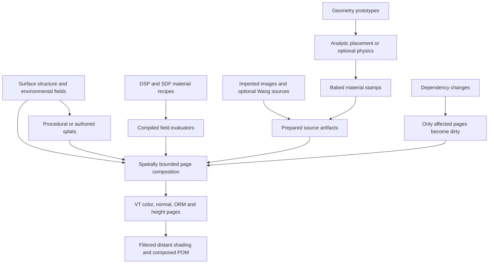

# Layered surface materials for terrain and buildings

Date: 2026-09-14. Revised: 2026-09-15. Status: agreed generation direction; implementation and visual acceptance pending.

Implementation: [layered texturing plan](../plans/2026-09-14-layered-surface-texturing.md).
Foundation: [reliable VT](2026-09-14-vt-reliability-and-throughput-design.md).
Evidence and external research: [texturing review](../../findings/texturing-system-review-2026-09-14.md).

## 1. Intended result

Create quieter, more convincing rock, soil, snow, masonry and wood with variation across distances and natural transitions between materials and objects. Preserve procedural generation and POM. Both terrain and buildings use the same material-composition rules.

The main authoring model generates appearance for a particular surface in physical coordinates. It must support coherent features larger than a source tile or VT page. Extensive improvements to the existing Wang-tile material library are not the route to this result. Retain Wang tiling as an explicit source option for suitable repeating materials, such as carpets, and for existing content.

Per the user's 2026-09-15 priority change, develop the visual results before finishing strict VT performance acceptance. Preserve correctness, valid fallback, bounded work and lightweight timing during iteration. The original VT timing/latency targets remain open and unchanged for later acceptance; deferring them does not establish that they pass. Avoid a large renderer rewrite as a prerequisite to the first visual proofs.

The user's layered-splat idea becomes **cached material composition**: a base surface plus spatially bounded material patches, weathering, deposits and appearance changes. Splats are authoring records evaluated into affected VT pages. Visible surfaces sample the resulting material instead of requiring a draw call or an unbounded shader loop for every splat.

This work targets the material appearance and blending associated with well-authored UE5 environments. It does not claim overall UE5 parity. Nanite-style adaptive geometric displacement, exact displaced silhouettes/collision, animated decals/tracks, transparency and fluid simulation are separate projects. The research links and current POM limitations remain documented in the review and [surface-parallax contract](../../designs/castle-surface-parallax.md).

## 2. Pipeline and cache layers



Keep the following dependencies and caches distinct:

- **Recipe program:** validated, versioned field operations and their compiled evaluator. Direct field sources do not need an intermediate repeating bitmap or a GTEX bake.
- **Placement:** deterministic feature/instance transforms, including optional settled poses. Material-only changes reuse placements unless the edited parameter also affects placement or collision geometry.
- **Source artifact:** prepared compressed/mipped texture data. A hit performs no image decode, mip generation or BC encoding.
- **Prepared surface data:** reusable geometry, chart reconstruction and spatial candidate lists.
- **Composed pages:** the material result for a specific surface region and content revision. The VT design governs residency and replacement. Disk persistence of composed pages is optional follow-up work after measurement.

## 3. Source-material contract and faster preparation

A source declares physical feature scale and optional repeat scale, color space, normal convention, roughness/metallic/AO, a height datum/range in metres, coordinate domain, generation seed, and content/evaluator version. Periodicity is explicit and optional. Sources may be direct field evaluators, baked geometry stamps, prepared images, or Wang sources. A validated externally authored PBR source may use the same contract for calibration; no external asset service is required.

### 3.1. Generation methods

Separate the creation of shapes/materials from the placement of those shapes. Any recipe may combine these methods:

| Method | Intended use | Execution |
|---|---|---|
| Spatial signal processing (DSP) | Broad variation, strata, grain, stain masks, directional weathering and filtered roughness | GPU field/image operations |
| Signed distance fields (SDFs) | Brick boundaries, mortar, bevels, chips, cracks and paint-mask edges | Start with 2D fields and analytic height profiles; use bounded 3D evaluation where necessary |
| Instanced geometry | Pebbles, fragments, needles and distinctive sculpted details | Place shared prototypes and bake their surface attributes |
| Physics-assisted placement | Rubble, piles and overlapping debris whose resting arrangement matters | Explicit preparation step producing reusable transforms |

DSP here means spatial signal processing: filters, remaps, ramps, blends, directional noise, domain distortion and control over feature frequency. Begin with a small reusable operator set, exposed through the existing authoring system. A node-graph editor is optional future UI, not a prerequisite. Compile per-texel evaluation to GPU work; do not execute a JS callback per output texel.

Begin each material with large, readable structure and quiet regions. Add object-scale variation next, then restrained microdetail. More noise octaves are not an acceptance criterion. Keep feature scales in metres, coherent across color, roughness, normal, height and coverage. Filter detail according to the requested physical footprint rather than making distant detail stronger to keep it visible.

An SDF returns signed distance to a boundary. Remap this distance to construct bevels, edge wear and transition widths. A 2D brick outline plus an analytic face-height profile should not require 3D ray marching. Expensive 3D tracing, erosion-like solvers or nonlocal processing remain explicit bounded preparation operations with reusable outputs.

Keep a feature's physical bevel width separate from antialiasing its color or
coverage boundary. A texel-footprint change must not collapse a mortar recess
into a one-texel step. Structural randomness should preserve the bond/course
layout while varying dimensions, laying offset, tilt and wear by stable brick
identity. Paint-mask transitions use the requested footprint, with a declared
minimum width; this first approximation still needs area-preserving filtering
for unresolved flakes. The [native shape review](../../agent/evidence/2026-09-15-material-shapes/README.md)
exercises these rules without a source image or physics bake. It does not close
the complete filtering or realism contract.

### 3.2. Evaluation contract and page independence

A field evaluator receives stable surface/object/world position, the required normal/tangent frame, footprint in physical units, recipe parameters, stable feature identity and read-only surface context. It returns a coherent material sample: linear base color, roughness/metallic, declared AO, normal information, height in metres and coverage. State whether the normal is derived from height or is residual detail so composition does not apply relief twice. Lighting is evaluated at render time; do not bake camera-dependent lighting into base color.

Feature identity derives from recipe identity, anchor and persistent structural/spatial identifiers. It must not depend on the camera, VT page, mip level, request order or output resolution. A brick, fracture or moss patch continues across page boundaries and remains the same feature after eviction and regeneration. Resolution changes only its filtered representation.

Each operation declares its spatial dependencies. Finite filters and bounded warps evaluate an expanded region, then crop to the requested output; expand dirty bounds by that support as well. Distance transforms or other operations that require a larger domain prepare a stable asset/region result first. Never run them independently inside each VT page and accept the resulting discontinuities. Match CPU semantic references and GPU results within declared tolerances rather than requiring cross-device floating-point bit identity.

### Direct-source v1 implementation boundary (2026-09-15)

The first implementation extends the existing surface scalar program with one
complete material output. It does not introduce a second graph language:

```js
surfaces(s) {
  s.source(MATERIAL_HANDLE, {
    baseColor: [0.35, 0.31, 0.26], // linear RGB; values or SurfaceNodes
    roughness: 0.82,              // perceptual roughness
    metallic: 0,                 // optional, default 0
    occlusion: 1,                // optional, default 1
    height: s.x.mul(0.01),        // metres in the source's local frame
    heightRange: [-0.05, 0.05],   // finite ordered metre bounds
  });
}
```

The canonical output is `source 1 rR rG rB rRough rMetal rAO rHeight min_m max_m`.
It requires exactly one fallback material (ID 0..255) at constant weight one.
The source provides full coverage; bounded layer/splat coverage remains a
separate part of the planned composition contract. RGB and ORM clamp to 0..1,
height clamps to its declared bounds, and nonfinite outputs use neutral
fallbacks. Existing optional appearance modifiers apply afterward.

`s.footprint` supplies the requested texel edge length in local metres. It is
valid only in a direct-source surface program, not legacy classification or
habitat. Direct sources allow up to 512 deduplicated operations, subject to
the 96 simultaneously live GPU register limit described below. This
input enables authored filtering; it does not automatically filter all existing
noise or discontinuous operators.

VT evaluates the program at reconstructed continuous surface positions, without
making a Wang atlas or running the geometry/physics texture bake. Four additional
height evaluations form centred differences in the local tangent frame, with a
half-texel offset (minimum 0.1 mm); constant height ranges omit them. Height may
use position, footprint, noise and arithmetic. Interpolated receiver fields,
curvature and normal/slope inputs are currently rejected as height dependencies
because their spatial derivatives are not supplied. Those fields may still drive
color or roughness. This is a correctness limit to remove through a tested
context/derivative contract, not the final layered-material feature set.

**Receiver-context extension (2026-09-17):** explicitly set
`heightContext: 'receiver'` in the final recipe passed to `s.source` to emit
`source 2` with the same output registers and bounds. Omission or `'position'`
keeps v1; unknown strings/versions fail closed. Use the option on the final
composed recipe, including when its height comes from `s.layer`/`s.splat`.

The ordinary chart consumer resamples receiver context at each finite-difference
offset. It reconstructs barycentrics, follows crossed triangle neighbors,
interpolates the new triangle's f16 field lanes, and normalizes its interpolated
normal before evaluating height. This includes context-driven layer coverage
in the resulting normal. Neighbor traversal is bounded to eight faces; a closed
edge uses a one-sided extension of the current triangle. A degenerate metric
stops traversal without division; degenerate-neighbor fallback is not yet
exhaustively validated. v1 evaluation remains unchanged.

The context is the receiver mesh's sampled field, not an exact per-texel terrain
query. CPU point evaluation uses its supplied normal/world context; GPU fields
use the same existing interpolation/quantization contract as appearance.
Analytic tests must distinguish this sampling approximation from derivative
correctness. LOD-independent environmental fields, broad cross-sector continuity
and sparse per-instance contexts remain separate acceptance requirements.

Periodic shared material domains and finite geometry source recipes retain
their explicit v1-only contract. Context-dependent ordinary pages bypass
position-only canonical page sharing. Composed height still publishes the
existing R16/metre-range format; its version is independent of source v2.
See [implementation and native/scene evidence](../../agent/evidence/2026-09-17-receiver-height/README.md).

Published direct pages use categorical auxiliary alpha bytes 1..3; legacy pages
retain byte 255. The initial direct-source implementation used byte 1. The L4
implementation below adds chart interior/padding tags 2/3 and stores composed
height in a fifth R16 pool channel. Consumers avoid reapplying legacy Wang
detail or its unrelated POM over the composed source. Existing legacy POM
remains available. Source metadata enlarges the compositor request record from
144 to 192 bytes, independently of resident page storage.

Native evidence and remaining implementation limits are recorded in
[the direct-source evidence](../../agent/evidence/2026-09-15-direct-source/README.md).
The terrain/brick visual proofs, general layers, splats, filtering/seam acceptance,
prepared source artifacts and final performance gates remain open.

### Direct-source authoring additions (2026-09-15)

`cellNoise2(seed, x, y)` hashes the floored coordinate pair into `[0,1)`.
It uses the existing integer noise hash on both CPU and GPU, accepts a uint32
seed, and returns zero for nonfinite or out-of-domain coordinates. The domain
is `[-2^24, 2^24)` on each axis. This supplies a stable random **attribute** per
structural cell, not a globally unique feature ID or a filtered texture. Feature
coverage and relief must still be filtered. The brick recipe uses it for course /
brick variation without enlarging the 96-register shader workspace.

`cellular3(seed, x, y, z, feature = 'gap')` supplies reusable 3D cellular
structure for ground, cliff faces and bounded splat recipes. Coordinates are
in cell units: multiply metre coordinates by cells/metre, choosing local or
world inputs explicitly. The uint32 seed and coordinate domain match
`cellNoise2`. One site per cell is jittered across its full unit cube.
Features share those sites:

- `distance`: distance to the nearest site, in cell units.
- `gap`: second-nearest squared distance minus nearest squared distance.
  It is zero at cell boundaries and has planar segments; it is not an SDF.
- `value`: a stable `[0,1)` attribute of the nearest site, independent of VT
  page, physical cache slot, mip and request order.

Canonical grammar: `cellular3 <seed> <distance|gap|value> rX rY rZ`.
CPU and GPU first evaluate 27 sites. If the second-nearest distance exceeds
the lower bound for unvisited cells, they extend to the outer ring of a 125-site
window. Two inner candidates are within sqrt(3) cell units; sites beyond the
complete window are at least 2 away. Reference tests compare against a larger
343-site double-precision search and include cases requiring the outer ring.
All three features come from the same search result. The GPU compiler reuses
that result when successive cellular queries have the same seed and immutable
coordinate expressions, even when unrelated scalar operations intervene.
A changed query replaces it. Reuse is local to one evaluator invocation;
other texels, normal derivatives and layer evaluations obtain their own result.
It introduces no persistent VT cache or additional residency owner. Native
checks cover seed/coordinate changes and returning to a previous query.
Shaping a clamped `gap` profile gives flatter crowns
and irregular flanks; use the same profile/attribute for coherent height and
appearance. Blend discontinuous attributes through feature coverage and fade
small feature variation about its mean with `s.footprint`. The primitive does
not automatically antialias arbitrary authored fields. These operators run
in the shared surface evaluator for base materials and splat contents.

The terrain visual pass combines the gap with variable-radius distance masks
so individual stones leave bare ground between them. Filling almost every cell
with a flat crown produced a paving-like pattern in native captures and was
rejected. A 131,072-position diagnostic of the revised profile reports about
24% stone-body coverage; the outer search ring runs for 0.37% of those probes.
These are recipe-development measurements, not general density/performance
guarantees for arbitrary authored coordinates.

`s.layer(base, layer, { coverage, operation, width })` lowers the section 5
reference blend into the existing scalar evaluator. Both materials declare
linear `baseColor`, perceptual `roughness`, metre `height` / `heightRange`, and
optional `metallic` / `occlusion`. Operations are `replace` (default), `deposit`
(nonnegative thickness), and `appearance` (preserves substrate height). Coverage
clamps to 0..1; positive width is in metres and has a 1 micrometre denominator
floor. Each input height clamps to its declared range; the helper derives a
conservative output range. Roughness blends squared values and derived normals
come from the final height. Appearance layers need no height declaration.

```js
const painted = s.layer(brick, paint, {
  operation: 'deposit', coverage: paintCoverage, width: 0.002,
});
s.source(MASONRY, painted);
```

This is a bounded **authoring helper**, not the completed L3/L5 record system.
Chained layers must fit the current whole-program operation cap. Spatial splat
records, ordered contributor chunks, local dirty bounds, prepared image/stamp
layers and complete filtering/seam acceptance remain open. The helper establishes
shared field-material semantics for the proofs and future splat contents; it
does not create splat placements or override pages.

### Bounded recipe capacity (2026-09-15)

Direct sources accept at most 512 deduplicated scalar operations. The GPU compiler
reuses physical registers after their last use, remapping all source, weight and
appearance outputs. It rejects graphs needing more than 96 simultaneously live
values. Legacy classifiers and terrain fields retain their 96-operation limit;
CPU-only habitat retains its separate 1024-operation limit.

The instruction arena remains 1568 blocks of 96 instructions, each 48 bytes:
7,225,344 bytes (6.890625 MiB). A source reserves one to six contiguous blocks;
admission failure defers preparation instead of publishing a vertex-weight
substitute. Reuse follows existing GPU retirement rules. Fragmentation may defer
admission even with enough total free blocks; no in-flight program is relocated.
CPU staging reservations explicitly include the larger parser/packer scratch.
The physical VT page format remains unchanged.

A native ten-layer deposition fixture uses 196 operations and matches the CPU
blend oracle. A separate 512-operation GPU fixture verifies remapped channels,
height normals, two mips, eviction/regeneration and edits. This increases recipe
capacity; it does not implement contributor chunking, spatial splat indexing or
prove throughput. Full-program height evaluations still add work for nonconstant
relief. [Native checks and limits](../../agent/evidence/2026-09-15-bounded-layers/README.md).

### Bounded splat authoring prototype (2026-09-15)

`s.coverageShape(placement)` lowers a box or ellipsoid mask to the shared scalar
program. `s.splat(base, material, placement, options)` multiplies that mask by
optional scalar `options.coverage`, then calls the same `s.layer` blend. This
supports appearance-only stains, replacement and deposition with coherent
RGB/ORM/metre-height outputs; normals continue to derive from composed height.

```js
surface = s.splat(surface, mossMaterial, {
  shape: 'ellipsoid', anchor: 'world', center: [6, 1.5, 11],
  halfSize: [3.0, 2.8, 2.2], feather: 0.3,
}, { operation: 'deposit', coverage: mossField, width: 0.012 });
```

Placement requires `shape` (`box` or `ellipsoid`), `anchor` (`local` or `world`),
finite three-component `center`, positive `halfSize`, and positive `feather`.
Optional `axes` are three orthonormal rows mapping anchored positions into shape
coordinates. `footprintScale` defaults to one; authors must supply a conservative
local-to-anchor scale for non-unit transforms. World fields require an anchored
receiver, following the existing world-input contract.

Boxes use the Euclidean box signed distance. Ellipsoids use the conservative
radial approximation `(length(q / halfSize) - 1) * min(halfSize)`; feathering is
wider along longer axes. With `w = max(feather, footprint * footprintScale)`,
coverage is `smoothstep(0, 1, 0.5 - distance / w)`. This softens boundaries at the
requested footprint; it is **not** a complete area-preserving subpixel filter.
It does not yet conserve tiny-feature coverage at arbitrarily coarse mips.

Future candidate bounds must include this support: box axes grow by `w/2`,
while ellipsoid half-axes scale by `1 + w/(2*min(halfSize))`, before rotation.
Height derivative sample offsets require additional support. Local recipes can
use these masks now, but the spatial index must not cull at the unexpanded shape.

This prototype compiles authored placements into the surface recipe. It does
not persist independently keyed splat records, generate stable candidate IDs,
spatially cull contributors, invalidate only moved/deleted bounds, enforce
receiver tags/contact/facing, prepare image/geometry stamps, or create sparse
instance overrides. All its placements spend the current recipe budget and are
evaluated on every page of that recipe. Those section 4 / L5 requirements remain
open; the helper is the shared material/coverage foundation for them.

[Native semantic checks and visual iterations](../../agent/evidence/2026-09-15-weathering/README.md)
cover both proof scenes. The brick carries paint, stains and foundation moss;
terrain carries the same moss material through broad fields and bounded world
placements. These are functional visual prototypes, not final appearance or
performance acceptance.

### Receiver categories in direct sources (2026-09-17)

`s.receiverMaterial` (`input receiver_material`, input code 13) exposes the
original low-byte mesh material on the evaluated triangle, before the source's
constant output carrier. It can select base recipes or mask layers/splats.
The value is categorical, constant for all height-derivative samples on that
triangle, and does not itself require world anchoring. Legacy weight-only and
habitat programs reject it. Prepared reusable face materials reject it because
their eventual receiver is not known. CPU source/appearance sampling accepts
the original material explicitly; existing callers default to zero.

GPU evaluation reads the triangle material already present in geometry input.
Canonical shared-page identity includes that material; mixed-category rectangles
use ordinary composition. No new GPU descriptor or VT texel format is required.

The `SurfaceContactProof` prototype authors separate terrain, rock, foundation,
protected shelf and outside-volume wall receivers. A world-space bounded
dampness/dirt/moss recipe uses categories to exclude back/cap/shelf faces and
physical volume bounds to exclude the remote wall. The CPU recipe and synthetic GPU checks support authored material filtering.
Native scene review exposed that world recipes bind only to sectors: selected
placed objects still need an explicit binding path using their expanded world
frames, with matching registration, invalidation and fallback behavior. The
scene is not a completed cross-object demonstration. These checks do not
provide general receiver tags, automatic facing/contact queries
or sparse instance overlays. World anchoring still requires a single-instance
variant. Existing finite/periodic geometry-baked bases still bind their own
local recipe; layering world contacts on those bases remains separate work.

[Implementation and validation evidence](../../agent/evidence/2026-09-17-surface-contact/README.md).

### 3.3. Geometry placement without simulation

Support deterministic uniform, Poisson and clustered placement, surface projection and normal alignment, curve placement, structural patterns such as brick courses, density masks and bounded overlap rejection. Local relaxation is optional and bounded. Spatial candidate generation includes the influence of neighboring regions; evaluating a page or loading a region must not change which instances exist.

Generate prototype geometry once and share it across placements. Bake source surface attributes onto a suitable projection/cage: color, normal, height and coverage, with other material channels when present. Keep projection error and the supported relief envelope explicit. A full 3D overlap or silhouette cannot always be represented by one height value; retain geometry or select a separately validated representation for those features.

#### Brick source direction — user revision, 2026-09-15

The user requests actual detailed brick geometry as the bake source, with
visible dents/divots, substantial relief, slightly rounded/chipped edges, and
texture on the bricks themselves. Make this the next masonry visual milestone.
The follow-up requests fine surface noise, substantially more small pockmarks,
and some linear scratches. Use several physical scales: larger dents and edge
damage in source geometry, dense smaller pores and short irregular strokes in
the projected relief, and finer grain through the shared material evaluator.
Filter unresolved detail with footprint; retain broad, quieter color structure.
The current analytic outline/height brick remains a comparison and a useful
generation option; it does not establish acceptance of this geometry-source path.

1. Author a small deterministic catalogue of physical 3D clay bricks. The same
   bounded solid recipe supplies a source mesh for inspection and finite-face
   GPU projection for baking. Use analytic placement for courses; no settling
   is required. Preserve quiet regions among dents, pits and edge losses.
2. Project each source face into reusable **finite** height, normal and coverage
   data. Include its physical U/V domain, proper frame and metric height datum.
   Split high-resolution projection into bounded regions on one pixel lattice;
   publish a face only when every region succeeds. Failed or cancelled work
   cannot publish a partially filled source. Keep source geometry/projection
   identity separate from appearance identity so clay color edits reuse geometry.
3. Texture the source surface with the shared GPU DSP/material evaluator at
   the reconstructed 3D source point: fired-clay color variation, granular
   roughness and restrained fine relief. Combine geometric normals with any
   residual material detail consistently. A flat palette per brick is only a
   shape diagnostic, not the requested finished material.
4. Select source variant/face and placement variation from persistent brick
   identity. Sample the finite stamps with coverage selecting mortar outside
   the brick, then compose mortar, paint loss, dampness and moss through the
   shared layer evaluator into complete VT channels. Do not bake one periodic
   wall image and count its repetition as the non-repeating material solution.
5. Use the same prepared source contract for a local chipped-brick repair or
   rubble imprint splat. Its transform, coverage, height datum and receiver
   rules must agree with the ordinary material path. Large silhouette losses,
   exposed corners and undercuts remain geometry when one height value cannot
   represent them.

`ClayBrickSource` and `ClayBrickGeometryProof` introduce the source-shape review
with eight high-resolution meshes and flat diagnostic colors.
`ClayBrickMaterialProof` uses the same solid with a separate direct GPU clay
recipe. Neither is the final wall representation: textured finite stamps,
their VT composition and the layered wall review remain required follow-ups.

The [source-material/filtering checkpoint](../../agent/evidence/2026-09-15-face-material/README.md)
now evaluates the shared GPU material program at actual source hits for all
six orientations of eight clay variants. Its prepared finite sampler has
coverage-premultiplied mip channels, squared-roughness filtering and an exact
area reduction for odd dimensions. Source coordinates never wrap or clamp to
an edge color. Its physical box footprint retains area attenuation even when
the whole source is smaller than one receiver pixel; a last-mip clamp alone
would keep small splats incorrectly opaque. Consumers must query candidates
over the receiver footprint, including its overlap outside the source domain.

The current 64-byte float records are preparation/interchange data, not a
compressed runtime artifact. Geometry depth is along the projection axis;
material microheight is along the source surface normal. Both axes remain
explicit in the raw bake. `prepare_projected` now resamples that displaced
surface into the projection frame before a source can enter VT: solve
`q + detail(q) * geometricNormalUV(q) = targetUV`, then evaluate all channels
at `q` and use `geometryDepth(q) + detail(q) * geometricNormalN(q)` as depth.
The bounded solve rejects incomplete/nonconvergent results and retains the
previous source. Its stored normal remains the baked material normal at that
hit; this is not a full differential reconstruction of an arbitrarily warped
or folded surface. Blind scalar height addition remains invalid on sloped dents.

The first C++ receiver binding assigns one immutable finite source to each
receiver face through categorical vertex IDs; a triangle must have one ID.
Rigid physical frames, plane/facing checks and source bounds prevent wrapping,
stretching and projection onto unrelated faces. The VT compositor evaluates
the direct base, then coverage-composites source RGB/ORM/normal/height, including
the height slope at a partial-coverage transition. It encodes the existing five
VT channels with one published height decode range. Shared source uploads use
the existing per-frame byte/allocation budgets; partial uploads do not publish.
This is the first source binding, not the general ordered splat candidate system.

Compressed prepared artifacts, provider/JS wall binding, general wall/splat
composition and low-poly wall appearance acceptance remain open. The current
whole-wall preview still instantiates source geometry. See the
[VT source integration checkpoint](../../agent/evidence/2026-09-15-stamp-vt/README.md).

#### Reusable part source declaration

A reusable receiver may declare `static finiteSurface(p)`. It returns strict
version-1 data: `solid` (the existing bounded `solidSource` recipe),
`boundsMinM`/`boundsMaxM`, `pixelM`, `material`, and two functions,
`appearance(s)` and `base(s)`, each returning a direct material recipe.
The appearance is evaluated at source-geometry hits. The base supplies the
receiver underneath partially covered source samples. Both functions use
the same surface recorder and native GPU compiler as `World.surfaces(s)`;
they run once to compile a tape, never once per texel in JavaScript.

`ScriptHost::evaluate_finite_surface` reads the declaration without constructing
the Part, calling `build()`, invoking a GPU service or writing an artifact.
Imports, parameter defaults, overrides and deterministic RNG use the normal
part context. Missing declarations succeed as an opt-out; malformed ones,
world-anchored inputs, nonfinite operands, unsupported GPU tapes and oversized
face plans fail without replacing an earlier complete result. Evaluation has
a deadline and cancellation/generation checks. Each material recorder owns
its register numbering and restores the previous recorder even after a throw.

The result owns the solid operations and both material programs. Its resolved
part hash follows the receiver's authored identity, while the geometry digest
and appearance/base program hashes remain separate. A color-only change must
retain the geometry digest. Providers can reevaluate this declaration from the
retained bake plan on geometry-cache hits; a `.part` format change is not needed
to carry an uncompiled JS callback.

The first receiver is `ClayBrickSurface`: six planar faces, twelve triangles,
with modular depth 117.5 mm by default. Its declared dimensions drive both the
receiver and detailed brick recipe. A generic native planner derives six
outward orthonormal projection frames and their receiver datum planes from the
same bounds, with a two-pixel guard and bounded aggregate source pixels. Jobs
borrow the evaluated recipe's operations, so their owner must outlive queued
work. Projection still checks clipped-inside ray entries; the padded mesher
grid is not treated as an exact solid enclosure.

Provider publication and both renderer registration paths are implemented, with
native lifecycle/preparation checks. The attempted wall of individual brick
receivers is a diagnostic only: its current display fails visual acceptance,
and the user's clarified target below requires one receiver box per wall.
Final compressed source artifacts, visibility/silhouette treatment and the lit
multi-size wall review remain open.

#### Walls are sized from physical brick layouts — user revision, 2026-09-15

Wall geometry and texturing must share one authoritative brick layout. Do not
choose an arbitrary wall rectangle and crop a repeating bond at its top or
exposed ends. Whole bricks, joints and whole courses determine the dimensions.
This is required for the building proof, not an optional cosmetic refinement.

- Support direct brick/course counts and requested metric dimensions with an
  explicit deterministic fit policy (`nearest`, `inside`, `outside`). Report
  the resulting dimensions. For a single-wythe stack bond with N stretchers
  and C courses, the external dimensions are `N*brickLength+(N-1)*headJoint`
  and `C*brickHeight+(C-1)*bedJoint`; external half-joints are not implied.
- A staggered running bond cannot simply be clipped to a rectangle while
  retaining whole bricks at both ends. The layout must explicitly solve its
  termination: full header bricks/returns at suitable wall thickness, wrapped
  building corners, or another authored whole-brick bond. Header length,
  depth, joints and neighboring wythes must fit in 3D with no overlaps. A
  uniform modular header closure normally requires
  `brickLength = 2*brickDepth + headJoint`; do not assume every source brick
  has that proportion or silently stretch it to make the bond fit.
- Record every brick's stable ID, prototype/face choice, rigid transform,
  physical dimensions, course and boundary role. Anchor the layout consistently
  so adding a course or extending the wall preserves existing brick identities
  and source variation. Geometry, mortar, finite-stamp sampling and generated
  weathering/repair splats consume this same record set and coordinate frame.
- Derive one box receiver per solid wall from the layout. The user's clarified
  proof target is three boxes / 36 triangles total: brick and mortar geometry
  are bake inputs only. All six faces receive the composed surface in VT.
  Top, end and header faces need corresponding source projections/material
  coordinates. Do not paste the stretcher-front texture onto every orientation.
  Chipped outlines require a later explicit visibility/geometry representation;
  do not add per-brick receiver meshes to meet this first proof.
- Door/window reveals and adjoining walls obey compatible brick/course grids
  or explicit whole-brick omission/termination rules. An arbitrary opening cut
  is not allowed to masquerade as whole-brick construction. Unsupported size,
  thickness or bond combinations produce a useful diagnostic/valid alternatives
  rather than partial bricks or an unannounced bond change.

Acceptance includes 1×1, narrow, wide, tall and odd-count walls; count-driven
and dimension-driven sizing; top/end/corner/opening views; and resizing without
texture stretching, cropped boundary bricks or reseeding unchanged bricks.
Record physical dimensions and use the same layout in raster, RT and collision
where the wall has collision. The existing free-cropped wall prototype does
not satisfy this requirement.

The [whole-wall VT composition specification](2026-09-15-whole-wall-vt-composition.md)
defines generic composite-receiver authoring, shared source banks, page candidate
selection, structural depth composition, weathering splats and acceptance for
the three-box target. It supersedes the individual-brick runtime receiver as
the masonry delivery; that receiver remains a source/binding diagnostic.

### 3.4. Physics is explicit and cached

New generation recipes default to analytic placement and require an explicit physics operator for simulated arrangements. Preserve the existing recipe semantics through versioning/migration rather than silently changing every old `layer()` default. If no placement requires simulation, bypass physics-world creation and final relaxation entirely.

Expose deterministic preview/final settling profiles containing timestep, solver substeps, maximum ticks or simulation duration, sleep/convergence settings and final relaxation count. Use the same seed and compare reduced substeps, shorter caps and less final relaxation against a reference arrangement before selecting new defaults. Existing sleep-based early exit already exists; do not report it as a new optimization. Any additional convergence rule must use repeatable simulation state and a declared stability window. Wall-clock budgets can schedule work but must not silently determine the final arrangement.

Cache keys include placement inputs, collider/source geometry, seed, solver/version and all settling parameters. A paint-color or roughness edit must not rerun physics; a collider, scale or placement change may. Preview poses and final poses have distinct identities. Measure collision preparation, settling and geometry/material baking separately so a faster settle cannot conceal a slow bake or upload.

Source baseline inspected before the first L2b implementation: `LayerSpec` defaults `physics=true` and supports analytic placement; `SettleParams` defaults to 1/120-second ticks, four substeps, a 10-simulated-second cap per layer, a 99% sleeping criterion and 30 final relaxation ticks. The baseline orchestrator constructs and finalizes a world even with no simulated bodies. These are existing settings, not prescribed new defaults. See [layer records](../../../MatterEngine3/src/tileset_spec.h), [settling settings](../../../MatterEngine3/src/tileset_settle.h), and [bake orchestration](../../../MatterEngine3/src/tileset_bake.cpp).

### 3.5. Preparation and interactive previews

Introduce a versioned prepared artifact beside GTEX rather than changing existing GTEX readers in place. Its key includes source content, decode/channel conventions, requested resolution/quality, tiling/slicing policy, mip-filter version, encoder format/version/options, and height metadata. The file stores a checked directory of channel/layer/mip payloads, block formats, dimensions, pitches, offsets and integrity data. Use the existing asset-storage and atomic-publication facilities where applicable.

Use prepared images for imported content, geometry stamps and costly reusable field results. Simple direct fields may compose straight into requested VT pages. The prepared-image contract must not force every new recipe through the old periodic tile/settle pipeline.

Validate bounds, formats, sizes, hashes and device compatibility before allocation/upload. A corrupt or unsupported prepared artifact becomes a recoverable miss; it never replaces a valid active source. Prepare asynchronously, publish atomically, deduplicate identical tile layers/mip work, and retain old source versions while referenced. Preview and final quality have distinct identities. Record CPU preparation, artifact I/O, upload and first usable material separately.

Improve material content alongside caching. Give rock correlated mineral color, roughness and relief without forcing normals to carry all variation. Give masonry deterministic per-brick color, relief, wear and mortar variation inside its bond structure. Preserve quiet regions, coherent physical scale and restrained normal strength. Higher texture resolution alone is not a source-quality fix.

Interactive previews are a measured design aim, not a claim that every graph is instantaneous. Keep geometry preparation, physics, field evaluation, composition, encoding and upload separately observable. Coalesce superseded edits and retain the last complete valid result. Preview resolution/quality must be explicit and must not be mistaken for the final artifact.

## 4. Layer and splat records

The names below describe proposed records, not currently implemented DSL APIs.

| Record field | Contract |
|---|---|
| Stable identifier and revision | Deterministic edits, deletion, caching and ordering |
| Source material | Immutable field recipe or prepared image/geometry-stamp dependency |
| Generator identity | Optional generator/version and persistent feature ID; manual records remain first-class |
| Anchor | Surface-local, instance-local, or world-space |
| Shape and transform | Bounded box/ellipsoid/projector or spline strip; physical scale |
| Projection | Surface UV/chart, planar or triplanar, with normal/depth restrictions |
| Coverage | Authored field/paint plus optional slope, height, exposure, curvature or contact masks |
| Influence bounds | Projection extent plus declared filter, warp and context support |
| Operation | Material replacement, bounded deposit, or appearance-only modifier |
| Order and seed | Stable priority, with identifier as tie-breaker; camera-independent randomization |
| Channel controls | Tint, roughness, normal strength, height scale/bias and blend width |
| Receiver filters | Material/surface tags and projection-facing/depth constraints |

A base layer provides complete coverage. Material layers contribute coherent color, normal, ORM and height. Appearance-only modifiers alter selected channels without inventing a new height field. A deposit has explicit thickness relative to the accumulated substrate inside the supported relief envelope. Arbitrary overlapping shell geometry is not represented by one height field.

Cull splats against surface regions before composing pages. Build bounded page/subtile candidate lists in stable order. Start with a batch width of eight contributors, then process additional contributors in ordered chunks through intermediate accumulation; eight is a work-unit size, not silent truncation of the author's stack. Bound total work and admission. If a page cannot be admitted at the configured complexity, preserve its last valid result and report the cause. Never publish a partially evaluated stack as the final result.

### 4.1. Generating splat contents and placements

A splat combines a material recipe, a coverage recipe and a placement. Its contents can come from DSP/SDF evaluation, a baked geometry stamp, an imported source, or a mixture. Reuse the section 3 generation operators for both base materials and splats; do not create a second incompatible material generator for decals.

Support three authoring routes through the same record/compiler:

1. **Directly authored:** bounded brush/projector regions and curves with explicit material, coverage and controls.
2. **Procedurally placed:** stable candidates generated from density fields, structural features, surface orientation, contact or other available context, followed by receiver filtering and bounded overlap checks.
3. **Geometry-derived:** analytically placed or optionally settled geometry is baked into a reusable material/height/coverage stamp and placed through the same splat path. Physics computes its source arrangement once; it is never repeated for each receiver or page fill.

Use continuous fields for broad geology, paint coverage and dampness. Create discrete splat records where localized features or author control require them. Do not represent every grain, brick texel or field sample as an individually allocated splat. Brick-course structure can be evaluated directly, while a localized repair or moss patch is a splat.

### 4.2. Stable generation, edits and VT composition

Generate splats in bounded surface/asset or world regions, independently of camera and page requests. Candidate IDs come from stable generator/region/feature identities. An edit to density or coverage should not randomly renumber unrelated candidates. Generate enough neighboring support to make region boundaries consistent, deduplicate overlap by identity, and retain explicit manual overrides without regenerating them away.

The pipeline is: generate or edit records → resolve receiver/projection constraints → index conservative influence bounds → evaluate relevant recipes in stable order for affected VT pages → publish complete color/normal/ORM/height results through the existing VT replacement contract. No per-splat draw call or unbounded per-pixel contributor loop is required in final surface rendering. New surfaces use valid coarse/base coverage while complete composed data is pending.

Movement/deletion invalidates the union of old and new influence bounds. Include filter support, permitted warps, affected context, gutters and coarse mips. Changing a recipe invalidates its dependent splats/pages while preserving unrelated placement and settled-pose caches. World-anchored splats use the placement-specific page overrides in section 8; repeated base materials and stamp sources remain shared.

Bound candidate count, preparation bytes, operation work and pending regions. Overflow or cancellation preserves existing complete data and reports or defers the remaining work; it must not silently drop contributors or change the authored appearance. Nonlocal context comes from declared upstream fields, not recursively from neighboring final VT results.

### 4.3. Reference recipes

- **Terrain:** broad rock/soil distribution and coherent strata are direct fields. Fracture structure guides irregular moss/deposit patches. Optional analytically placed pebbles supply baked height and material stamps. Sparse physical settling is reserved for an actual debris pile.
- **Brick wall:** stable course/brick identities select finite stamps baked from detailed 3D clay bricks, with source-surface texturing and placement variation as specified in section 3.3. Analytic SDF outlines/height remain an optional source. A broad paint layer crosses bricks and mortar. SDF/DSP coverage removes paint to reveal the already composed substrate; paint thickness and edge normals track that coverage. Runoff, repairs and foundation moss are localized splats with compatible physical scales.
- **Moss splat:** a bounded region provides broad coverage; distance-to-boundary and directional fields shape irregular growth; finer structure contributes coherent color, roughness and bounded thickness. Normal/depth/contact filters prevent projection onto unrelated surfaces. A baked geometry stamp may replace some internal detail without changing placement semantics.

Paint loss removes the paint contribution rather than painting the substrate a guessed color. Deposits add declared thickness relative to the substrate. Appearance-only stains change selected channels without inventing relief. Curled paint flakes or large protrusions need geometry when their shape exceeds the single-height-field envelope.

## 5. Composition semantics

Resolve geometry and the layer's projection at a common surface point. Each material's color, normal, ORM and height uses the same transform and stochastic sample choices. Evaluate heights in metres relative to a shared datum before blending.

For the initial two-material reference evaluator, let `c` be clamped layer coverage, `h0` the substrate height, `h1` the candidate layer height including physical bias, and `w` a positive blend width in metres. Define:

```text
t = clamp(c + c * (1 - c) * (h1 - h0) / max(w, epsilon), 0, 1)
weight = t * t * (3 - 2 * t)
```

This preserves exact zero/full coverage and lets raised features emerge through a partial transition. Version the evaluator; compare it with the current height blend in the controlled proof before content migration. Appearance-only operations use their authored coverage without a height test. Ordered accumulation is deterministic; a deposit first constructs its candidate height from substrate plus thickness, then uses the same coverage contract.

Blend color in linear space. Express full material normals in a common frame before blending/normalization; use a reoriented detail-normal operation only for explicitly additive microdetail. Filter roughness with a declared convention (initially blend squared roughness, then take the square root), and retain metallic endpoints. Blend source AO as a material channel; apply geometric enrichment once, tracked by content revision. Height-derived transition slopes and residual source normals must be evaluated consistently rather than applying the same relief twice.

The current auxiliary material IDs require an immediate correctness fix: IDs must use lossless categorical storage and exact integer/nearest access, with associated weights preserved. If reconstruction combines neighboring samples, gather their IDs and combine weights by identity; never interpolate the numbers themselves. Until fully composed near shading replaces that path, both selected material contributors must participate consistently in near detail and height evaluation.

## 6. Variation across distances

Assign each scale an explicit role:

- **Regional:** geology, soil/snow coverage, weathering zones and broad color/roughness fields. Reuse and tune existing world-space fields.
- **Object/mesoscale:** rock strata, sediment pockets, brick-by-brick variation, foundation dirt and runoff streaks.
- **Microdetail:** grains, pores, shallow cracks and small roughness changes, filtered out as the pixel footprint grows.

For natural materials, use surface-specific fields and generated features as the primary structure. Stochastic source-patch sampling is an optional ingredient, with consistent transforms across channels and contrast-preserving blending. Preserve Wang-edge compatibility only where that explicitly selected source is used. For bricks/boards, preserve course, bond and grain direction; vary source selection and damage using stable structural identifiers.

Compose the complete material once at the needed footprint. The current `page * live_detail / global_mean` overlay is replaced, because it can reinforce detail already in the page. If a residual detail path remains after profiling, it must use a matched low-pass reference, mapping and normal decomposition; a global average is insufficient. Do not introduce camera-driven random seeds or distance-dependent changes in the underlying pattern.

## 7. Composed height and POM

Add a composed height channel to the VT contract. Start with `R16_UNORM` and an explicit per-surface-snapshot datum/range in metres so precision is measurable. All neighboring pages/mips in that snapshot share the decode convention. Alternative compression is an optimization gated by height, grazing-angle and seam error measurements. Include the channel in pool sizing, copies, serialization, barriers and shader bindings.

The implemented storage contract keeps the source's minimum/range/version in
each physical page's 16-byte metadata record alongside its immutable draw-input
bank. All pages from one source snapshot share the convention; old displayed
pages keep their own decode across edits. Publish metadata only with accepted
channel copies. Compatible draw-bank rebinding must preserve height metadata.
The current pool is process-local and has no serialized physical-page cache;
any future disk cache must version the channel/metadata contract explicitly.
The [native storage checkpoint](../../agent/evidence/2026-09-15-composed-height/README.md)
records correctness and the nine-byte-per-texel pool accounting. The subsequent
[composed-POM checkpoint](../../agent/evidence/2026-09-15-composed-pom/README.md)
connects the first raster/secondary-RT consumers; representative nonlinear
height filtering and complete seam/transition acceptance remain open.

The current marcher shares local-to-atlas metrics and traversal between raster
and secondary RT. Raster derives the metric from uniform screen derivatives;
RT uses triangle edges. The unnormalized local ray retains world-metre travel
under nonuniform instance transforms. Every height lookup resolves residency,
checks matching source range/input snapshot, and validates the four bilinear
AUX texels against the starting chart. Direct AUX uses R for the carrier,
G/B for a 16-bit chart ID, and A=2 for geometry interior or A=3 for padding.
IDs beyond 65535 retain tag 1 and flat direct shading. This reuses existing
storage; legacy AUX interpretation is unchanged.

Traversal limits each step to half a desired-mip atlas texel and caps the work
at 128 steps; exhausting travel or encountering invalid coverage keeps the
proxy sample. Relief fades with footprint and distance. Final color, normal,
ORM and depth share the resolved displaced coordinate. Primary visible-input
bit 8 identifies composed-height pixels, while the existing ORM alpha carries
world-ray travel for proxy recovery. Feedback strips that bit before requests.
Secondary RT preserves its original visibility position. This does not add a
ray payload or another resident image. Native analytic tests pass. Subsequent
[boundary diagnostics](../../agent/evidence/2026-09-15-pom-boundaries/README.md)
identified chart-footprint rejection: the initial 10 mm planar recess lost
displacement in 9 of 41 samples across packed charts. Connected-surface
traversal now preserves all 41 displaced samples from both directions in the
native finite-receiver seam fixture, including tested bends and diagonal cuts.
The broader streamed-part/LOD and representative-scene seam contract remains
open; passing that finite fixture does not establish complete terrain continuity.

Rebase composed height to the declared outer shell so existing inward-only parallax remains bounded. Reject unsupported relief outside the configured envelope or require geometry for it. Supply the chart tangent metric/Jacobian needed to convert view-ray travel in metres into texture-space travel, including rotated/nonuniformly scaled instances.

Near POM marches the composed height and then samples color, normal and ORM at the resulting displaced coordinate. A residency lookup checks the requested coordinate throughout the march, since it can cross a page. Use valid coarser height/material coverage when finer data is missing. Never sample an unrelated chart through atlas wrapping. Bound ray travel at chart discontinuities unless a tested neighbor mapping exists. Fade displacement continuously as its height footprint becomes unresolved.

An artificial chart cut through a connected surface must not create a strip
of undisplaced shading in the accepted implementation. Use proven connected
neighbor mapping or equivalent continuous reconstruction, including explicit
handling of curved receivers, streamed parts and LOD changes; proximity in
the packed atlas is not evidence of surface connectivity. Reject unsupported
or disconnected transitions safely. This fallback alone is not continuity
acceptance.

Filtering, gutters and cross-page lookup must support the declared march bounds; four border texels alone cannot cover arbitrary parallax travel. Height mips use an explicitly tested representative-height filter; any min/max bounds used for conservative traversal are separate data. Avoid averaging material IDs into this field.

Initially request sufficiently fine composed pages through the shared residency system. An additional near cache or live bounded evaluator requires profiling and a shared semantic oracle; it must not reintroduce a second incompatible material model. Preserve the existing direct finished-surface path as a migration fallback until the layered path passes depth/color/normal tests.

Raster and RT share the material/height convention. Keep RT visibility/outgoing rays based on the proxy origin as today. This feature does not provide exact relief silhouettes or brick-level ray-traced occlusion.

## 8. World blending and instance sharing

Start cross-object blending with the same bounded world-space splat affecting terrain and building receivers: soil around foundations, moss on nearby rocks, and dampness at contact regions. Projection depth, facing, contact distance and receiver tags prevent a patch from leaking onto the opposite wall, a roof or a separate floor.

The first implemented adapter explicitly selects ordinary static modules with
`streaming.surfaceReceivers`. A selected variant must have one rigid placement;
the engine composes the sector and child transforms and supplies the same world
source to its VT pages. `s.receiverMaterial` reads the original triangle category
for substrate selection and authored projection exclusions. Repeated placements
and unsupported transforms retain asset shading. Finite/periodic source modules
are rejected by this adapter because composing world overlays over their shared
local base requires the separate override path below. This limited adapter does
not satisfy sparse per-instance or moving-object acceptance by itself.
[Native binding/POM proof](../../agent/evidence/2026-09-17-world-receiver-binding/README.md).

For automatic inheritance, add a sparse three-dimensional surface-context index containing proximity/surface samples, material coverage and semantic environmental masks. Do not assume a single top-down height map: cliffs, walls, overhangs and stacked surfaces need distinct receivers. Produce context from geometry and authored/base environmental fields, not from the final blended output; this prevents recursive material feedback between neighboring objects. Exact index representation is selected by the contact proof with measured memory/query costs.

A world splat can produce different results on different placements of the same mesh. Shared base pages remain shared. Use sparse placement-specific overridden pages only where the material context differs, with fallback to the shared base elsewhere. The content key includes the required placement transform/context digest; overrides must never mutate shared base pages. Alias identical contexts when possible. Moving a local-anchored object preserves local material identity; moving it through a world field updates only the changed world-dependent regions.

This copy-on-write behavior prevents a small dirt patch from requiring a complete unique atlas per building or tree. Count override metadata and mandatory coverage in admission; stress-test large instance counts before broad adoption. Geometry representations without compatible charts retain their established shading until an explicit adapter is validated.

## 9. Delivery and visual acceptance

Develop the two controlled visual proofs first, alongside the minimum shared field/layer evaluation and current-path correctness they require. Add composed-height/POM, generated/authored splats and cross-object blending through those proofs. Prepare/cache expensive sources as needed to keep iteration responsive. Then expand content and complete deferred performance acceptance against the unchanged VT targets. The implementation plan records dependencies; its task numbers are not a requirement to finish all source-cache optimization before seeing the new materials.

Use a rock/soil/moss slope and a weathered brick wall with a ground contact. Compare close, middle and far views at fixed exposure/lighting, including grazing angles, camera motion, LOD/page boundaries, rotated/scaled instances, RT reflections and cold/warm caches. Retain a legacy reference and parameter-matched captures so a lighting change cannot masquerade as a material improvement.

Acceptance requires natural transitions, quieter relief, reduced visible repetition, consistent near/distant patterns and preserved POM behavior, supported by source statistics and side-by-side native captures. Numeric image metrics help diagnose repetition but do not substitute for the user's aesthetic judgment. Functional/performance checks can be automated; record visual feedback and remaining art issues explicitly before declaring the broad appearance goal accepted.

Generation acceptance additionally requires: a terrain field proof and SDF brick/paint proof that create zero physics worlds; stable feature/splat identity across pages, mips, region traversal and regeneration; bounded-filter seams matching an untiled reference; physics pose reuse on material-only edits; seeded comparisons of reduced settling profiles; and authored/generated splats using the same composition semantics. Record preview and final generation latency separately. Visual proof approval allows further art iteration while full delivery/performance gates remain open.

## 10. Evidence and representation extension

These are precedents for components of the design, not proof of MatterEngine performance or a universal industry-standard implementation:

- [Houdini Copernicus](https://www.sidefx.com/products/houdini/lookdev/copernicus/) combines GPU image processing, SDF shapes, noise, distortion and rasterized geometry for material generation.
- [Substance Designer SDF functions](https://experienceleague.adobe.com/en/docs/substance-3d-designer/using/substance-function-graphs/nodes-reference-for-substance-function-graphs/function-node-library/sdf-functions/working-with-sdf-functions) establish procedural distance-field shape authoring; [its distance operation](https://experienceleague.adobe.com/en/docs/substance-3d-designer/using/substance-graphs/nodes-reference-for-substance-graphs/atomic-nodes/distance) provides mask expansion and bevel-oriented gradients.
- [Unreal Runtime Virtual Texturing](https://dev.epicgames.com/documentation/en-us/unreal-engine/runtime-virtual-texturing-in-unreal-engine) caches shading data and supports decal-like material contributions over terrain.
- [Houdini geometry texture baking](https://www.sidefx.com/docs/houdini/nodes/cop/bakegeometrytextures.html) transfers normals and high-to-low displacement into texture data.

Keep the generated material contract usable by future mesh-proxy and voxel-surface adapters. Our current foliage implementation already combines fixed surface patches with sparse textures and voxel aggregates, but its shaders do not currently sample the chart VT. Sharing generated material data requires stable addressing, appropriate footprint filtering, feedback and compatible snapshot publication. A voxel containing multiple surfaces needs filtered material/normal-distribution information; one arbitrary chart UV is insufficient. Geometry, coverage and visibility remain owned by the relevant representation. General sparse-volume residency and exact shell/displacement reconstruction are separate experiments, not prerequisites for the terrain/building material proofs. [Unreal's experimental Nanite foliage](https://dev.epicgames.com/documentation/en-us/unreal-engine/nanite-foliage) is evidence for retaining material and normal-distribution information through voxel aggregation, not evidence that our existing 2D VT can serve that role unchanged.
