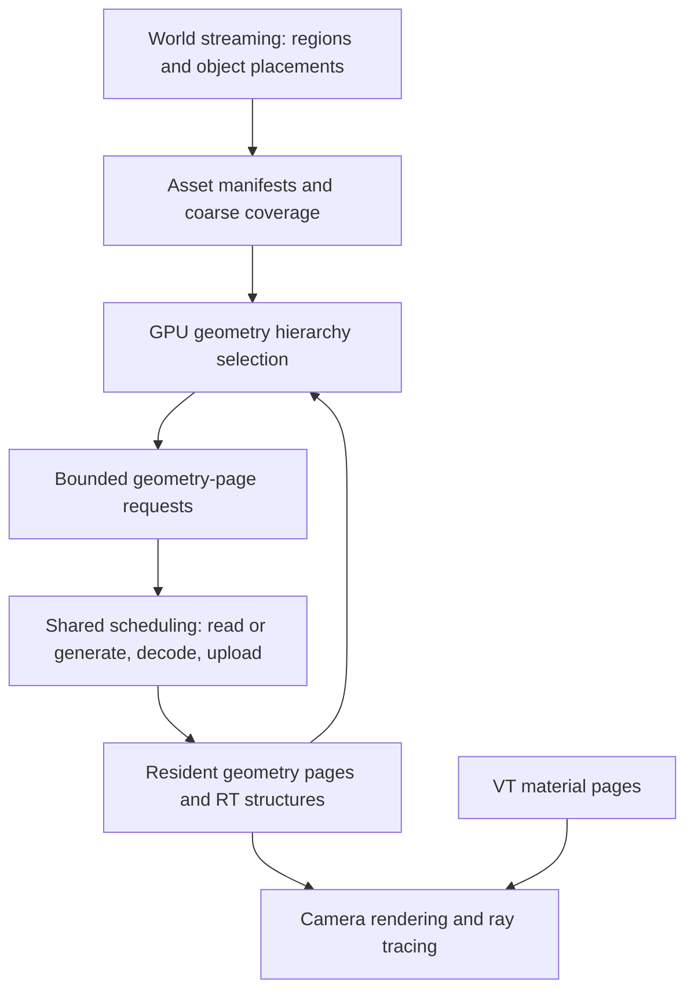

# Virtualized procedural geometry

Date: 2026-09-18. Status: CPU hierarchy and disk-page foundation implemented; production GPU/world integration remains.

Initial implementation lives in [src/geometry](../../../MatterEngine3/src/geometry/).
It compiles indexed meshes into connected replacement trees, serializes paged
metadata/geometry, and selects compatible CPU cuts with missing-page and budget
fallback. An opt-in simplifier mode preserves border connections while internal
borders unlock after merging. This is an in-memory compiler/reference stage:
GPU traversal, indirect rasterization, RT publication and world integration are
not implemented by this checkpoint. See [evidence and remaining work](../../agent/evidence/2026-09-18-geometry-pages/README.md).

## Objective and scope

Render large, complex, **unique** procedural meshes with visible geometric
relief, silhouettes, debris gaps, shadows and GI. Repeated instances are useful
but must not be necessary to demonstrate scalability. Displacement and debris
are producers of geometry consumed by the same hierarchy as an ordinary mesh.

The foundation is a hierarchy of simplified triangle groups, independently
resident geometry pages, GPU selection and visibility, and a compatible
ray-tracing representation. Sparse aggregates remain an optional representation
for dense disconnected detail. A universal voxel renderer, a new software
rasterizer, and vendor-specific cluster ray tracing are not initial dependencies.

This direction replaces further expansion of connected POM as the proposed
solution for new geometric detail. Existing POM remains a legacy comparison and
continues working on unconverted assets during migration. Material generation,
VT caching, surface layers and world overlays remain useful. Geometry already
displaced must not receive that displacement again through POM or normals.

The existing terrain performance objective remains unachieved. This design does
not redefine its native-resolution, terrain-only, whole-GPU-frame target below
5 ms. RT/GI configurations receive separate measurements; that terrain target
is not a new promise of a complete ray-traced scene below 5 ms.

## 1. What already exists

This table records the planning audit on 2026-09-18, before the implementation
checkpoint above. Older design milestones are not evidence that their endpoints
are implemented.

| Existing component | Reuse | Required extension or limit |
| --- | --- | --- |
| [SectorStreamer](../../../MatterEngine3/src/sector_streamer.h), [coordinator](../../../MatterEngine3/src/streaming/sector_streaming_coordinator.h) | World-region selection, asynchronous tagged requests, stale-completion rejection, publication/acknowledgement ordering, retained parent coverage | Select geometry pages inside admitted assets without issuing a sector rebake for every camera refinement |
| [PartStore](../../../MatterEngine3/src/render/part_store.h) | Part identity, worker staging, coherent snapshots, publication and release boundaries | Separate resident asset metadata/coarse coverage from independently loaded fine geometry |
| [Part clustering](../../../MatterEngine3/src/part_cluster.h), [flattening](../../../MatterEngine3/src/part_flatten.cpp) | Deterministic partitioning and existing cluster/LOD artifact machinery | Current spatial splits and independent LOD ladders are not a connected simplification hierarchy with page dependencies |
| [LOD bake](../../../MatterEngine3/src/lod_bake.cpp), [solid proxy LOD](../../../MatterEngine3/src/surface_proxy_lod.cpp) | Simplification and geometric-error measurement building blocks | Preserve attributes and boundaries across groups; the solid proxy helper rejects textures and color gradients |
| [GPU culling](../../../MatterEngine3/shaders_vk/cull.comp), [canonical LOD rule](../../../MatterEngine3/src/render/lod_distance.h) | Bounds, instance transforms, LOD convention, indirect draw output | Current instance-by-cluster dispatch must become bounded hierarchy traversal for opted-in assets |
| [Vulkan resources](../../../MatterEngine3/src/render/vk_resources.h), [renderer](../../../MatterEngine3/src/render/vk_scene_renderer.cpp) | Indexed geometry, ordinary rasterization, triangle BLASes, retained GPU resource lifetimes | Page addresses/epochs, incremental geometry-group admission, RT selection and build budgets |
| [Shared foliage surfaces](../../../MatterEngine3/src/render/vk_sparse_voxel.cpp) | Prototype sharing and retained local acceleration structures across placement changes | Current production primary path uses fixed triangle surfaces and separate sparse shadows; it is not unique-mesh geometry paging or a complete VT material adapter |
| [AssetStoreLib](../../../libs/AssetStoreLib/README.md) | Content-addressed packed blobs, committed index, checksums and batched reads | No engine adoption was found in this audit; `ReadBatch::submit` is synchronous and must run on workers |
| [VT residency](../../../MatterEngine3/src/render/vt_residency.h) | Parent coverage, immutable publication and retirement lessons; material data | Geometry needs its own payload, dependency and acceleration-structure lifetimes, not reuse of the 2D texture page format |

The current flat-part loader materializes cluster LOD data and a legacy merged
whole-part view. New-format admission must not recreate all of that data merely
to make one fine geometry page available.

## 2. Two levels of streaming, one coordinated budget

World streaming owns **which regions and placements are admitted**. Geometry
streaming owns **which detail pages of those assets are resident**. Moving along
a cliff may refine one small portion without replacing the cliff's world object
or rebaking its entire sector. A unique building or imported mesh uses the same
geometry layer without needing a terrain tile identity.

An asset may be referenced by several world regions. Region release removes a
reference; it does not free pages still retained by another placement, a fallback
cut, or an in-flight GPU submission. World-owner/generation tags authorize
publication; immutable content keys identify reusable asset bytes independently
of that world generation.

Keep one admission policy for worker capacity, CPU staging, upload bytes and GPU
work. Track separate geometry, material, BLAS and scratch memory categories so
one large build cannot consume the fallback reserve. Geometry requests are
deduplicated by content/page identity and fan out to interested owners. Reads
of existing pages must not wait behind large optional generation jobs.

### Disk-page storage

The [binary asset-page cache design](2026-09-18-binary-asset-page-cache-design.md)
defines the shared storage workstream. Geometry pages live in binary pack files,
ordered for spatial/dependency locality and read in bounded coalesced batches.
Logical page, I/O batch and pack sizes are separate choices. Loaded pages expose
validated offset-based views or one-time decoded arrays with retained owners.
Writes append changed pages and commit a new manifest; they do not rewrite all
geometry in the region. AssetStoreLib is the reuse target, with explicit work
for engine adoption, bounded requests, warm-path cost and reader-safe maintenance.

## 3. Geometry artifact and hierarchy

Define a versioned manifest containing source/content identity, compiler version,
bounds, root groups, material mapping, page directory and dependency records.
Page payloads contain indexed triangles and required shading attributes. Instance
identity and transforms remain outside the immutable geometry payload.

Build bounded leaf clusters, group adjacent clusters, simplify a group's combined
surface, and recluster its result to construct coarser representations. Preserve
material boundaries, shading discontinuities and compatible group borders. A
simple centroid partition is a useful baseline but does not establish adjacency,
crack freedom or an efficient hierarchy. Cluster size and page size are measured
parameters, not hard-coded claims of Nanite equivalence.

Represent replacement dependencies explicitly: a selected set of groups (a
**cut**) covers the original surface once. Refinement replaces complete compatible
groups, never arbitrary available children. Grouping may require a dependency
graph rather than treating every child as an independently replaceable tree node.
Locking every finest-cluster border forever is insufficient if it prevents useful
coarse reduction; measure boundary complexity and triangle reduction.

Store conservative bounds around the final detailed surface and monotonic error
metadata against that surface, including propagated simplification error. Label
sampled deviation measurements as estimates; finite sampling is not a proof of
a conservative geometric bound. Use independent reference checks and establish
the error contract before using it for acceptance.

Root geometry and the metadata needed for safe traversal form the mandatory
resident set for each admitted asset. Account for this floor: many unique assets
cannot all be admitted without limit. Fine metadata must also be bounded or
paged; loading every leaf descriptor of a huge mesh is not free streaming.

## 4. Residency, publication and selection

Page lifecycle:

`absent -> requested -> staged -> uploaded -> render-ready -> retiring -> absent`

Render-ready requires validated payloads, usable material fallback, and the
required acceleration structure when the page participates in the RT cut. Upload
completion alone is not publication. Snapshot swaps retain old resources through
all GPU readers and use generations to reject stale page IDs or recycled slots.

The CPU reference selector and GPU selector must agree on compatible cuts and
missing-page fallback. GPU work and feedback queues are bounded; overflow keeps
a valid parent representation and records a diagnostic instead of dropping
geometry. Avoid CPU readback of the full selected geometry list every frame.
Demand feedback can arrive later because the current resident cut remains valid.

Reuse the canonical LOD convention. Extend its error-to-switch conversion in one
place, with CPU/GPU equivalence tests covering FOV, viewport, instance scaling
and near-plane cases. Do not introduce an unrelated pixel-error rule in a new
shader. Normal cones, HZB and more aggressive culling are staged optimizations;
coarse bounds and conservative visibility work before adding them.

Coordinate frame budgets across decode, upload and acceleration-structure work.
Prioritize missing coarse coverage, visible refinement and lighting needs before
speculative detail. Use hysteresis and request deduplication to prevent churn.
Cancellation invalidates publication but does not prematurely free active GPU
work. Bad/missing cache pages retain parents and enter bounded retry/backoff.

## 5. Rasterization, materials and ray tracing

Use ordinary indexed rasterization and existing shading first, with indirect
work emitted from the selected cut. This is a functional baseline; rasterization
of many tiny triangles may become a measured bottleneck. Mesh shaders or a
specialized raster path are follow-up choices if evidence justifies them.

Keep material coordinates stable across geometry LODs. Generated geometry must
sample the same source material/domain, including world overlays. A page needs
usable coarse material coverage before activation, but fine material pixels and
fine geometry need not stream in lockstep. Separate residual normal detail from
the displacement already contained in vertices.

RT uses immutable geometry groups with cached triangle BLASes and bounded
updates to the instance structure. A BLAS per tiny cluster and a rebuilt
whole-world TLAS per refinement are both hypotheses to reject or justify with
measurements; page/group/BLAS granularity need not be identical. Initial groups
can use conventional Vulkan triangle acceleration structures.

Reuse unchanged groups and patch actual membership/LOD changes. Audit the live
RT mirror before implementing the older [RT mirror design](../../rt-tlas-cpu-mirror-redesign-2026-08-07.md);
its historical timings and unimplemented proposals are not current measurements.
Conventional TLAS builds may still touch all active entries when changes occur;
incremental CPU bookkeeping does not imply a free GPU update.

Camera culling must not remove geometry needed by reflections, shadows or GI.
Retain coarse off-screen coverage within the admitted lighting scene and define
secondary-ray refinement requests separately. The first proof uses identical
resident geometry for camera and RT where visible; later cheaper RT cuts need
explicit error and lighting acceptance. Vendor-specific cluster acceleration is
an optional backend, not a requirement for artifact identity or world authoring.

## 6. Procedural generation and terrain boundaries

Procedural and imported mesh producers enter the same compiler. Displacement is
evaluated from stable source fields in physical units, before simplification.
Current recipes with footprint-dependent filtering require an explicit source
sampling convention; camera position and transient VT residency cannot change
the identity of the finest generated geometry.

Generate unique debris groups directly or reference shared prototypes where
appropriate. Independent identity/editing remains available without requiring
one engine scene object per pebble. Prove scalability first with unique geometry;
repeated-tree or repeated-rock counts cannot substitute for that proof.

Bound build memory and support worker cancellation. For very large sources,
stream source blocks and use external-memory processing as required; a compiler
that merges the whole world into a triangle soup is not acceptable. Cache keys
include recipe/seed, source dependencies, displacement convention, geometry and
material mappings, and compiler version. Local edits invalidate affected pages
and necessary hierarchy ancestors while retaining unaffected bytes.

Distinguish internal cluster boundaries from independent terrain-sector seams.
The former are controlled by group replacement dependencies. The latter already
have [shared-contour](../../contour-seam-design-2026-08-13.md) and
[volumetric-sector](../../volumetric-sectors-design-2026-08-10.md) contracts, with
multiple implementation paths. Audit the active scene path before integration.
Displacing sector interiors must preserve the declared shared boundary or update
the boundary/transition geometry coherently. Do not invent a universal weld
rule, add cosmetic skirts as acceptance, or encode neighbor camera LOD into the
whole sector's bake identity.

## 7. Acceptance and evidence

First acceptance object: a large **unique** procedural rock/terrain mesh with
connected detail, an undercut and disconnected debris, plus a material boundary.
Use a retained full-detail mesh as the reference. Camera movement must show
different detail levels within that one object, missing-page fallback and real
RT visibility. Then test several different unique objects and multiple sectors.

Required evidence:

- No geometric holes, duplicated coverage or stale page reuse during refinement,
  merges, eviction, source edits, camera teleport or world detach.
- Stable silhouettes, materials, depth, picking and motion; shadows and GI see
  the intended geometry. Keep the lighting regression suite in scope.
- Cold/warm startup, generated/read/decompressed/uploaded bytes, CPU staging,
  geometry/metadata/BLAS/scratch/VT memory, resident source triangle counts,
  selected triangle counts, traversal work, failed refinements and retirements.
- Whole-frame CPU/GPU and presented time, individual passes, median/p95 and
  streaming stalls at fixed hardware, resolution and camera paths.
- Increasing source complexity at fixed view and declared error should not
  force all fine geometry into RAM/VRAM or require scanning every leaf each
  frame. Report exceptions caused by genuinely visible complexity.
- Native MSVC builds and Vulkan validation. Saved terrain issue cameras retain
  their original acceptance settings; successful small proofs do not close the
  below-5-ms terrain goal or claim unrestricted Nanite parity.

## References and implementation sequence

- [Implementation plan](../plans/2026-09-18-virtualized-procedural-geometry.md).
- [LOD/VT redesign](../../lod-vt-redesign-2026-08-04.md): reuse existing identities
  and migration work; implementation gaps remain explicit.
- [Epic: Nanite overview](https://dev.epicgames.com/documentation/unreal-engine/nanite-virtualized-geometry-in-unreal-engine):
  hierarchical triangle groups, fine streaming, and separate VT responsibilities.
- [Karis: tessellation approaches](https://graphicrants.blogspot.com/2026/02/possible-approaches-for-tessellation.html):
  runtime amplification and efficient simplified clusters have different costs;
  generation caching alone is not the complete scalability solution.

## Visible-first acceptance clarification (2026-09-18)

The user's one-second loading target applies to **all geometry visible in the
current camera frustum**, with its required virtual-texture pages and the
existing distance-based detail policy satisfied. A coarse fallback alone does
not count as ready. Prioritize this work before off-frustum refinement or
background sector residency. Background work must not consume admission, read,
decode, upload or publication capacity needed by visible work.

Report process startup separately from visible-set convergence after the scene
or camera is requested, and continue reporting complete admitted-scene readiness.
Do not count an incomplete visible set as success just because global queues are
empty, and do not require off-frustum queues to drain to declare visible readiness.
Frustum-edge bounds must remain conservative; camera changes must reprioritize
pending work without evicting needed fallback coverage. Validate initial entry
and camera turns with the visible target geometry/VT set, plus rendering frame
intervals below 10 ms. Startup cost remains reported, not silently excluded.

Current GPU hierarchy traversal already rejects nodes outside the frustum;
sector admission/root preparation priority and visible readiness instrumentation
still require implementation/verification. Existing full-scene audit measurements
are useful baselines but are not a direct test of this clarified visible-set target.

### Sector-cube requirement

The active virtual-geometry streaming architecture uses bounded sector cubes.
Do not design visible-first scheduling around legacy unbounded terrain columns.
StreamMountain already authors nestedSectors=true and volumetricSectors=true;
cache performance tests explicitly force volumetric sectors so inherited rollback
environment settings cannot silently select columns. Legacy selector code remains
in the repository pending cleanup, but is not the target architecture or an
acceptance path for this goal.
