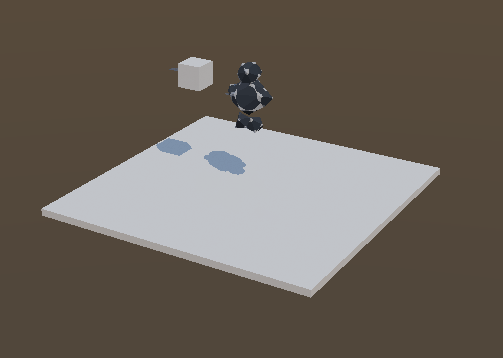
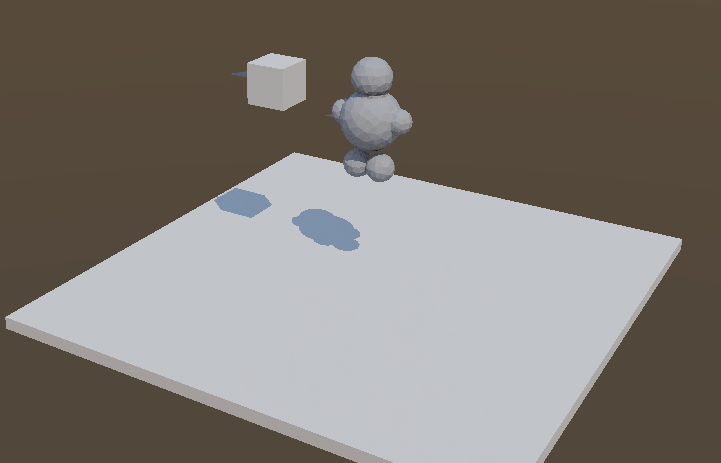
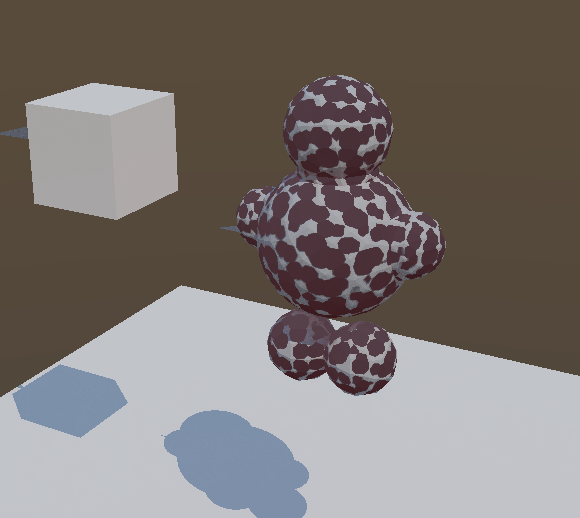
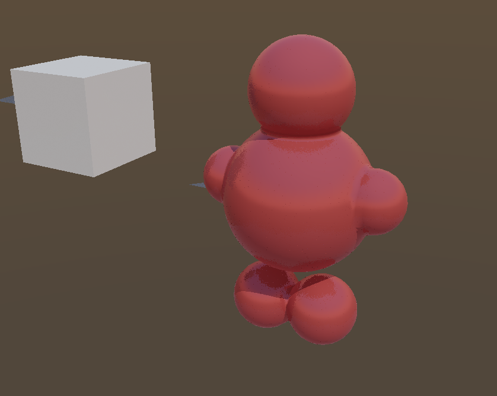
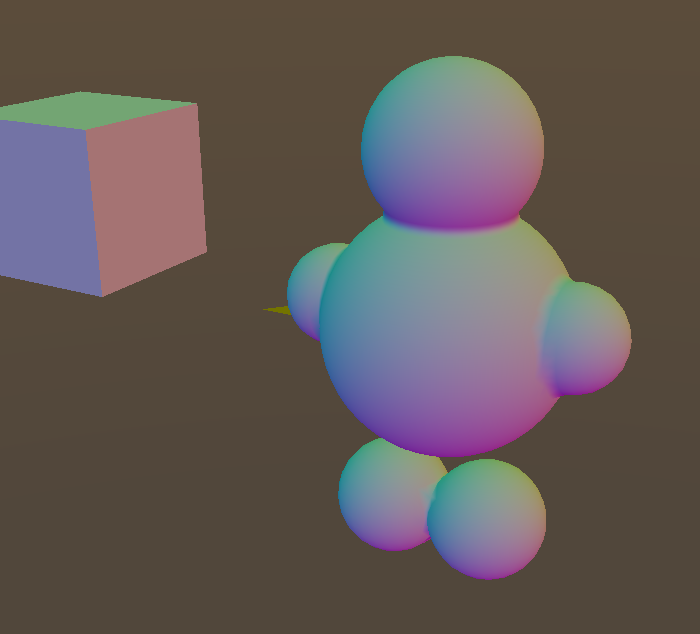
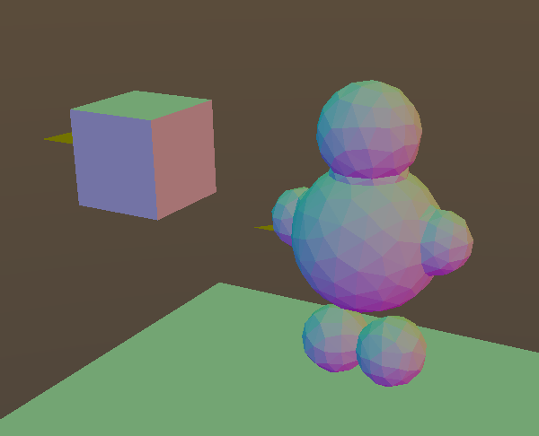
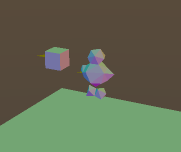

# Coarse LOD rungs drop material and smooth normals; raster and RT lanes disagree

## Symptom

Two defects, reported together because the first is what made the second visible.

1. As the camera pulls back, the creature changes material (red → grey) and its
   shading goes faceted.
2. In a band of middle distances two differently-shaded copies of the creature
   are on screen at once, interpenetrating; the second copy reads as
   inside-out.

## Expected

A part looks the same at every distance apart from silhouette detail: the
authored material and smooth shading hold across the whole ladder, and only one
rung is ever visible.

## Root cause

Two independent bugs, one per symptom.

1. `lod_bake::bake_lods` passed `nullptr` TriEx to every *decimated* rung
   (`MatterEngine3/src/lod_bake.cpp`, the `const TriEx* ex = (full && ...)`
   line). TriEx carries materialId/tint/normals/AO, so every coarse rung fell
   back to the instance material and to flat per-face shading. `part_flatten.cpp`
   had reprojected TriEx across its own ladder since 2026-07-07; the ladder
   `script_host.cpp` bakes for animated parts never did.
2. `VkSceneRenderer::build_ray_geometry` selected the traced rung from the
   part's **static** cluster AABB/radius, while the raster lanes select from the
   **dynamic** animation-bounds union (`resolve_animation_cluster_union`). For a
   partitioned animated part the static bound is an origin-centered box covering
   skin *and* every rigid segment, so its radius runs well above the animated
   skin's and the tracer held a finer rung than the gbuffer across a wide band.
   Both surfaces are on screen at once — gbuffer shades, traced geometry
   supplies GI and shadow rays — so they interpenetrate.

## Repro

Launch from `MatterEditor/` (from a shell that has **not** exported
the MSYS2 UCRT64 PATH — env vars only reach a native exe through its
own prefix, and an MSYS bash swallows them):

```bash
MATTER_WORLD=AnimatedRigGallery MATTER_CAM="20.000,16.000,34.000,0.529,1.303,2.222" ./build/windows/editor.exe
```

Simulation was in **Edit** for the first shot — press Play if the defect only appears in motion.

## Report

_As captured, verbatim._

There are multiple issues that I'm seeing wrong with the LODs and rendering.
- First there appear to be distances where two meshes are visible intersecting with different materials,
one of these meshes often looks to have inverted normals
- Second higher LODs with lower resolution do not preserverve smooth normals, or the original material for the object

## Evidence

### 1. shot-1.png



- region: region (503x358)
- camera: `20.000,16.000,34.000,0.529,1.303,2.222`
- sim: Edit @ 1.00x — 5 instances, 27 tris, 4 batches, 16.56 ms

### 2. shot-2.png



- region: region (721x463)
- camera: `10.853,9.651,20.008,-8.718,-4.223,-12.077`
- sim: Edit @ 1.00x — 5 instances, 27 tris, 4 batches, 16.72 ms

```bash
MATTER_WORLD=AnimatedRigGallery MATTER_CAM="10.853,9.651,20.008,-8.718,-4.223,-12.077" ./build/windows/editor.exe
```

### 3. shot-3.png



- region: region (580x518)
- camera: `3.923,5.048,7.949,-13.874,-8.524,-25.278`
- sim: Edit @ 1.00x — 5 instances, 27 tris, 4 batches, 16.67 ms

```bash
MATTER_WORLD=AnimatedRigGallery MATTER_CAM="3.923,5.048,7.949,-13.874,-8.524,-25.278" ./build/windows/editor.exe
```

### 4. shot-4.png



- region: region (838x668)
- camera: `2.311,3.819,4.941,-15.485,-9.753,-28.287`
- sim: Edit @ 1.00x — 4 instances, 15 tris, 4 batches, 17.37 ms

```bash
MATTER_WORLD=AnimatedRigGallery MATTER_CAM="2.311,3.819,4.941,-15.485,-9.753,-28.287" ./build/windows/editor.exe
```

### 5. shot-5.png



- region: region (700x634)
- camera: `2.311,3.819,4.941,-15.485,-9.753,-28.287`
- sim: Edit @ 1.00x — 4 instances, 15 tris, 4 batches, 16.71 ms

```bash
MATTER_WORLD=AnimatedRigGallery MATTER_CAM="2.311,3.819,4.941,-15.485,-9.753,-28.287" ./build/windows/editor.exe
```

### 6. shot-6.png



- region: region (600x486)
- camera: `3.616,4.817,7.518,-13.721,-8.302,-26.133`
- sim: Edit @ 1.00x — 5 instances, 27 tris, 4 batches, 16.70 ms

```bash
MATTER_WORLD=AnimatedRigGallery MATTER_CAM="3.616,4.817,7.518,-13.721,-8.302,-26.133" ./build/windows/editor.exe
```

### 7. shot-7.png



- region: region (362x304)
- camera: `12.864,11.532,24.754,-5.069,-1.209,-8.728`
- sim: Edit @ 1.00x — 5 instances, 27 tris, 4 batches, 16.66 ms

```bash
MATTER_WORLD=AnimatedRigGallery MATTER_CAM="12.864,11.532,24.754,-5.069,-1.209,-8.728" ./build/windows/editor.exe
```

- `state.json` — per-shot camera/counts plus deep engine state
- `log-tail.txt` — console lines leading up to this report

## Acceptance

**Headless (the gate):**

```bash
make -C MatterEngine3/tests run-comp TMP="C:/Users/webde/AppData/Local/Temp" TEMP="C:/Users/webde/AppData/Local/Temp" GRAPHICS=GRAPHICS_API_OPENGL_43
```

`test_lod_rungs_preserve_material_and_smooth_normals` (composition_tests.cpp)
bakes a sphere ladder with an authored materialId and analytic smooth normals,
then asserts for **every** rung — not just the undecimated one — that TriEx is
present and parallel to the triangles, that the materialId survived, that
normals are unit length, and that ≥90% of triangles have corner normals that
differ from each other (a per-face normal field gives three identical corners,
so this is what separates smooth from faceted). Confirmed to fail on the
pre-fix tree with `FAIL: rung carries per-triangle TriEx` on both decimated
rungs, and to pass after.

A sphere is the probe on purpose: it is closed, so decimation is not pinned by
the boundary lock, and curved everywhere, so a flat grid would pass even with
per-face normals.

**Visual (what the pixels must show), via shot replay:**

```bash
cd MatterEditor && MATTER_REPLAY=../issues/424b0f49-194e-1803-8fe5-a2fbe275cef6/state.json MATTER_REPLAY_SHOT=3 MATTER_REPLAY_OUT=/tmp/after-3.png ./build/windows/editor.exe
```

- shot-3 (mid distance): one uniformly red, smoothly shaded creature. No grey
  blotches, no second interpenetrating surface.
- shot-6 (debug_view=1, coarse rung): smooth normal gradients, not flat facets.
- shots 2/3/4 together: the creature is the same red at every distance — no
  material pop across the ladder.

Delete `projects/world_demo/.cache/` before replaying. The baked LOD geometry
is content-addressed on the *source*, so an engine-side bake change does not
invalidate it and a stale cache will reproduce the old pixels exactly.

## Not fixed here

The ground plane disappears at close range (shots 4 and 5; `instances_drawn`
drops 5→4 and `clusters_culled` is 1). That is a wrong frustum cull of the
ground crate, not an LOD defect: the cull volume reaching `cull.comp` behaves
like a zero-sized box at the instance origin — visibility across all seven
shots brackets NDC ±1 at the origin (−0.91 and −0.95 visible, −1.36 culled)
while the slab's actual corners project well inside the frustum. Present before
these changes and unchanged by them. Worth its own issue.
