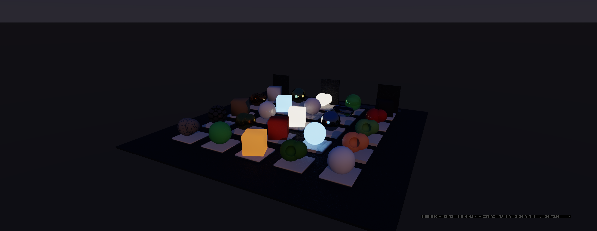
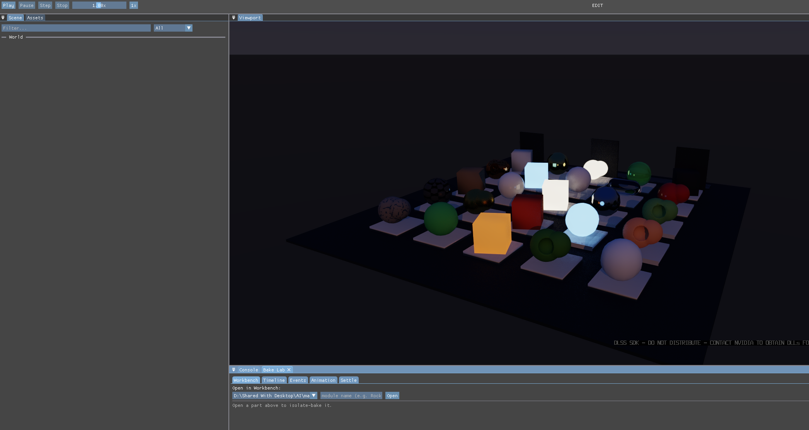

# Scene panel keeps showing the previous world's tree after a new world loads

## Report

Scene window often doesn't update when new worlds are loaded.

## Repro

Launch from `MatterEditor/` (from a shell that has **not** exported
the MSYS2 UCRT64 PATH — env vars only reach a native exe through its
own prefix, and an MSYS bash swallows them):

```bash
MATTER_WORLD=LightingGarden MATTER_CAM="17.406,14.075,32.946,-0.176,1.411,-0.751" ./build/windows/editor.exe
```

Simulation was in **Edit** for the first shot — press Play if the defect only appears in motion.

## Evidence

### 1. shot-1.png



- region: viewport (2385x927)
- camera: `17.406,14.075,32.946,-0.176,1.411,-0.751`
- sim: Edit @ 1.00x — 8 instances, 11968 tris, 8 batches, 16.79 ms

### 2. shot-3.png



- region: region (2093x1115)
- camera: `17.406,14.075,32.946,-0.176,1.411,-0.751`
- sim: Edit @ 1.00x — 8 instances, 11968 tris, 8 batches, 16.69 ms

- `state.json` — per-shot camera/counts plus deep engine state
- `log-tail.txt` — console lines leading up to this report

## Acceptance

`make -C MatterEngine3/tests run-asyncbake` — the `warm_session_publishes_graph`
case in `async_bake_tests.cpp` drives real WorldSessions through the failing
sequence: load a world cold, replace the session with a warm
(resolve-cache-hit) load of the same project, and assert

1. the warm session publishes its graph snapshot (`graph_generation() > 0`
   and `graph_snapshot()` returns the world's root) — the warm path never
   called `publish_graph_snapshot()`, so this failed before the fix;
2. the shipped panel policy (`MatterEditor/src/scene_tree_model.h`) drops the
   dead session's tree on a pre-publish draw and shows the new world after
   its publish, despite the cross-session generation collision (cold and
   warm generations both end at 1 — pinned by the test);
3. the seam reset wired into `clear_app_models` unlocks the refresh even when
   no draw happened during the pre-publish window.

Before the fix the case fails with 6 CHECK failures (warm generation stays 0,
`graph_snapshot()` stays false, the panel keeps the dead tree); after it
passes. The suite's two `production AnimatedRigGallery` failures predate this
issue and are identical with and without the fix (on main the suite could not
run at all — `EngineContext::create` under `MATTER_VULKAN_ONLY` refused
headless creation and test (c) crashed on the null engine).
