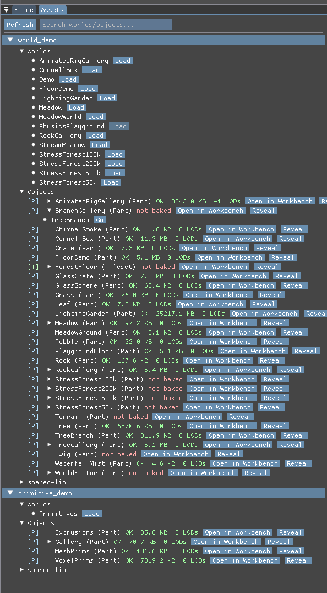

# Open in Workbench, Reveal and Go do nothing

## Report

Clicking open in workbench, Reveal and Go don't appear to do anything.
I would expect Open/Go to load the part in the main viewport. 
Reveal I would expect to select the part in the parent world if it is loaded.

## Repro

Launch from `MatterEditor/` (from a shell that has **not** exported
the MSYS2 UCRT64 PATH — env vars only reach a native exe through its
own prefix, and an MSYS bash swallows them):

```bash
MATTER_WORLD=PhysicsPlayground MATTER_CAM="17.406,14.075,32.946,-0.176,1.411,-0.751" ./build/windows/editor.exe
```

Simulation was in **Pause** for the first shot.

## Evidence

### 1. shot-1.png



- region: region (594x1076)
- camera: `17.406,14.075,32.946,-0.176,1.411,-0.751`
- sim: Pause @ 1.00x — 10 instances, 1038 tris, 4 batches, 16.66 ms

- `state.json` — per-shot camera/counts plus deep engine state
- `log-tail.txt` — console lines leading up to this report

## Acceptance

Headless (primary):

```bash
make -C MatterEditor run-test-workbench-actions \
  TMP="C:/Users/webde/AppData/Local/Temp" TEMP="C:/Users/webde/AppData/Local/Temp"
```

must print `ALL PASS`. It pins, per control:

- **Open in Workbench / Go** — the generated isolation world places its root
  with `expand: false`. The W2 generator hardcoded `expand: true`, which
  hard-fails on leaf parts (`expand: root has no children`) and published an
  empty world: the viewport showed nothing, which read as a dead button.
- **Reveal** — `reveal_part_in_world` maps a module to its baked root and
  replaces the selection with `SelectedObject{BakedRoot, resolved_hash}`
  (untouched selection + console report when the module isn't a loaded root).
- **Focus** — `focus_camera_on_selection` frames a BakedRoot's real
  world-space bounds through the new bounds-provider parameter.

Scripted capture (secondary, drives the SAME registry commands the buttons
issue — the FIFO verbs `workbench <module>` / `reveal <module>` were added
for exactly this):

```bash
cd MatterEditor
MATTER_WORLD=PhysicsPlayground MATTER_CMD_FIFO=/tmp/cmd.txt ./build/windows/editor.exe
# append to /tmp/cmd.txt:  workbench Crate   then:  shot after-workbench.png
# append:                  reveal PlaygroundFloor   then:  shot after-reveal.png
```

`after-workbench.png` must show the crate alone, framed in the main viewport
with the Bake Lab raised on its Workbench tab and a "baked ok" status (pre-fix:
empty grey viewport + `bake error []: expand: root has no children`).
`after-reveal.png` must show the camera framing the playground floor with the
selection outline on it (pre-fix: nothing changed; on warm-cache launches the
engine additionally never published the restored graph snapshot, so there was
no baked root to select — fixed in matter_engine.cpp's resolve-cache-hit path).
