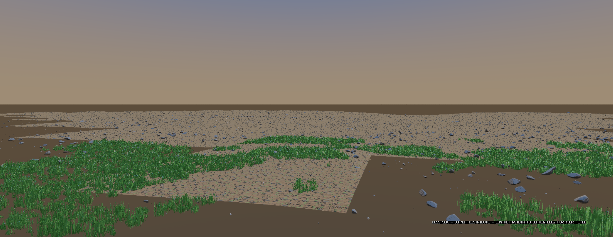
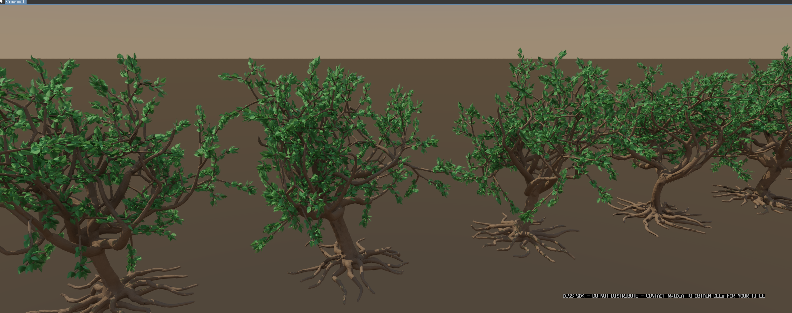
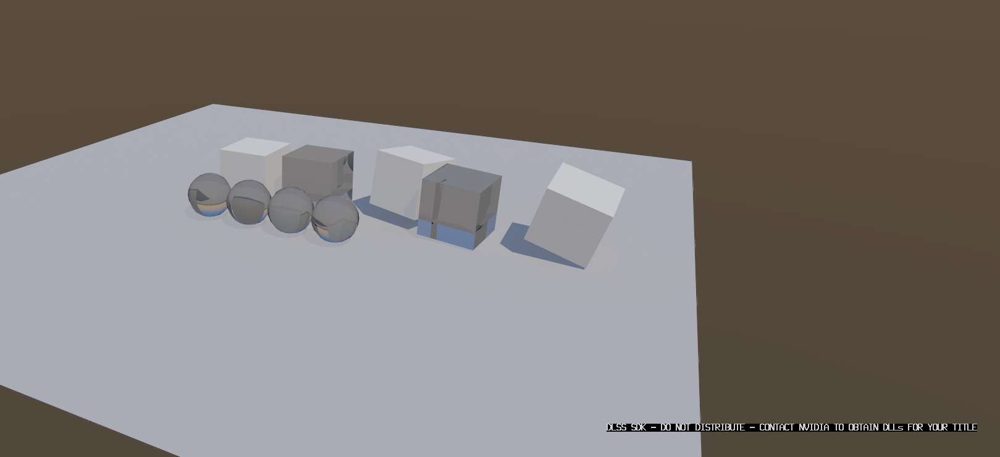

# DLSS presents the un-upscaled low-resolution image even when enabled

## Report

DLSS doesn't appear to work in streaming meadow in this build even when "enabled" we just see the low resolution render instead of the nice clean DLSS output.

## Repro

Launch from `MatterEditor/` (from a shell that has **not** exported
the MSYS2 UCRT64 PATH — env vars only reach a native exe through its
own prefix, and an MSYS bash swallows them):

```bash
MATTER_WORLD=PhysicsPlayground MATTER_CAM="20.260,28.154,-59.035,58.730,26.166,-70.036" ./build/windows/editor.exe
```

Simulation was in **Edit** for the first shot — press Play if the defect only appears in motion.

## Evidence

### 1. DLSS not working in this world - grainy



- region: viewport (2385x927)
- camera: `20.260,28.154,-59.035,58.730,26.166,-70.036`
- sim: Edit @ 1.00x — 11916 instances, 951041 tris, 239 batches, 84.15 ms

### 2. It's working here



- region: region (2354x934)
- camera: `10.670,13.423,-23.623,-0.712,2.983,13.342`
- sim: Edit @ 1.00x — 144 instances, 1164495 tris, 144 batches, 31.73 ms

```bash
MATTER_WORLD=PhysicsPlayground MATTER_CAM="10.670,13.423,-23.623,-0.712,2.983,13.342" ./build/windows/editor.exe
```

### 3. Working here too



- region: region (1619x741)
- camera: `17.406,14.075,32.946,-0.176,1.411,-0.751`
- sim: Pause @ 1.00x — 10 instances, 1038 tris, 4 batches, 16.68 ms

```bash
MATTER_WORLD=PhysicsPlayground MATTER_CAM="17.406,14.075,32.946,-0.176,1.411,-0.751" ./build/windows/editor.exe
```

- `state.json` — per-shot camera/counts plus deep engine state
- `log-tail.txt` — console lines leading up to this report

## Acceptance

_TODO — the check that closes this. Prefer a headless `make -C MatterEngine3/tests run-*` target; fall back to a scripted capture (`MatterEngine3/tools/viewer_shots.sh`) plus what the pixels must show._
