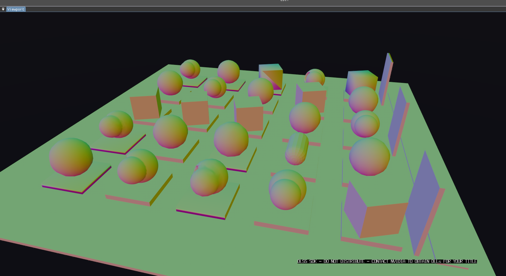
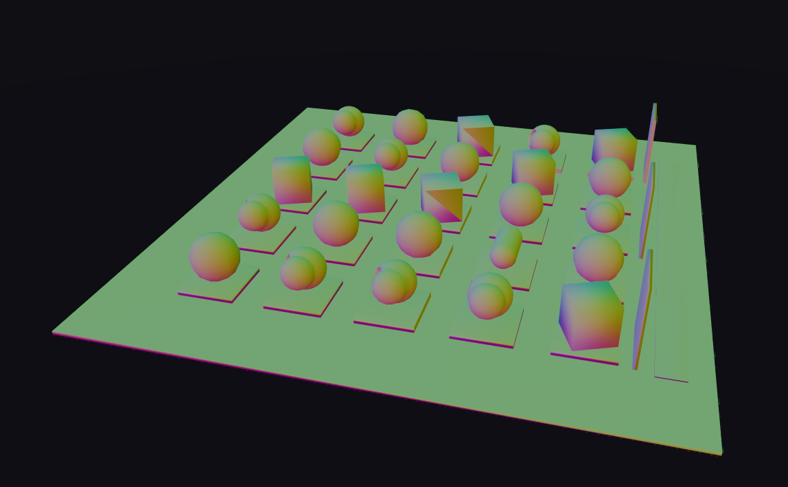

# Coarse LOD rungs smooth across hard edges, so boxes shade like blobs when they pop down a rung

## Report

Some meshes shouldn't be getting smooth normals at lower LOD, the cubes here look janky when they pop to lower lod

## Repro

Launch from `MatterEditor/` (from a shell that has **not** exported
the MSYS2 UCRT64 PATH — env vars only reach a native exe through its
own prefix, and an MSYS bash swallows them):

```bash
MATTER_WORLD=LightingGarden MATTER_CAM="25.071,13.975,-6.718,-8.176,-6.816,1.493" ./build/windows/editor.exe
```

Simulation was in **Edit** for the first shot — press Play if the defect only appears in motion.

## Evidence

### 1. shot-1.png



- region: region (1692x923)
- camera: `25.071,13.975,-6.718,-8.176,-6.816,1.493`
- sim: Edit @ 1.00x — 8 instances, 61738 tris, 8 batches, 16.67 ms

### 2. Broken normals on cubes



- region: region (1148x710)
- camera: `39.540,22.976,-10.234,6.458,2.048,-1.712`
- sim: Edit @ 1.00x — 8 instances, 10286 tris, 8 batches, 16.67 ms

```bash
MATTER_WORLD=LightingGarden MATTER_CAM="39.540,22.976,-10.234,6.458,2.048,-1.712" ./build/windows/editor.exe
```

- `state.json` — per-shot camera/counts plus deep engine state
- `log-tail.txt` — console lines leading up to this report

## Acceptance

Headless gate — `make -C MatterEngine3/tests run-comp` green, specifically:

- `test_lod_rungs_preserve_hard_edges` (new): bakes a tessellated box through
  `lod_bake::bake_lods` and asserts every axis-aligned triangle on every
  decimated rung keeps per-face corner normals (dot against its own face
  direction > 0.999 at all three corners). Verified to FAIL against the
  pre-fix smoothing (both decimated rungs) and pass with the fix.
- `test_lod_rungs_preserve_material_and_smooth_normals` (issue 424b0f49's
  gate): still green — sphere rungs keep the authored material and
  smoothly-varying corner normals. The fix must hold BOTH: hard stays hard,
  smooth stays smooth.

`make -C MatterEngine3/tests run-flatten` green (the part_flatten ladder is
the path LightingGarden's boxes actually bake through), and
`make -C MatterEngine3/tests run-partstore` green (bake_lods' other consumer;
its single-triangle fixtures are what forced the donor grid onto vertex-AABB
sizing with clamped insertion — the centroid AABB of one triangle is a point,
and an unclamped grid over a 1e-6 cell ran away to 50 GB).

Visual check — wipe `projects/world_demo/.cache` first (it is content-addressed
on the JS source, so an engine-side bake change does not invalidate it), then
replay both shots per the Repro section with `MATTER_REPLAY_STRICT=1`. In the
normals debug view every box and plate must shade one flat color per face at
every distance (no rainbow gradient across a 90° edge), while the spheres and
the marching-cubes blobs stay smooth. Verified 2026-07-28: the coarse-rung
cubes in shot 2 went from smooth gradients to flat faces; sphere pixels
unchanged.

### Root cause

`reproject_triex` (libs/MatterSurfaceLib/src/mesh_transform.cpp) rebuilt every
decimated rung's shading normals as smooth area-weighted vertex normals over
the whole welded target mesh — no notion of a crease, so a box's 90° edges
averaged into a gradient. The part_flatten ladder (the path a static Part like
LightingGarden bakes through) has reprojected this way since 4d47c8cb
(2026-07-08, "smooth reproject normals"); 70e3cb1d (2026-07-27) extended the
same idiom to `bake_lods`. Fixed by adding a `ReprojectNormals::SampleSource`
mode that samples the SOURCE's authored shading normals per target corner
(nearest crease-compatible donor triangle, clamped-barycentric interpolation),
so a rung inherits the authored shading character instead of recomputing it
blind. LOD ladders (lod_bake, part_flatten x2) opt in; mesh_retopo keeps the
default `SmoothTarget` behavior unchanged.

Donor ranking uses true point-to-triangle distance over a triangle-AABB
overlap grid, not centroid distance — the ground slab's top face is two
32-unit triangles whose centroids sit ~10 units from the slab's corners,
so centroid ranking made slab corners sample the spheres hovering above
them (visible as giant gradient wedges across the ground on the first
attempt at this fix). The overlap grid is sized from the vertex AABB with
insertion clamped to the grid span; sizing it from the centroid AABB melts
down on tiny sources (see run-partstore note above).
