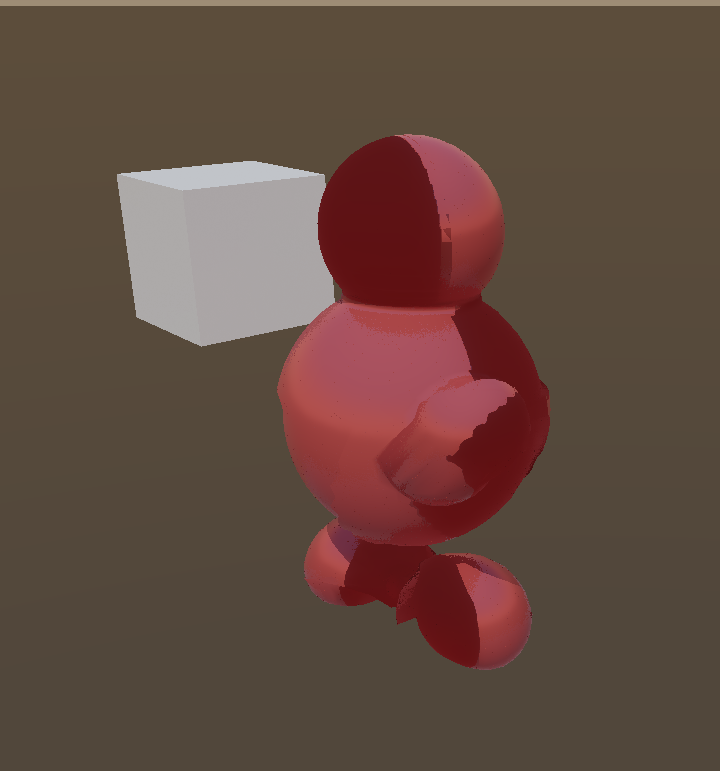
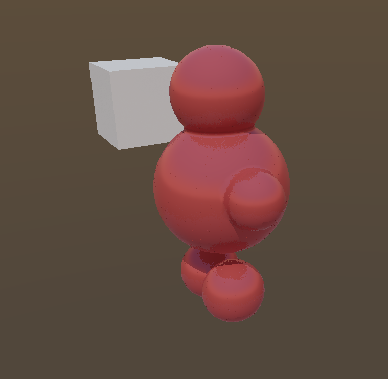

# Traced geometry stays in the bind pose while the raster mesh is skinned, so an animated part self-shadows in hard-edged dark patches

## Report

Could the wierd dark red color also be an artifact of the animated ray traceed mesh being out of alignment with the raster mesh? Do we animated both? I would like you to figure out if there is a way we can both simplify this and make it more correct.

## Answers

1. **Yes, it is an alignment artifact.** The gbuffer surface is the
   compute-skinned pose; the traced geometry for the same part was the
   immutable bind-pose BLAS (`SkinnedRtBuildContract` in
   `animation_budget.h` — build-once, no update, no refit). Wherever the
   posed surface sits inside the bind-pose silhouette, its GI and sun
   shadow rays self-hit immediately: fully shadowed, GI-occluded pixels
   that keep their red albedo — the hard-edged dark red carving. Shot-1
   (Pause, mid-gait) shows it; shot-2 (Edit, poses coincide) does not.
2. **No, we did not animate both.** The raster lane deforms
   (`animation_skin.comp` writes `skin_current_output`, drawn by the
   skinned raster pipeline); the traced lane rebuilt nothing — the BLAS
   held bind-pose vertices from `part.rt_geometry`, only the TLAS
   transform moved. The rigid `segments()` were already correct in both
   lanes because they travel as whole-part TLAS/draw transforms.
3. **Simpler and more correct:** the raster side already has a
   single-owner rule — an accepted skin draw excludes the cluster's
   static bind-pose draw (`kVkAnimationBoundsSkinRaster`, honored by
   `cull.comp::uses_skin_raster`). The tracer was the one lane that
   ignored it. The fix extends the same ownership rule to the traced
   lane through one shared predicate
   (`animation_skin_raster_owns_cluster`): while a skin draw owns a
   cluster, its bind-pose BLAS stays out of the TLAS. One policy, three
   consumers, no second geometry representation to keep aligned.

## Root cause

`VkSceneRenderer::build_ray_geometry`
(`MatterEngine3/src/render/vk_scene_renderer.cpp`) selected every cluster
of a dynamic part into the TLAS unconditionally, including clusters whose
raster geometry had been replaced by a compute-skinned draw this frame.
Commit `70e3cb1d` made both lanes agree on the LOD rung, but the traced
rung was still bind-pose geometry under a skinned gbuffer.

The deliberate non-fix: rebuilding/refitting the BLAS from the skinned
vertex stream every pose change would make the traced copy exact, but it
widens the intentionally conservative RT build contract (per-instance
BLAS lifetimes, skin-compute → BLAS-build synchronization, per-frame
build cost) and is the "later deforming-RT phase" the contract comment
reserves. Until then a skinned cluster contributes no traced geometry:
a missing occluder reads as a soft lighting omission, a wrong-pose
occluder reads as geometry. The cost is that a deforming skin neither
casts RT shadows nor occludes GI while animating; BindPose skin
fallbacks publish no draw, so a fallen-back creature still traces its
(then-aligned) bind pose.

## Repro

Launch from `MatterEditor/` (from a shell that has **not** exported
the MSYS2 UCRT64 PATH — env vars only reach a native exe through its
own prefix, and an MSYS bash swallows them):

```bash
MATTER_WORLD=AnimatedRigGallery MATTER_CAM="5.310,3.743,2.420,-26.075,-9.679,-18.552" ./build/windows/editor.exe
```

Simulation was in **Pause** for the first shot.

## Evidence

### 1. shot-1.png



- region: region (720x771)
- camera: `5.310,3.743,2.420,-26.075,-9.679,-18.552`
- sim: Pause @ 1.00x — 4 instances, 15 tris, 4 batches, 16.67 ms

### 2. shot-2.png



- region: region (759x742)
- camera: `5.310,3.743,2.420,-26.075,-9.679,-18.552`
- sim: Edit @ 1.00x — 4 instances, 15 tris, 4 batches, 16.65 ms

- `state.json` — per-shot camera/counts plus deep engine state
- `log-tail.txt` — console lines leading up to this report

## Acceptance

**Headless (the gate):**

```bash
make -C MatterEngine3/tests run-vk-scene-renderer TMP="C:/Users/webde/AppData/Local/Temp" TEMP="C:/Users/webde/AppData/Local/Temp" GRAPHICS=GRAPHICS_API_OPENGL_43
```

`test_skin_raster_ownership_excludes_traced_bind_pose`
(vk_scene_renderer_tests.cpp) pins the traced lane's half of the
skin-ownership invariant: an accepted skin draw owns its (instance,
generation, cluster) for the tracer regardless of LOD, ownership does not
leak across clusters/slots/generations, an empty draw list keeps every
bind-pose BLAS traceable, and — the part that prevents this class of bug
returning — the flag the culler consumes and the predicate the traced
lane consumes resolve identically record for record.

**Visual (what the pixels must show), via shot replay:**

The stock replay never applies the recorded transport, so the sim stays
in Edit and every pose is the bind pose — the defect cannot appear. Drive
the transport through the command file: launch the shot-1 replay with
`MATTER_CMD_FIFO=<file>` and `MATTER_REPLAY_SETTLE=3000`, and once the
bake settles append `play`, wait ~2.7 s (a non-multiple of the 0.8 s walk
cycle), append `pause`. The shot then captures a frozen mid-gait pose
after full denoiser accumulation.

- Before the fix that procedure reproduces shot-1's carving: 9.26% /
  9.25% of crop pixels are dark-red (max channel < 110 and R at least 25
  above G and B) across two runs. Clean references (shot-2, bind pose)
  sit at ~0.4%.
- After the fix the same procedure yields 0.28% / 0.29% — a posed,
  uniformly lit creature. Same-build repeat runs differ by ~0.9% of
  pixels (the noise floor); before→after differs by 15.1%.

Delete `projects/world_demo/.cache/` before replaying — the bake cache is
content-addressed on the JS source, so an engine-side change does not
invalidate it.

## Not fixed here

While a skin draw owns a cluster, that cluster casts no RT shadow and
occludes no GI (previously it cast them in the wrong pose). Restoring
animated-skin participation in the traced scene needs the deforming-BLAS
phase: build per-instance BLASes from `skin_current_output` (the skinned
vertices already sit on the GPU in `VkSkinVertex` layout), synchronize
skin-compute writes before the BLAS build, and widen
`SkinnedRtBuildContract` deliberately rather than incidentally. That is a
planned phase of its own, not a patch on this defect.
