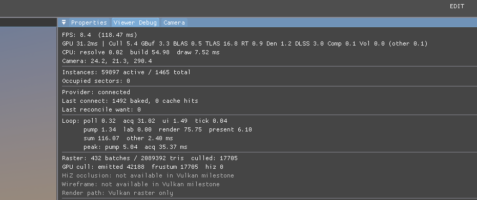

# Sector streaming spends O(world) main-thread CPU per published part

Resolved 2026-07-28 by `c78b6c9c` + `df350465` on
`claude/baking-pipeline-cpu-50562b`. Owning subsystem:
`MatterEngine3/src/render/vk_scene_renderer.{h,cpp}` (static buffer upload,
`update_instances`) and `MatterEngine3/src/render/vk_temporal.{h,cpp}`.

**Symptom:** with baking already off the main thread (pump 1.3 ms), `build`
stayed at 55–78 ms per frame while sectors streamed in. Each published part
set `static_upload_dirty_`, and the next frame recreated and re-uploaded the
ENTIRE resident cluster/vertex/index buffers (the `uploads` counters in
`state.json` show ≈1 full re-upload per registered part), rebuilt a ~60k-node
temporal history map, and rebuilt the full 60k-instance candidate set with
~24 MB of allocation — O(world) work per publish, making the load O(N²).

**Expected:** publish cost scales with the published part, not the resident
world; `build` stays in single digits while sectors land.

**Fix:** static uploads are now tail-appends into the live buffers (full
recreate only on capacity growth, which doubles — O(log N) per load); the
temporal keyed index is a flat-probe table, `begin()` returns by reference,
`update_instances` reads history positionally and reuses scratch buffers.
Measured in-editor after the fix: ~9 ms build on sector-landing frames.

## Report

It seems like build still is taking 60ms per frame or so... We just did a lot of work to offload building off the main thread so can we look at what's eating up the time?

## Repro

Launch from `MatterEditor/` (from a shell that has **not** exported
the MSYS2 UCRT64 PATH — env vars only reach a native exe through its
own prefix, and an MSYS bash swallows them):

```bash
MATTER_WORLD=StreamMeadow MATTER_CAM="24.224,21.303,290.399,15.911,24.519,251.341" ./build/windows/editor.exe
```

Simulation was in **Edit** for the first shot — press Play if the defect only appears in motion.

## Evidence

### 1. shot-1.png



- region: region (931x391)
- camera: `24.224,21.303,290.399,15.911,24.519,251.341`
- sim: Edit @ 1.00x — 42244 instances, 2095723 tris, 476 batches, 115.99 ms

- `state.json` — per-shot camera/counts plus deep engine state
- `log-tail.txt` — console lines leading up to this report

## Acceptance

1. **Headless (the gate):** `MATTER_VK_SMOKE_MODE=cull
   ./build/windows/vulkan_smoke_tests.exe` from `MatterEditor/` — the
   `run_static_append_upload_tests` section registers 16 parts one frame
   apart and asserts (a) each registration performs exactly one static
   upload, (b) a full re-upload happens only when a buffer must grow, (c) a
   registration that fits existing capacity appends in place, and (d) the
   appended clusters' GPU bytes are real, via an emitted/culled split that
   depends on each appended AABB. ALL PASS with 0 validation errors closes
   this. (Also runs in the default mode.)

2. **In-editor census:** launch the Repro command, watch the Viewer Debug
   overlay while sectors land. `state.json`'s `uploads.static_append` must
   climb with registered parts while `uploads.static_full` stays near-flat
   (growth events only), and `build` must stay in single-digit ms during
   streaming (was 55–78 ms). Verified 2026-07-28: ~9 ms on sector-landing
   frames, settles to baseline once `reconcile want` reaches 0.
